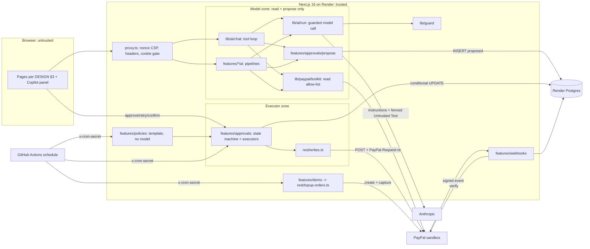
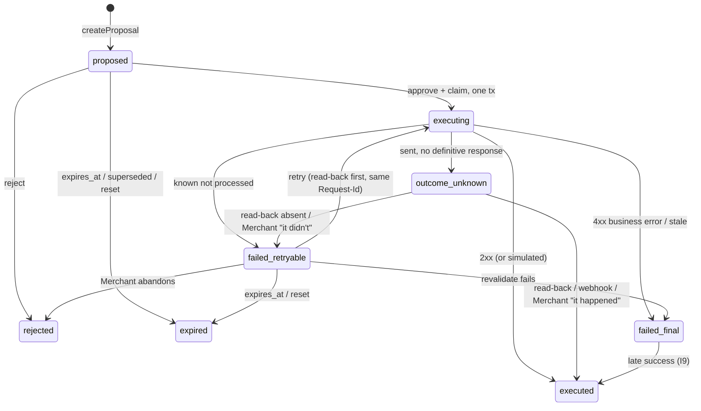

# PLAN: Steward

Build plan for Steward, an ops copilot for one small PayPal Merchant. Inputs: `REQUIREMENTS.md` (FR/NFR/SC; NG4, NFR-S1, SC-1, FR-5.5 amended), `ASSUMPTIONS.md` (A-*, D-1..D-10), `CONTEXT.md` (terms used exactly), ADR 0001/0002, and the binding rulings in `docs/PLAN-DECISIONS-R1.md` (R1–R25).
**Ownership (R1).** `docs/AI-QUALITY.md` owns models, routing, prompts, Untrusted Text format, evidence-ref grammar, eval commands, budgets and CI eval policy. `docs/DESIGN.md` owns routes, pages, copy and tokens. This plan owns architecture, data model, invariants, slices, CI/CD, probes and code paths (§6), and references the others by section.
Dates: today 2026-10-03; v0.5 tag Nov 6 (A-14); feature freeze Nov 8; submit Nov 11; deadline Nov 12 12:00 PT.

## 1. Live environment facts

| # | Fact | Source / status | Design consequence |
|---|---|---|---|
| F1 | `@paypal/agent-toolkit@1.11.0` depends on `ai@4` + `zod@3`; its 47 tools adapt to AI SDK 7 via `tool({ description, inputSchema: zodSchema(t.parameters), execute })` | **Probed** (spike branch `spike/toolkit-adapter`, `0b9a003`) | `lib/paypal/toolkit` adapter; nested `ai@4` stays server-only (client-bundle grep in CI) |
| F2 | Toolkit `execute` returns a JSON string and never throws | Probed (spike) | Adapter zod-parses and maps error payloads to a typed `ToolError` |
| F3 | `accept_dispute_claim` is enabled by config key `disputes.create` | Probed (spike) | Allow-list by **tool name**; snapshot test pins the registered set |
| F4 | Not in toolkit: provide-evidence (multipart `input` JSON + optional `evidence-file`), verify-webhook-signature, sandbox-only `/adjudicate` and `/require-evidence` (Dispute must be `UNDER_REVIEW`) | Probed (spike) + PayPal docs | Own REST client; simulators only in `seed-writes.ts` (§4, R18) |
| F5 | Sandbox Disputes are filed only by a sandbox buyer in the Resolution Center, on a PayPal-wallet payment | Probed (spike) | Runbook §8; labeled SIM Disputes (FR-3.6); timeline per R11/R21 |
| F6 | Card-funded Orders (`intent: CAPTURE`, `payment_source.card`) capture via API with no buyer approval | Probed (spike) | Seed, reset and smoke top-up create captures unattended |
| F7 | Transaction Search: 31-day max window; up to 3 h lag | PayPal docs (verified 2026-10-03) | 31-day chunks; lag note in UI; seed ≥ 3 h before recording |
| F8 | verify-webhook-signature rejects the webhook simulator's mock events | PayPal/Hookdeck docs (verified) | SC-8 proved with MSW; live check uses real events (P0-9) |
| F9 | AI SDK 7: `system` → `instructions`; `stopWhen: isStepCount(n)`; `onFinish` → `onEnd`; `prepareStep`/`onStepFinish` per step; built-in `needsApproval` | Vercel docs; AI-QUALITY header (`ai@7.0.127`) | Names used as stated; `needsApproval` rejected (T3) |
| F10 | `claude-sonnet-5-5` / `claude-opus-5-5` return 400 on non-default `temperature`, prefill or forced `tool_choice` | AI-QUALITY header | No temperature anywhere except the Haiku classify call |
| F11 | Next.js 16: middleware renamed `proxy.ts` (Node runtime); nonce CSP requires dynamic rendering; `after()` runs work after the response | Next 16.2 docs (verified) | `src/proxy.ts`; pages dynamic; lazy work in `after()` (R23) |
| F12 | AG Grid v36; Enterprise via per-module registration; row grouping, master/detail, status bar, set filter, sparklines and charts are Enterprise | AG Grid docs (verified) | Register only used modules; lazy-loaded (§10); Community fallback scheduled (§7, R25) |
| F13 | Render free Postgres expires after 30 days; free web sleeps after 15 min | Render docs (verified) | D-10: Postgres `basic-256mb` from slice 1, web `starter` from v0.5 |
| F14 | Model prices | AI-QUALITY §6 (verified against Anthropic pricing docs 2026-10-03) | Versioned price table in config; not restated here |

**Probes.** Credential-free probes run in 0.1a. Credentialed probes run when the project owner's `.env` exists (0.1c, R13); `scripts/probe.ts` prints a redacted report and findings are **appended to this section** before dependent code is written. Until a kind is probed, `requestIdReplaySafe=false` (R21).

| Probe | Check | Branch if it fails |
|---|---|---|
| P0-1 PayPal scope (cred, 0.1c) | Token `scope` lists invoicing, disputes, reporting, payments; one GET each | Enable in the sandbox app; Transaction Search off -> `/risk` uses seeded data, labeled (C6) |
| P0-2 Models (cred, 0.1c) | `GET /v1/models` lists AI-QUALITY §6 IDs; one minimal call each; usage fields, TTFT | AI-QUALITY §6 fallbacks; config only |
| P0-3a Replay + read-back, remind and refund (cred, 0.1c) | probe.ts creates a throwaway Invoice and card capture; same `PayPal-Request-Id` twice on remind and refund; find each read-back signal (Invoice reminder metadata; capture refunds by `custom_id`) | Not replay-safe -> flag stays `false`; no read-back signal -> unknown outcomes stay `outcome_unknown` until the Merchant confirms (R17), never `failed_final` |
| P0-3b Replay + read-back, Dispute writes (cred, start of 0.3c) | provide-evidence on probe Dispute #2, accept-claim on #3, each sent twice with one Request-Id; read-back via Dispute status/evidence list | Same branch as P0-3a; probe Disputes already closed (P0-7) -> flags stay `false`, read-back via GET Dispute status only |
| P0-4 Invoice backdating (cred, 0.1c) | Send an Invoice dated 40 d ago, due 25 d ago | Earliest allowed due dates (Oct 5–15) so Invoices become overdue for real |
| P0-5 Local tools (free, 0.1a) | `node -v` 24.x, `pnpm -v` ≥ 10, `docker compose version`, Playwright browsers install | Corepack/nvm; no Docker -> `DATABASE_URL` to a Render dev DB |
| P0-6 Render (free, 0.1a) | Blueprint validates; `NODE_VERSION=24`; `autoDeployTrigger: checksPass` | `autoDeploy: true` + branch protection |
| P0-7 Sandbox Dispute lifecycle (cred, probe Dispute #1 filed Oct 6, observe only) | Initial status, seller window length, auto-close/escalation, `/require-evidence` effect | Window < 10 d or auto-close -> demo Disputes filed Nov 5; recording may use SIM Disputes, labeled |
| P0-8 MSW interception (free, 0.1a) | MSW `setupServer` in a Next 16 server intercepts server `fetch` and the toolkit's HTTP client | E2E mocks at the `ReadPort` seam behind `callRead`; T8 changes only |
| P0-9 Webhook delivery (cred, 0.5a) | `record-payment` emits `INVOICING.INVOICE.PAID`? API refund emits `PAYMENT.CAPTURE.REFUNDED`? | Paid-Invoice expiry relies on `revalidate` (I5); live demo uses the refund event |

**Credentials (verify commands in ASSUMPTIONS §1; the agency never enters any).**

| Service | Credential -> env / secret | Exact scope | Needed from | Verify |
|---|---|---|---|---|
| PayPal sandbox app | `PAYPAL_CLIENT_ID`, `PAYPAL_CLIENT_SECRET` | Invoicing (read, send, remind, record payment), Orders/Payments (create, capture, refund), Disputes (read, provide-evidence, accept-claim), Transaction Search, Webhooks | 0.1c (placeholders before) | P0-1 |
| PayPal webhook | `PAYPAL_WEBHOOK_ID` | Events in §2 webhook row | 0.5a | P0-9 |
| PayPal sandbox logins | Business + 2 personal (project owner only, never in env) | Wallet payment, file Disputes | Oct 6 | sandbox.paypal.com login |
| Anthropic | `ANTHROPIC_API_KEY` (local, Render env group, Actions secret) | Messages API on AI-QUALITY §6 models; console spend limit ≤ A-9 | 0.1c | P0-2 |
| Eval spend ledger | `EVAL_DATABASE_URL`: Render Postgres role `steward_eval` with `SELECT, INSERT` on `ai_runs` only | Cumulative eval guard (R20) | 0.3b | `psql` as the role: `DELETE` is denied |
| GitHub | `gh` with `repo` scope; Actions secrets `ANTHROPIC_API_KEY`, `EVAL_DATABASE_URL`, `CRON_SECRET`, `STEWARD_URL`, `DEMO_PASSCODE` | Public repo, push, secrets, scheduled workflows | 0.1a (go-ahead) | `gh auth status` |
| Render | Dashboard connected to GitHub | Blueprint: web, Postgres, env group (no cron service) | 0.1a (go-ahead) | P0-6 |
| AG Grid | `NEXT_PUBLIC_AG_GRID_LICENSE_KEY` (public, domain-locked) | Enterprise modules | decision **Oct 20** (R10) | No watermark on Render URL |

No media pipeline is built (the video is the project owner's, D-8), so no codec probe applies.

## 2. Architecture



**Trust boundaries.** (1) Browser -> server: passcode cookie, CSRF on every state change, zod on every body. (2) Model zone -> executor zone: the only crossing is a `proposals` row. (3) Write modules (R18): `writes.ts` only from `features/approvals/executors/**`; `topup-orders.ts` only from `features/demo/**` and `scripts/**`; `seed-writes.ts` only from `scripts/**`; enforced by ESLint and by one module-graph test that walks every import from `src/**` and `scripts/**`. (4) Server -> PayPal/Anthropic: secrets server-only; Untrusted Text normalized and fenced per AI-QUALITY §3. (5) PayPal -> server: nothing trusted before verify-webhook-signature returns `SUCCESS`. (6) GitHub Actions -> server: `x-cron-secret` (timing-safe) on `cron/tick`, `policies/run`, `demo/topup` only; cannot approve agent Proposals.

**Data flows**

| Flow | Steps |
|---|---|
| Chat turn (FR-1.4) | `POST /api/chat` -> session + rate limit -> `streamText` (`instructions`, read + propose tools, `stopWhen: [isStepCount(8), capReached]`) -> `prepareStep` reserves the step (R22), `onStepFinish` settles it; a failed reservation aborts with AI-QUALITY §6 cap copy -> read results recorded in the Run Ledger, returned fenced |
| Pipeline run (FR-2.1/2.2, 3.2/3.3, 4.2, 5.2; R7) | `POST /api/invoices/chase`, `/api/disputes/:id/assess`, `/api/risk/explain`, `/api/brief/refresh` -> code fetches by ID via `callRead`, builds the Context Bundle (AI-QUALITY §2.1), computes ranking, amounts, deadlines, risk -> reserve -> **one** structured-output call, no tools -> settle -> validators (refs, placeholders, output checks) -> `createProposal` or cached Brief line; streams `data-step` parts |
| Proposal creation | Refs resolve in the Run Ledger (SC-6) -> `resolveTarget` re-fetches the PayPal record and derives target, `subject_ref` (§5 table), recipient, amount, currency (NFR-S4; refunds from `basis` + `line_item_refs`, R5) -> insert `proposed` + Audit Entry; open-work index hit -> "already has open work" |
| Approve -> Execute (R3) | `POST /api/proposals/:id/approve` (session, CSRF, Origin, rate limit) -> **one tx**: `UPDATE … SET status='executing' WHERE id=$1 AND status='proposed' RETURNING` + insert `approvals`, `executions`, Audit Entry (in-flight index violation -> "another write is in flight for this subject") -> `revalidate` -> write, `PayPal-Request-Id = stw_<proposalId>` (20 s per request, ≤ 60 s total) -> classify outcome (§5) -> tx: new status + Audit Entry. Zero rows updated = no-op returning current status |
| Retry / confirm / reconcile (R2, R17) | `POST /api/proposals/:id/retry`: if the last outcome was unknown or `requestIdReplaySafe=false`, run `readBack` first (found -> `executed`; definitively absent -> proceed; no signal -> refuse, stay `outcome_unknown`); then `-> executing`, same Request-Id. `POST /api/proposals/:id/confirm {happened: bool}` (Merchant "I checked PayPal", audited) resolves `outcome_unknown`. `reconcileStuck` (executing > 5 min, all `outcome_unknown`) runs `readBack` |
| Webhook ingest (FR-5.1) | Subscribed: `INVOICING.INVOICE.PAID`, `INVOICING.INVOICE.CANCELLED`, `CUSTOMER.DISPUTE.CREATED/UPDATED/RESOLVED`, `PAYMENT.CAPTURE.REFUNDED`. Raw body -> verify (`PAYPAL_WEBHOOK_ID`) -> non-`SUCCESS` = 400, zero writes -> `INSERT webhook_events ON CONFLICT (event_id) DO NOTHING` -> upsert `attention_items`, expire superseded Proposals, or resolve `outcome_unknown`/late success (I9) -> 200. No model call, no Execution |
| Lazy work (R23) | Page renders do no side effects. `/`, `/queue` schedule `after()` jobs (policy run if enabled, `reconcileStuck`, `expireDue`), each under `pg_try_advisory_lock(<job key>)` (skip if held). `cron-tick.yml` calls `POST /api/cron/tick` and `/api/policies/run` every 30 min with the same locks |
| Standing Policy (D-3, R6) | `runPolicies` -> deterministic selection with caps -> **template reminder, no model, no Untrusted Text** -> `createProposal(created_by='policy')` -> approve as `PolicyActor` (same one-tx claim; DB CHECK, §5) -> executor. Open-work index hit -> skip, `policy_runs.skipped += 1`. `/api/policies/run` auth: session + CSRF (Merchant "Run now") **or** `x-cron-secret` |
| Reset and top-up (R12, R19) | `POST /api/demo/reset` (session + CSRF; global cooldown 15 min, ≤ 12/day, locked on `demo_state`): bump epoch, expire old-epoch `proposed`/`failed_retryable`, top up ≤ 5 card captures. `POST /api/demo/topup` (cron secret only, ≤ 10/day): one fresh capture, **no epoch bump**, re-arms the `SIM-SMOKE` Dispute's overlay row; used by the hosted smoke |

**Routes.** Pages per DESIGN §3 (R9): `/enter`, `/` (Brief), `/queue`, `/invoices`, `/disputes`, `/risk`, `/audit`, `/policies`, `/settings`. API: `chat`, `session`, `invoices/chase`, `disputes/[id]/assess`, `risk/explain`, `brief/refresh`, `proposals/[id]/{approve,reject,retry,confirm}`, `webhooks/paypal`, `policies/run`, `cron/tick`, `demo/reset`, `demo/topup`, `health`. Risk Flags are **Attention Items, not Proposals**; `/queue` lists Proposals only. `DISPUTE_SOURCE` (`live|simulated|mixed`) is env-only; `/settings` shows it read-only.

## 3. Tech choices

| # | Choice | Trade-off accepted | Alternative rejected, why |
|---|---|---|---|
| T1 | TypeScript, Next.js 16 App Router, one Render web service | One deploy unit, shared types | Repo default Python/LangGraph: stack fixed (REQUIREMENTS §7); toolkit, AG Grid, streaming UI are TS-native |
| T2 | Pipelines (one structured call) for desk/chaser/risk/Brief; one tool loop for chat only (R7) | Two shapes to test | All-agent loop: more steps, cost, injection surface. LangGraph JS: no multi-node graph; durable state is the Proposal queue |
| T3 | Own `proposals` table + separate approve route | More code than a flag | AI SDK 7 `needsApproval`: write tool stays in the model's tool set with model-chosen args (ADR 0002, NFR-S1/S4); approvals must outlive the chat |
| T4 | Toolkit for model **and** UI reads via one `callRead` (ADR 0001) | Two token caches | Re-implementing reads: two shapes to mock and drift |
| T5 | Drizzle + `pg` on Render Postgres | Hand-written SQL for conditional UPDATEs and locks | Prisma: heavier, weaker raw SQL. Snowflake/dbt/Databricks/Tableau/Sigma: OLTP, hundreds of rows |
| T6 | Rate limits, spend counters and job locks in Postgres (advisory locks) | Extra writes per request | Redis/Upstash: another credential for one instance |
| T7 | Real Postgres in tests | Docker needed | PGlite: one connection, cannot prove concurrency (SC-2) |
| T8 | MSW in unit/integration; same handlers injected into the Next server for E2E via `NODE_OPTIONS=--import test/msw/register.mjs` (`STEWARD_E2E=1`) | Mock drift, mitigated by recorded-response contract tests | Toolkit base URL not overridable; fallback P0-8 |
| T9 | Models and routing per **AI-QUALITY §6**; Opus only for dispute assessment (NFR-C2); no model for policy reminders (R6) | Routing changes need eval re-runs | One model everywhere: too costly or too weak |
| T10 | Passcode cookie session | Shared secret, not identity (NG2) | Auth.js/OAuth: identity is a non-goal |
| T11 | Scheduled work via GitHub Actions calling secret routes + `after()` lazy runs (R6, R23) | Actions schedules can lag | Render cron service: extra paid unit |

## 4. Module design (deep modules, small interfaces)

Seams exist only where two adapters exist: **PayPal HTTP** (sandbox vs MSW), **dispute source** (live vs simulated), **dispute writer** (REST vs simulated), **language model** (Anthropic vs scripted mock). Everything else is concrete.

| Module | Interface | Invariants | Test seam |
|---|---|---|---|
| `lib/env` | `env` (parsed once, `server-only`); `parseEnv(raw)` | `PAYPAL_ENV` = `z.literal('sandbox')` (NG1); placeholders allowed so a credential-free deploy boots into DESIGN's "Couldn't reach PayPal" state; `AI_PROVIDER=mock` rejected when `RENDER` is set; no secret under `NEXT_PUBLIC_` | Pure unit |
| `lib/paypal/rest` | `paypalFetch<T>({method, path, body?, multipart?, requestId?, schema, timeoutMs=20000})` -> `T` or `PayPalError{kind, status, debugId, sent: boolean}`. `writes.ts`: `sendInvoiceReminder`, `provideDisputeEvidence`, `acceptDisputeClaim`, `refundCapture(captureId, amount, rid)`. `topup-orders.ts`: `createAndCaptureCardOrder(spec, rid)`. `seed-writes.ts`: Invoice create/send/record-payment, tracking, seed refunds, Dispute simulators, probe writes. `webhooks.ts` | Token cached to `expires_in - 60 s`, single-flight, one retry on 401; retries only when **known not sent/processed** (connect error, 429, 5xx with a no-processing body), max 3, jittered backoff, `Retry-After`; whole call ≤ 60 s; same Request-Id every attempt; `sent` distinguishes failure before vs after the request left; sandbox base URL hard-coded; redacted logs. Import rules per §2 boundary (3) | MSW per endpoint; recorded-response contract tests |
| `lib/paypal/toolkit` | `callRead<T>(name, args, schema): Result<T, ToolError>`; `getReadTools(ledger): ToolSet` | `READ_TOOL_ALLOWLIST` = `list_invoices`, `get_invoice`, `search_invoicing`, `get_order`, `list_disputes`, `get_dispute`, `list_transactions`, `get_refund`, `get_shipment_tracking` (verified against spike `getTools()`); read-only config **and** name filter; results zod-validated, ledgered, fenced | Snapshot = allow-list; MSW |
| `lib/untrusted` | `normalize(text, field)`, `fence(text, meta): FencedText` (branded) | Implements AI-QUALITY §3 exactly; prompt builders accept Untrusted Text only as `FencedText` | fast-check |
| `lib/ai/ledger` | `createRunLedger(runId)`: `record`, `resolve` | Ref grammar per AI-QUALITY §2.4; resolves only records fetched in this run (SC-6) | Unit |
| `lib/ai/run` | `guardedGenerate`, `guardedStream`, `capReached` | **Only** importer of `generateText`/`streamText` and the provider (ESLint), so every call is reserved and settled (R7); no `temperature` except Haiku classify (F10) | Mock model |
| `lib/ai/chat` | `runChatTurn({messages, session})` | `instructions` per AI-QUALITY §2.2; `stopWhen: [isStepCount(8), capReached]`; ≤ 3 propose calls/turn | Scripted mock |
| `lib/guard` | `rateLimit`; `reserve({scope, sessionId?, purpose, model, estInputTokens, maxOutputTokens})`; `settle(res, usage)`; `release(res)` | R22: short tx only, never across a model call: `INSERT … ON CONFLICT DO NOTHING` today's `spend_days` row, then `SELECT … FOR UPDATE` in fixed order `spend_days` -> `sessions`; reservation = uncached input estimate (chars/4 × 1.2) + max output at list price; unsettled reservations released on abort or after a 10-min TTL (swept inside `reserve`); fails closed. `scope='eval'` skips the demo ceiling and uses the eval guard (R20) | 20 parallel reserves at the ceiling; abort/TTL release |
| `lib/auth` | `login`, `requireSession`, `verifyCsrf`, `verifyCronSecret`, `requireSessionOrCron` | Timing-safe compares; login 5/IP/10 min; `HttpOnly; Secure; SameSite=Lax`; CSRF header + `Origin` | Route integration |
| `features/approvals` | `schema.ts` (Proposal zod schemas, R14); `createProposal`, `approve`, `reject`, `retry`, `confirmOutcome`, `listQueue`, `expireDue`, `reconcileStuck`; `propose.ts`; `EXECUTORS[kind] = {editableSchema, revalidate, execute, readBack, requestIdReplaySafe}` | §5 I1–I10; edits: draft text, refunds also amount ≤ remainder (`edited_fields`, R5) | Executor adapters; real Postgres; kill and unknown-retry tests |
| `features/invoices` | `rankOverdue` (pure, reason template); `ai/chase.ts`; `resolveReminderTarget` | Overdue only; recipient/amount from the fetched Invoice; one call per Invoice | Pure + MSW + mock |
| `features/disputes` | `DisputeSource {list, get}`: `liveSource`, `simulatedSource` (fixtures + `sim_dispute_state` overlay, R25); `evidencePlan(reason)`; `ai/assess.ts` | `SIM-` IDs and `source:'simulated'` end to end; simulated writer updates the overlay, never PayPal; simulated deadlines are offsets from epoch start | Two sources, two writers; golden set |
| `features/refunds` | `resolveRefundTarget(captureId, basis, lineItemRefs)` | Amount by code from captured lines/shipping; ≤ remainder; open Dispute on the capture -> reject | MSW |
| `features/risk` | `computeFlags` (pure) -> `attention_items` `risk_flag`; `ai/explain.ts` | Cites only the flag's Transaction IDs; never "fraud" | Pure + citation validator |
| `features/brief` | `briefSnapshot(epoch)` (DB-only); `refreshAttention()`; `ai/lines.ts` | R8: first paint from DB, no PayPal or model call; client triggers refresh when `refreshed_at` > 10 min; "Refresh brief" also re-runs model lines | Pure ordering |
| `features/webhooks` | `ingest(headers, rawBody)` | No model call, no Execution | SC-8 table tests |
| `features/policies` | `runPolicies(trigger: 'lazy'\|'manual'\|'cron')` | Off by default; template only; caps before any Proposal; advisory lock | Integration |
| `features/demo` | `resetDemo(actor)`, `topUp(n)` | R19 caps and cooldown under a `demo_state` row lock; deletes nothing | Integration + MSW |
| `db` | `schema.ts`, SQL migrations, pool (max 5) | §5 constraints live in migrations | Migrations in every test DB |

## 5. Data model and Proposal state machine

**`subject_ref` derivation (R16)**, computed by `resolveTarget` from the fetched PayPal record, never from model text:

| Kind | `subject_ref` | Source |
|---|---|---|
| `invoice_reminder` | `invoice:<invoice_id>` | Fetched Invoice |
| `dispute_contest`, `dispute_accept` | `capture:<capture_id>` | Live: the Dispute's disputed transaction (`seller_transaction_id`) resolved to its capture; unresolvable -> no Proposal. SIM: the linked seeded Order's capture |
| `refund` | `capture:<capture_id>` | Fetched capture |

| Table | Key columns | Constraints that matter |
|---|---|---|
| `proposals` | `id uuid`, `epoch`, `kind`, `status`, `payload jsonb`, `rationale`, `risk_level`, `evidence_refs`, `target_ref`, `subject_ref`, `amount_minor`, `currency`, `idempotency_key`, `created_by` (agent\|policy), `run_id`, `supersedes_id`, `expires_at`, `stale_reason` | `idempotency_key = 'stw_' \|\| id` (generated, `UNIQUE`); `UNIQUE(id, kind, created_by)`; `CHECK jsonb_array_length(evidence_refs) >= 1` (SC-6); **open-work** `UNIQUE (epoch, subject_ref) WHERE status IN ('proposed','executing','failed_retryable','outcome_unknown')`; **in-flight** `UNIQUE (subject_ref) WHERE status IN ('executing','outcome_unknown')` (all epochs) |
| `approvals` | `id`, `proposal_id`, `proposal_kind`, `proposal_created_by`, `actor_type` (merchant\|policy), `actor_id`, `edited_fields` | `UNIQUE(proposal_id)`; FK `(proposal_id, proposal_kind, proposal_created_by)`; `CHECK (actor_type='merchant' OR (proposal_kind='invoice_reminder' AND proposal_created_by='policy'))` (R23) |
| `executions` | `id`, `proposal_id`, `approval_id NOT NULL`, `request_id`, `status` (pending\|succeeded\|failed_retryable\|failed_final\|unknown), `attempts`, `http_status`, `paypal_debug_id`, `paypal_ref`, `response_digest`, `simulated`, `late_success_at` | `UNIQUE(proposal_id)`, `UNIQUE(request_id)`; FK to `approvals` (SC-1) |
| `audit_entries` | `id bigserial`, `epoch`, `proposal_id`, `approval_id`, `event`, `actor_type`, `actor_id`, `data` | UPDATE/DELETE trigger raises; `CHECK (event NOT IN ('execution_started','executed','late_success','outcome_confirmed') OR approval_id IS NOT NULL)` |
| `webhook_events` | `event_id PK`, `event_type`, `resource_id`, `payload`, `verified_at`, `outcome` | PK dedupe (SC-8) |
| `attention_items` / `brief_lines` | `epoch`, `kind` (overdue_invoice\|dispute\|risk_flag), `source_ref`, `title`, `amount_minor`, `due_at`, `cited_refs`, `refreshed_at` / `attention_item_id`, `text`, `run_id` | `UNIQUE(epoch, kind, source_ref)`; `UNIQUE(epoch, attention_item_id)` |
| `sim_dispute_state` (R25) | `epoch`, `sim_dispute_id`, `status`, `last_execution_id`, `updated_at` | PK `(epoch, sim_dispute_id)`; absent row = fixture default; new epoch = fresh SIM Disputes |
| `standing_policies` / `policy_runs` | caps / `trigger`, `created`, `skipped`, `capped` | `CHECK kind='invoice_reminder'`, `max_per_run BETWEEN 1 AND 5`, `enabled DEFAULT false` |
| `ai_runs` | Fields per AI-QUALITY §6 + `scope`, `reserved_usd`, `reserved_at`, `settled_at` | Index `(created_at)`; eval guard sums `purpose='eval'` |
| `spend_days` / `sessions` / `rate_limits` / `demo_state` | `day PK, reserved_usd, spent_usd` / hashed id, CSRF hash, `tokens_used` / `(key, window_start)` / `epoch`, `last_reset_at`, `resets_today`, `topups_today` | Locks per R22 / R19 |



Reset expires only `proposed` and `failed_retryable` rows of the old epoch; `executing` and `outcome_unknown` are never expired, so their subjects stay locked across epochs by the in-flight index.

**Invariants.** **I1** each transition is one conditional `UPDATE … WHERE status = <from> RETURNING`; zero rows = return current state. **I2** approve, claim, approval, execution row and Audit Entry commit in one tx; no resting `approved` state (R3). **I3** one Execution row per Proposal, with an Approval FK (SC-1). **I4** `PayPal-Request-Id = idempotency_key = stw_<proposalId>` on every attempt (SC-2). **I5** `revalidate` before each attempt: Invoice unpaid; Dispute awaiting seller and before its Response Deadline; refundable remainder ≥ amount and no open Dispute on the capture. **I6** timeouts 20 s per request, 60 s per attempt, reconcile threshold 5 min. **I7** outcome classification (R17): `failed_retryable` only when PayPal provably did not process (`sent=false`, 429, or 5xx with a no-processing body); anything sent without a definitive answer is `outcome_unknown`, which leaves only via read-back, webhook or audited Merchant confirmation. **I8** expiry: reminders 72 h, dispute Proposals at the Response Deadline, refunds 7 d, plus reset (above). **I9** a success seen after `failed_final` sets Execution `succeeded` + `late_success_at`, Proposal `executed`, and a `late_success` Audit Entry. **I10** at most one write in flight per subject (in-flight index); switching Contest to Accept = reject + new Proposal with `supersedes_id`.

## 6. Repo layout (code paths cited by AI-QUALITY)

```
src/app/            pages per DESIGN §3; api/ routes per §2 Routes
src/proxy.ts        nonce CSP, headers, signed-cookie gate (no DB)
src/features/       approvals/{schema.ts,propose.ts,state.ts,executors/*,ui}, invoices/{ai,ui}, disputes/{ai,sources,fixtures,ui},
                    refunds/, risk/{ai,ui}, brief/{ai,ui}, webhooks/, policies/, demo/
src/lib/            env/, paypal/rest/{client,writes,topup-orders,seed-writes,webhooks}.ts, paypal/toolkit/,
                    ai/{run,chat,ledger,models,prompts}/, untrusted/, guard/, auth/, log/
src/db/             schema.ts, migrations/
scripts/            probe.ts, seed-sandbox.ts, dispute.ts (wallet-order, capture, sim), check-bundle.ts, start.sh (migrate, then next start)
evals/              per AI-QUALITY §4 (runner uses lib/guard scope 'eval')
test/               msw/{handlers,register.mjs}, fixtures/recorded/, e2e/*.spec.ts, arch/module-graph.test.ts
.github/workflows/  ci.yml, eval-nightly.yml, cron-tick.yml, hosted-smoke.yml
render.yaml  docker-compose.yml  .env.example  .env.ci (dummy; !.env.ci in .gitignore)  LICENSE  README.md  DEMO.md
```

## 7. Build plan: vertical slices (19 sessions)

Each row is one builder session, finished, tested and pushed in that session. A version is tagged only after all its rows pass in CI and on Render; `@v0.x` E2E specs stay green later. Grid features land with their page (R10); screens and states per DESIGN §4–§6. Until Oct 20 Enterprise features are built with the dev watermark (D-7).

**v0.1 Walking skeleton (5 sessions; tag Oct 10; buffer Oct 9–10)**

| Session | Scope (FR) | Customer sees / demo command | Stubbed | Test seams | Exit (SC) |
|---|---|---|---|---|---|
| 0.1a Oct 4 (no creds) | P0-5/6/8; scaffold; `lib/env`; `lib/auth` + `/enter`; `proxy.ts`; base tables + `start.sh`; `render.yaml` (placeholders); CI incl. `.env.ci` (FR-1.5, 1.6) | Render URL: passcode, then the app shell with "Couldn't reach PayPal" | All PayPal, chat | `parseEnv`, cookie, CSP header tests | CI green; Render up; SC-13, SC-15, SC-18 |
| 0.1b Oct 5 (no creds) | `lib/paypal/toolkit` `callRead` + allow-list (D18); MSW handlers; `/invoices` grid over MSW; first `@v0.1` E2E | `pnpm dev:mock` -> `/invoices` with mock Invoices | Live PayPal | Allow-list snapshot; MSW-in-Next E2E | `@v0.1` spec green in CI |
| 0.1c Oct 6 (needs `.env`) | `lib/paypal/rest` client + `seed-writes.ts`/`topup-orders.ts` skeletons (FR-1.1); `probe.ts`: P0-1, P0-2, P0-3a, P0-4 -> §1; `dispute.ts wallet-order/capture`; owner files **3 probe Disputes** (R21) | Probe report appended to §1 | Seed, live grid | MSW for retry/`sent` classification | Probe facts recorded; module-graph test green |
| 0.1d Oct 7 | `seed-sandbox.ts` (FR-1.2); live `/invoices` grid (FR-1.3) | 12 cafés' Invoices live. `pnpm seed && pnpm dev` | Chat | Seed "already exists" paths | 2nd seed creates 0 |
| 0.1e Oct 8 | `getReadTools`; `lib/untrusted`; `lib/ai/{run,chat,ledger}`; `lib/guard` + `spend_days`; `/api/chat` (FR-1.4, NFR-C1, NFR-O1) | Copilot answers "which invoices are overdue?" with cited, streamed text | Propose tools | Mock-model E2E; 20-way reserve; TTL release | SC-9 `@v0.1`, SC-16 caps, SC-10 dry run; **tag v0.1** |

**v0.2 Invoice chaser (3 sessions; tag Oct 17; buffer Oct 16–17)**

| Session | Scope (FR) | Customer sees / demo command | Stubbed | Test seams | Exit (SC) |
|---|---|---|---|---|---|
| 0.2a Oct 11 | Proposal tables + both indexes; one-tx approve/claim; reminder executor; `POST /api/invoices/chase`; approve/reject routes; basic `/queue` (FR-2.1–2.4) | "Chase overdue" -> Proposals with reasons -> Approve -> reminder in PayPal sandbox | Failure paths | 10 parallel approves; MSW write recorder | **SC-1, SC-2** (reminders), SC-6 |
| 0.2b Oct 13 | Outcome classification (I7), `outcome_unknown`, `retry` with read-back, `confirm`, reconcile/expire in `after()` + advisory locks, `cron/tick` + `cron-tick.yml`, late success | Forced 503 -> "Try again (safe)"; forced post-send timeout -> "Not sure this went through" -> resolved | Edit, audit page | **Kill test** (child SIGKILLed while MSW blocks mid-write -> exactly 1 write); **unknown-retry test** (replay-unsafe kind, post-send timeout, Merchant retry -> exactly 1 write) | I1–I10 tests green |
| 0.2c Oct 15 | Edit-then-approve; `/audit` (FR-2.5); queue grouping + status bar (R10); batch approve (S, FR-2.6); chat `propose_invoice_reminder` | Edited reminder approved; Audit Log. `pnpm e2e --grep @v0.2` | Disputes | SC-7 checks | SC-7 (reminders), SC-9 `@v0.2`; **tag v0.2** |

**v0.3 Dispute desk (4 sessions; tag Oct 26; buffer Oct 25–26)**

| Session | Scope (FR) | Customer sees / demo command | Stubbed | Test seams | Exit (SC) |
|---|---|---|---|---|---|
| 0.3a Oct 18 | `DisputeSource` live + simulated with `sim_dispute_state`; `/disputes` grid, Response Deadline countdown, urgency sort; Untrusted Text fence UI; Simulated badge (FR-3.1, 3.5, 3.6) | `DISPUTE_SOURCE=mixed pnpm dev` -> `/disputes` | Assessment, writes | One contract test over both sources | SC-19 |
| 0.3b Oct 20 | `POST /api/disputes/:id/assess` (evidence plan, classify, assess; AI-QUALITY §2.1); master/detail Evidence Packet; eval guard + `EVAL_DATABASE_URL`; **AG Grid key decision** (FR-3.2, 3.3) | Assess -> Evidence Packet with source links, draft, Contest/Accept + confidence + fee | Dispute writes | `pnpm eval --suite golden` | SC-3, SC-4, SC-6 (disputes) |
| 0.3c Oct 22 | P0-3b; executors: provide-evidence (multipart), accept-claim, simulated writer (overlay); deadline revalidate (FR-3.4, 3.5). If no key on Oct 20: Proposal drawer replaces master/detail (DESIGN §2 fallback) | Approve "Contest" -> PayPal or simulated result; SIM row shows "Evidence submitted (simulated)" | Refunds | **Contest ∥ Accept on one capture -> exactly 1 write**; MSW multipart; `pnpm eval --suite injection` | **SC-5**, SC-1/2 dispute kinds, SC-7 |
| 0.3d Oct 24 | Judge calibration vs **12 human-labeled drafts** (owner labels by Oct 23; AI-QUALITY §4.3); chat dispute propose tools; `pnpm eval --suite full` | `evals/results/latest-summary.json` committed | Refunds | Judge agreement ≥ 80% | Full pass (tag gate); **tag v0.3** |

**v0.4 Refunds and risk (2 sessions; tag Nov 1; buffer Oct 31–Nov 1)**

| Session | Scope (FR) | Customer sees / demo command | Stubbed | Test seams | Exit (SC) |
|---|---|---|---|---|---|
| 0.4a Oct 27 | `/risk` via `list_transactions` (31-day chunks); `computeFlags` -> Attention Items; `POST /api/risk/explain`; sparklines (FR-4.1, 4.2). If no key: grouping becomes DESIGN's sectioned view, sparklines an inline SVG renderer, chart cut (C5) | Flagged rows with cited explanations | Refund writes | Pure rules, fixed clock; citation validator | SC-6 (Risk Flags) |
| 0.4b Oct 29 | Refund Proposals (`basis` + `line_item_refs`, code amount, capped Merchant edit, R5); executor; open-Dispute revalidate; integrated chart (Enterprise only); history panel (S, FR-4.4) (FR-4.3) | Approve a partial Refund; edit recorded in Audit. `pnpm e2e --grep @v0.4` | Webhooks, Brief | Over-refund, open-Dispute, edited-amount | SC-1/2 refunds, SC-9 `@v0.4`, full eval; **tag v0.4** |

**v0.5 Polish and autonomy (5 sessions; tag Nov 6 per A-14; buffer Nov 7; freeze Nov 8)**

| Session | Scope (FR) | Customer sees / demo command | Stubbed | Test seams | Exit (SC) |
|---|---|---|---|---|---|
| 0.5a Nov 2 | Webhooks (FR-5.1); P0-9; web to `starter` (D-10) | Paid Invoice expires its reminder; new Dispute in the Brief | Brief | SC-8 table: valid, tampered, replayed, unsigned | **SC-8** |
| 0.5b Nov 3 | Brief (R8), `brief/refresh` (FR-5.2); telemetry (FR-5.4); reset + topup (R19, FR-5.5). Owner files demo Disputes Nov 3–5 | Brief figures paint first; Reset with shared-demo confirm | Policies | Cooldown/cap tests; topup re-arms `SIM-SMOKE` | SC-16 telemetry |
| 0.5c Nov 4 | Standing Policy (R6, R23): `/policies`, Run now, cron, skip counting | Policy-approved template reminders under caps in `/audit` | none | CHECK: policy can't approve agent or non-reminder Proposals | SC-1 (policy actor); **security-auditor sign-off** |
| 0.5d Nov 5 | Polish only (R10): keyboard-complete approval, reduced motion, grid polish (FR-5.3, 5.7) | DEMO.md grid tour | Eval dashboard | Keyboard E2E; snapshots 320/768/1024/1440 | SC-17 inventory; NFR-A1 |
| 0.5e Nov 6 | Eval dashboard (S, FR-5.6); Lighthouse, axe, Firefox/Safari; **manual VoiceOver + Safari pass**; `hosted-smoke.yml`; full eval | `pnpm e2e:hosted` on the Render URL | none | `check-bundle.ts`; axe | SC-11, SC-14, SC-9; **tag v0.5** |

After freeze: Nov 8 `ACCEPTANCE.md`, `solution-verifier` clean-checkout run (SC-10) and the one manual pre-submission full eval (R20); Nov 9 video (SC-12); Nov 10 launch docs; Nov 11 submit (SC-20).

## 8. Seed and Dispute strategy

| Fixture | How | Idempotency key |
|---|---|---|
| ~12 wholesale cafés as Invoices: ~4 paid, ~3 due, ~5 overdue; one note with Untrusted Text | `seed-writes.ts`: create -> send; paid via record-payment; overdue per P0-4 | `EO-INV-0NN`; search first |
| ~20 retail Orders with line items + shipping; one repeat Customer, one high-value first Order | `topup-orders.ts` (card capture) | `seed-order-NN` |
| Tracking on ~10 Orders; 3–4 Refunds (one partial, a "refund spike" cluster) | `seed-writes.ts` | Lookup first; `seed-refund-NN` |
| Reset top-up (≤ 5) / smoke top-up (1) | `topup-orders.ts` | `topup-e<epoch>-<n>` / `smoke-<date>` |

Re-runs create nothing; `pnpm seed --check` writes nothing; seed refuses unless `PAYPAL_ENV=sandbox`.
**Dispute timeline (R11, R21).** Oct 6: three probe Disputes (#1 observe-only for P0-7, #2 provide-evidence and #3 accept-claim for P0-3b). Nov 3–5: 2–3 demo Disputes for the recording. Runbook: `pnpm dispute wallet-order` (prints buyer approval link) -> buyer approves -> `pnpm dispute capture <orderId>` -> buyer files "Item not received" / "Not as described" -> `pnpm dispute sim require-evidence <id>` if `UNDER_REVIEW`.
**SIM Disputes.** ~6 fixtures shaped like `GET /v1/customer/disputes/{id}` (same zod schema), `SIM-*` IDs linked to seeded Orders, plus `SIM-SMOKE` for the hosted smoke; always badged "Simulated dispute" in text; Executions update `sim_dispute_state`, never PayPal (SC-19). **Hosted judging and SC-11 smoke use SIM Disputes**: the smoke calls `demo/topup` (fresh capture for its refund, `SIM-SMOKE` re-armed), contests `SIM-SMOKE`, refunds the fresh capture. Stated in DEMO.md.

## 9. Security design (summary; `security-auditor` expands in SECURITY.md)

| Area | Design |
|---|---|
| Trust boundaries | §2 (six boundaries); three write modules (R18) checked by ESLint + `test/arch/module-graph.test.ts`; SC-1 write scan covers `writes.ts` endpoints; `topup-orders.ts` endpoints excluded per amended SC-1 |
| Secrets | `.env` gitignored; `.env.example` names only (`DATABASE_URL`, `PAYPAL_*`, `ANTHROPIC_API_KEY`, `DEMO_PASSCODE`, `SESSION_SECRET` ≥ 32 B, `CRON_SECRET`, `EVAL_DATABASE_URL`, `NEXT_PUBLIC_AG_GRID_LICENSE_KEY`, caps, `DISPUTE_SOURCE`, `POLICIES_ENABLED`); Render env group `sync: false`; `.env.ci` fake values (gitleaks-allowlisted); `redact()` per AI-QUALITY §6; gitleaks full history; client-bundle grep (SC-15) |
| Webhook verification | Raw body; `PAYPAL-*` headers; verify with `PAYPAL_WEBHOOK_ID`; non-`SUCCESS` -> 400, zero writes; dedupe by `event_id` (NFR-S3, SC-8) |
| CSRF / auth modes | UI state changes (approve, reject, retry, confirm, reset, policy Run now) need session CSRF header + `Origin`. `cron/tick`, `demo/topup` are cron-secret only. `policies/run` accepts session + CSRF **or** cron secret (R23) |
| CSP and headers | `script-src 'self' 'nonce-…' 'strict-dynamic'`; `style-src 'self' 'unsafe-inline'` (AG Grid runtime styles); `connect-src 'self'`; `frame-ancestors 'none'`; `object-src 'none'`; `base-uri 'self'`; HSTS, `nosniff`, `Referrer-Policy`, `Permissions-Policy` (NFR-S6) |
| Abuse limits | Passcode (A-10, D-4) 5/IP/10 min; every route 60/IP/min; chat 20/IP/10 min; approve 30/session/min; reset 1 per 15 min global, ≤ 12/day; topup ≤ 10/day |
| Cost ceiling | Per-step reservation (R22); fail closed; Anthropic console limit outer guard; evals: per-run `--budget-usd` + $90 cumulative guard (R20) |
| Prompt injection | Structural (ADR 0002); policy reminders see no Untrusted Text (R6) |
| Errors | Short message + correlation id; logs carry `debug_id` (NFR-S7) |

## 10. Testing, observability, performance

| Layer | Tooling | Gate |
|---|---|---|
| Unit | Vitest; fast-check for `lib/untrusted` | ≥ 80% lines/branches on `src/lib/**`, `src/features/**`, excluding `**/ui/**`, `src/app/**`, fixtures |
| Integration | Vitest + MSW + real Postgres + mock model; MSW write recorder checks each `writes.ts` call has an Approval and `stw_<id>` | SC-1, SC-2, SC-8; kill, unknown-retry, Contest ∥ Accept, reservation, advisory-lock tests |
| Architecture | `test/arch/module-graph.test.ts` | R18 import rules for all three write modules, `lib/ai/run` exclusivity |
| E2E | Playwright on `next start` + MSW + mock model; Chromium in CI, Firefox/WebKit at 0.5e and pre-tag | `@v0.x`; axe 0 serious/critical |
| Evals | AI-QUALITY §4 commands | Smoke per PR (8+8, ≤ $1); full only at v0.3/v0.4/v0.5 tags + one pre-submission run (R20) |
| Hosted | `pnpm e2e:hosted` (enter, ask, approve reminder, contest `SIM-SMOKE`, refund the top-up capture, view audit) | SC-11 weekly to Dec 15 |

**Baselines.** SC-3 beside AI-QUALITY's filed-reason baseline; SC-4 beside "Contest when tracking shows delivered, else Accept"; same golden set, scoring per AI-QUALITY §4.3.
**Observability (NFR-O1).** pino JSON logs via `redact()` (request id, route, proposal id, `debug_id`, latency); `ai_runs` per model call; `/api/health`; telemetry panel reads `ai_runs` and `spend_days`.
**Performance.** LCP = the Brief's DB-rendered figures (R8); chat and AG Grid are `next/dynamic`. **Budget exception:** the AG Grid + AG Charts chunk loads after first paint, excluded from initial JS (≤ 450 kB gz, `check-bundle.ts`); initial JS < 300 kB gz. Pipelines stream `data-step` parts immediately (AI-QUALITY §2.5).

## 11. CI/CD

| Workflow / job | Trigger | Runs |
|---|---|---|
| `ci.yml`: `lint`, `typecheck`, `test` (`postgres:17` service), `e2e` (Chromium), `build` (`.env.ci` + `check-bundle.ts`), `gitleaks` (`fetch-depth: 0`) | PR, push to `main` | Required; actions pinned to SHAs; `concurrency` cancels superseded runs |
| `ci.yml`: `eval-smoke` | PR from this repo when `ANTHROPIC_API_KEY` exists (job-level env flag) | `pnpm eval --suite smoke --budget-usd 1` (AI-QUALITY §4.4) |
| `eval-nightly.yml` | Nightly, only if `src/lib/ai/**`, `src/lib/untrusted/**`, `src/features/*/ai/**`, `src/features/approvals/schema.ts` or `evals/**` changed; plus `workflow_dispatch` | Nightly: `pnpm eval --suite golden` (~$3). Dispatch: `full` (tag gates, pre-submission) or `golden`. Every run checks the $90 cumulative guard via `EVAL_DATABASE_URL` |
| `cron-tick.yml` | Every 30 min | `POST /api/cron/tick`, `POST /api/policies/run` with `x-cron-secret` |
| `hosted-smoke.yml` | Weekly + `workflow_dispatch`; skips itself after 2026-12-15 | `demo/topup`, then `pnpm e2e:hosted` against `STEWARD_URL` (SC-11) |

Deploy: `render.yaml` (web, Postgres `basic-256mb`, env group), `autoDeployTrigger: checksPass` (fallback P0-6). `scripts/start.sh` migrates then starts. Repo push and production deploy each need the project owner's go-ahead.

## 12. Risks, failure modes and cut list

| ID | Risk / failure mode | Mitigation | Fallback |
|---|---|---|---|
| R1 | Sandbox Disputes slow, auto-closing or impossible | 3 probe Disputes Oct 6 (P0-7, P0-3b); demo Disputes Nov 3–5 | SIM Disputes, labeled |
| R2 | Toolkit renames tools or leaks `ai@4` client-side | Pin 1.11.0; allow-list snapshot; bundle grep | `paypalFetch` behind `callRead` |
| R3 | No AG Grid key by Oct 20 | Decision date; fallback work pre-scheduled in 0.3c/0.4a | DESIGN Community design; SC-17 counts only unwatermarked features |
| R4 | Demo abuse / cost / reset griefing | Passcode, rate limits, per-step reservation, reset cooldown and caps | Rotate passcode; lower caps |
| R5 | LLM nondeterminism (F10) | Structural containment; structured outputs, validators, repeated eval runs | Injection failures fixed in code, not only prompts |
| R6 | Render sleep / DB expiry in judging window | D-10; `starter` web through Dec 15; weekly hosted smoke | Owner extends plan (A-11) |
| R7 | Ambiguous write outcome | `outcome_unknown` + read-back + in-flight index (I7, I10) | Merchant confirms after checking PayPal (audited) |
| R8 | State drift between propose and approve | `revalidate` (I5); webhook expiry | "Stale" with the reason |
| R9 | Transaction Search lag or empty | Lag note; seed ≥ 3 h ahead | Seeded data, labeled (C6) |
| R10 | Webhooks don't fire for seed actions | P0-9 | Revalidate covers paid Invoices; SC-8 by MSW |
| R11 | Model outage or invalid IDs | P0-2; AI-QUALITY §6/§7 fallbacks | Grids, queue, approvals, audit, templates work without a model |
| R12 | MSW can't intercept the toolkit in Next | P0-8 in 0.1a | `ReadPort` fixture seam |
| R13 | Eval overspend | Golden-only nightly; full at gates; $90 guard (R20) | Skip nightly; gates only |
| R14 | Session overrun | 19 small sessions; buffers before each tag and Nov 7 | Cut list |

**Cut list (first to last; Must items never cut):** C0 night theme (R10); C1 eval dashboard (FR-5.6, S); C2 scheduled policy run (keep lazy + Run now); C3 batch approve (FR-2.6, S); C4 refund history panel (FR-4.4, S); C5 integrated chart (keep sparklines); C6 live Transaction Search (seeded, labeled); C7 Standing Policies entirely (D-3 scope). Never cut: approval gating, exactly-once, open-work and in-flight indexes, audit, webhook verification, labeling, caps.
**Non-goals held structurally:** NG1 `PAYPAL_ENV` literal + hard-coded sandbox URL; NG4 (amended) via the `approvals` CHECK; NG5 no mail library; NG2 no user table.

## 13. Revision log

| Round | Date | Change |
|---|---|---|
| 1 | 2026-10-03 | Initial plan: spike facts F1–F6, doc-verified facts, P0-1..6, 15 sessions, credential table. |
| 2 | 2026-10-03 | Critic 67/100; rulings R1–R15. D1 one-tx approve+claim + kill test; D2 `subject_ref` + open-work index; D3 temperature only on Haiku, AI SDK 7 names; D4 routing -> AI-QUALITY §6; D5 pipelines + routes, `lib/ai/run`; D6 timeouts, late success, `cron-tick.yml`; D7 `failed_retryable`/`failed_final`; D8 reset per R12; D9 policy + sign-off; D10 refund `basis`; D11 eval commands and gates; D12 grid per page, Oct 20; D13 credential-free 0.1a, P0-7/8/9; D14 Dispute timeline; D16 defer Untrusted Text; D17 R9 routes; D18 toolkit read path in 0.1a; D19 Brief LCP; D20 per-step reservation; D21 housekeeping. 16 sessions. |
| 3 | 2026-10-03 | Critic 77/100; rulings R16–R25. **N1/D2** `subject_ref` derivation table; capture ID for contest, accept and refund (R16). **N2/N3/D7** `outcome_unknown` state, `failed_retryable` = known-not-processed only, retry runs read-back first, `confirm` route, unknown-retry test, I7/I10 reworded, P0-3 branch never `failed_final`; in-flight index across epochs (R17). **N4** three write modules + module-graph test (R18). **N5/D8** reset cooldown/caps, cron-only `demo/topup` without epoch bump, `SIM-SMOKE` re-arm for the smoke (R19). **N6/D11** nightly golden-only, full at tag gates + one pre-submission run, $90 cumulative guard via `EVAL_DATABASE_URL`, nightly path list incl. `src/lib/untrusted/**` (R20, R25). **N7/D13** 3 probe Disputes, P0-3a (0.1c) / P0-3b (0.3c), replay-unsafe default, live grid moved to 0.1d, v0.1 rebalanced into 5 sessions (R21). **N8** spend lock: short tx, upsert then `FOR UPDATE`, lock order, 10-min TTL, eval scope, `prepareStep`/`onStepFinish` (R22). **N9** lazy work in `after()` with advisory locks; policy CHECK on `created_by='policy'`; two auth modes for `policies/run` (R23). **N10** `failed_retryable -> rejected/expired`; reset transitions stated (R24). **N11–N14** 19 sessions stated consistently; v0.3 buffer Oct 25–26; Community fallback scheduled in 0.3c/0.4a; `sim_dispute_state` overlay (R25). |
