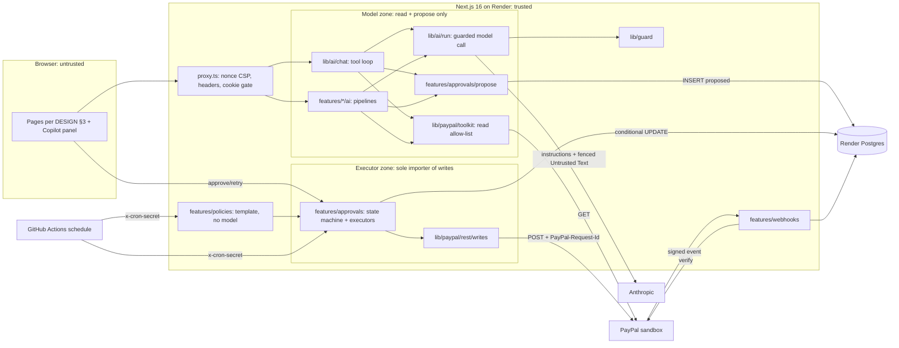
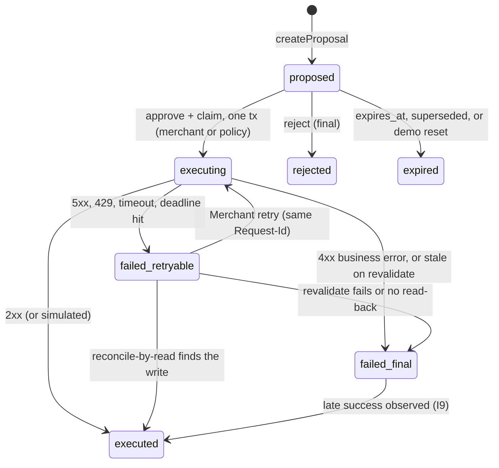

# PLAN: Steward

Build plan for Steward, an ops copilot for one small PayPal Merchant. Inputs: `REQUIREMENTS.md` (FR/NFR/SC; NG4 amended), `ASSUMPTIONS.md` (A-*, D-1..D-10), `CONTEXT.md` (terms used exactly), ADR 0001/0002, and the binding rulings in `docs/PLAN-DECISIONS-R1.md` (R1–R15).
**Ownership (R1).** `docs/AI-QUALITY.md` owns models, routing, prompts, Untrusted Text format, evidence-ref grammar, eval commands, budgets and CI eval policy. `docs/DESIGN.md` owns routes, pages, copy and tokens. This plan owns architecture, data model, invariants, slices, CI/CD and probes, and references the others by section.
Dates: today 2026-10-03; v0.5 tag Nov 6 (A-14); feature freeze Nov 8; submit Nov 11; deadline Nov 12 12:00 PT.

## 1. Live environment facts

| # | Fact | Source / status | Design consequence |
|---|---|---|---|
| F1 | `@paypal/agent-toolkit@1.11.0` depends on `ai@4` + `zod@3`; its 47 tools adapt to AI SDK 7 via `tool({ description, inputSchema: zodSchema(t.parameters), execute })` | **Probed** (spike branch `spike/toolkit-adapter`, `0b9a003`) | `lib/paypal/toolkit` adapter; nested `ai@4` stays server-only (client-bundle grep in CI) |
| F2 | Toolkit `execute` returns a JSON string and never throws | Probed (spike) | Adapter zod-parses and maps error payloads to a typed `ToolError` |
| F3 | `accept_dispute_claim` is enabled by config key `disputes.create` | Probed (spike) | Allow-list by **tool name**; snapshot test pins the registered set |
| F4 | Not in toolkit: provide-evidence (multipart `input` JSON + optional `evidence-file`), verify-webhook-signature, sandbox-only `/adjudicate` and `/require-evidence` (Dispute must be `UNDER_REVIEW`) | Probed (spike) + PayPal docs | Own REST client; simulators importable only from `scripts/` |
| F5 | Sandbox Disputes are filed only by a sandbox buyer in the Resolution Center, on a PayPal-wallet payment | Probed (spike) | Runbook §8; labeled simulated Disputes (FR-3.6); timeline per R11 |
| F6 | Card-funded Orders (`intent: CAPTURE`, `payment_source.card`) capture via API with no buyer approval | Probed (spike) | Seed and reset top-up create Orders, Refunds and Transactions unattended |
| F7 | Transaction Search: 31-day max window; up to 3 h lag | PayPal docs (verified 2026-10-03) | 31-day chunks; lag note in UI; seed ≥ 3 h before recording |
| F8 | verify-webhook-signature rejects the webhook simulator's mock events | PayPal/Hookdeck docs (verified) | SC-8 proved with MSW; live check uses real events (P0-9) |
| F9 | AI SDK 7 GA: `system` → `instructions`; step cap is `stopWhen: isStepCount(n)`; `onFinish` → `onEnd`; built-in `needsApproval` | Vercel docs; AI-QUALITY header (`ai@7.0.127`) | API names used as stated; `needsApproval` rejected (T3) |
| F10 | `claude-sonnet-5-5` / `claude-opus-5-5` return 400 on non-default `temperature`, prefill or forced `tool_choice` | AI-QUALITY header | No temperature anywhere except the Haiku classify call |
| F11 | Next.js 16 renames middleware to `proxy.ts` (Node runtime); nonce CSP requires dynamic rendering | Next 16.2 docs (verified) | `src/proxy.ts`; all app pages dynamic |
| F12 | AG Grid v36; Enterprise via per-module registration; sparklines/charts need AG Charts | AG Grid docs (verified) | Register only used modules; grid lazy-loaded (§10) |
| F13 | Render free Postgres expires after 30 days; free web sleeps after 15 min | Render docs (verified) | D-10: Postgres `basic-256mb` from slice 1, web `starter` from v0.5 |
| F14 | Model prices | AI-QUALITY §6 (verified against Anthropic pricing docs 2026-10-03) | Versioned price table in config; this plan does not restate it |

**Probes.** Credential-free probes run in session 0.1a. Credentialed probes run when the project owner's `.env` exists (expected 0.1b, R13); `scripts/probe.ts` prints a redacted report and its findings are **appended to this section** before dependent code is written. Every probe has a pre-decided branch.

| Probe | Check | Branch if it fails |
|---|---|---|
| P0-1 PayPal scope (cred) | Token `scope` lists invoicing, disputes, reporting, payments; one GET each on invoices, disputes, transactions | Enable the feature in the sandbox app; if Transaction Search stays off, `/risk` uses seeded Orders/Refunds, labeled (C6) |
| P0-2 Models (cred) | `GET /v1/models` lists the IDs in AI-QUALITY §6; one minimal call each; record usage fields and TTFT | Substitute per AI-QUALITY §6 fallbacks; config change only |
| P0-3 Request-Id replay + read-back (cred) | Same `PayPal-Request-Id` twice on remind, refund, accept-claim **and provide-evidence**; for each, find the read-back signal (Invoice reminder metadata, capture refunds by `custom_id`, Dispute status/evidence list) | `requestIdReplaySafe=false` disables auto-retry for that kind; no read-back signal -> unknown outcomes resolve to `failed_final` with "check PayPal" (I7) |
| P0-4 Invoice backdating (cred) | Send an Invoice with `invoice_date` 40 d ago, due 25 d ago | Seed uses earliest allowed due dates (Oct 5–15) so Invoices become overdue for real |
| P0-5 Local tools (free) | `node -v` 24.x, `pnpm -v` ≥ 10, `docker compose version`, `pnpm exec playwright install chromium firefox webkit` | Corepack/nvm; no Docker -> `DATABASE_URL` to a Render dev DB |
| P0-6 Render (free) | Blueprint validates; `NODE_VERSION=24`; `autoDeployTrigger: checksPass` accepted | `autoDeploy: true` + branch protection requiring CI |
| P0-7 Sandbox Dispute lifecycle (cred, from the Oct 6 probe Dispute) | Initial status, seller-response window length, whether it auto-closes or escalates, effect of `/require-evidence` | Window < 10 days or auto-close -> demo Disputes filed Nov 5 (not Nov 3) and the recording may use SIM Disputes, labeled |
| P0-8 MSW interception (free) | MSW `setupServer` inside a Next 16 server process intercepts (a) server `fetch` and (b) the toolkit's HTTP client | Fail -> E2E mocks at the `ReadPort` seam (fixture adapter behind `callRead`) instead of HTTP; T8 changes, nothing else |
| P0-9 Webhook delivery (cred, needs Render URL) | Does `record-payment` emit `INVOICING.INVOICE.PAID`; does an API refund emit `PAYMENT.CAPTURE.REFUNDED`? | No delivery -> paid-Invoice expiry relies on `revalidate` (I5); live webhook demo uses the refund event |

**Credentials (verify commands in ASSUMPTIONS §1; the agency never enters any).**

| Service | Credential -> env / secret | Exact scope | Needed from | Verify |
|---|---|---|---|---|
| PayPal sandbox app | `PAYPAL_CLIENT_ID`, `PAYPAL_CLIENT_SECRET` | Invoicing (read, send, remind, record payment), Orders/Payments (create, capture, refund), Disputes (read, provide-evidence, accept-claim), Transaction Search, Webhooks | 0.1b (0.1a uses placeholders) | P0-1 |
| PayPal webhook | `PAYPAL_WEBHOOK_ID` | Events in §2 webhook row | 0.5a | P0-9 |
| PayPal sandbox logins | Business + 2 personal (project owner only, never in env) | Wallet payment, file Dispute | 0.1b | sandbox.paypal.com login |
| Anthropic | `ANTHROPIC_API_KEY` (local, Render env group, Actions secret) | Messages API on AI-QUALITY §6 models; console spend limit ≤ A-9 | 0.1c | P0-2 |
| GitHub | `gh` with `repo` scope; Actions secrets `ANTHROPIC_API_KEY`, `CRON_SECRET`, `STEWARD_URL`, `DEMO_PASSCODE` | Public repo, push, secrets, scheduled workflows | 0.1a (go-ahead) | `gh auth status` |
| Render | Dashboard connected to GitHub | Blueprint: web, Postgres, env group (no cron service, R6) | 0.1a (go-ahead) | P0-6 |
| AG Grid | `NEXT_PUBLIC_AG_GRID_LICENSE_KEY` (public, domain-locked) | Enterprise modules | decision **Oct 20** (R10) | No watermark on Render URL |

No media pipeline is built (the video is the project owner's, D-8), so no codec probe applies.

## 2. Architecture



**Trust boundaries.** (1) Browser -> server: passcode cookie, CSRF on every state change, zod on every body. (2) Model zone -> executor zone: the only crossing is a `proposals` row; ESLint `no-restricted-imports` + a module-graph test forbid `lib/paypal/rest/writes` outside `features/approvals/executors/**`. (3) Server -> PayPal/Anthropic: secrets server-only; every Untrusted Text value is normalized and fenced per AI-QUALITY §3. (4) PayPal -> server: nothing trusted before verify-webhook-signature returns `SUCCESS`. (5) GitHub Actions -> server: scheduled calls carry `x-cron-secret` (timing-safe compare), can only run reconcile/expire/policies, never approve agent Proposals.

**Data flows**

| Flow | Steps |
|---|---|
| Chat turn (FR-1.4) | `POST /api/chat` -> session + rate limit -> `streamText` (`instructions`, read tools + propose tools, `stopWhen: [isStepCount(8), budgetExhausted]`) -> **each step** is reserved by `lib/guard` before it runs (`budgetExhausted` reserves the next step and stops the loop if the cap would be crossed) -> read results recorded in the Run Ledger and returned fenced -> per-step usage settles `ai_runs` |
| Pipeline run (FR-2.1/2.2, 3.2/3.3, 4.2, 5.2; R7) | Explicit route (`POST /api/invoices/chase`, `/api/disputes/:id/assess`, `/api/risk/explain`, `/api/brief/refresh`) -> code fetches by ID via `callRead` and builds the Context Bundle (AI-QUALITY §2.1) -> code computes ranking, amounts, deadlines, risk level -> `lib/ai/run` reserves -> **one** structured-output call, no tools -> validators (refs, placeholders, output checks) -> `createProposal` or cache line; streams `data-step` parts to the UI |
| Proposal creation | Refs must resolve in the Run Ledger (SC-6) -> `resolveTarget` re-fetches the PayPal record and derives target, `subject_ref`, recipient, amount, currency (NFR-S4; refunds from `basis` + `line_item_refs`, R5) -> insert `proposed` + Audit Entry in one tx; a hit on the open-work index (R4) returns "already has open work" |
| Approve -> Execute (R3) | `POST /api/proposals/:id/approve` (session, CSRF, Origin, rate limit) -> **one tx**: `UPDATE proposals SET status='executing' WHERE id=$1 AND status='proposed' RETURNING` + insert `approvals` + insert `executions` + Audit Entry -> `revalidate` -> write with `PayPal-Request-Id = stw_<proposalId>` (20 s per request, ≤ 60 s total) -> tx: `executed` / `failed_retryable` / `failed_final` + Audit Entry. Zero rows updated = no-op returning current status |
| Retry / reconcile (R2) | `POST /api/proposals/:id/retry`: `failed_retryable -> executing`, same Request-Id. `reconcileStuck` (executing > 5 min, or any `failed_retryable` with an unknown outcome): **reconcile-by-read** GETs the target and sets `executed` or keeps `failed_retryable`; runs lazily on `/queue` load and every 30 min from `cron-tick.yml` -> `POST /api/cron/tick` |
| Webhook ingest (FR-5.1) | Subscribed: `INVOICING.INVOICE.PAID`, `INVOICING.INVOICE.CANCELLED`, `CUSTOMER.DISPUTE.CREATED/UPDATED/RESOLVED`, `PAYMENT.CAPTURE.REFUNDED`. Raw body -> verify (`PAYPAL_WEBHOOK_ID`) -> non-`SUCCESS` = 400, zero writes -> `INSERT webhook_events ON CONFLICT (event_id) DO NOTHING` -> handler upserts `attention_items`, expires superseded Proposals, or records a late success (I9) -> 200. No model call, no Execution |
| Standing Policy (D-3, R6) | Lazily on `/queue` or `/` load (if enabled, at most once per 10 min) and via `POST /api/policies/run` from `cron-tick.yml` -> deterministic selection with caps -> **template reminder, no model, no Untrusted Text** -> `createProposal(created_by='policy')` -> approve as `PolicyActor` (same one-tx claim) -> executor. An open-work index hit skips the Invoice and increments `policy_runs.skipped` |

**Routes.** Pages per DESIGN §3 (R9): `/enter`, `/` (Brief), `/queue`, `/invoices`, `/disputes`, `/risk`, `/audit`, `/policies`, `/settings`. API: `chat`, `session`, `invoices/chase`, `disputes/[id]/assess`, `risk/explain`, `brief/refresh`, `proposals/[id]/{approve,reject,retry}`, `webhooks/paypal`, `policies/run`, `cron/tick`, `demo/reset`, `health`. Risk Flags are **Attention Items, not Proposals**; `/queue` lists Proposals only. `DISPUTE_SOURCE` (`live|simulated|mixed`) is env-only; `/settings` shows it read-only.

## 3. Tech choices

| # | Choice | Trade-off accepted | Alternative rejected, why |
|---|---|---|---|
| T1 | TypeScript, Next.js 16 App Router, one Render web service | One deploy unit, shared types | Repo default Python/LangGraph: stack fixed (REQUIREMENTS §7); toolkit, AG Grid and streaming UI are TS-native |
| T2 | Pipelines (one structured call) for desk/chaser/risk/Brief; one AI SDK 7 tool loop for chat only (R7) | Two shapes to test | All-agent loop: more steps, cost, nondeterminism and injection surface. LangGraph JS: no multi-node graph needed; durable state is the Proposal queue |
| T3 | Own `proposals` table + separate approve route | More code than a flag | AI SDK 7 `needsApproval`: the write tool would stay in the model's tool set with model-chosen args (ADR 0002, NFR-S1/S4); approvals must outlive the chat (queue, webhooks, policies) |
| T4 | Toolkit for model **and** UI reads via one `callRead` (ADR 0001) | Two token caches (toolkit + REST) | Re-implementing reads in our REST client: two shapes to mock and drift |
| T5 | Drizzle + `pg` on Render Postgres | Hand-written SQL for the conditional UPDATEs | Prisma: heavier, weaker raw SQL. Snowflake/dbt/Databricks/Tableau/Sigma: OLTP with hundreds of rows, no warehouse need |
| T6 | Rate limits and spend counters in Postgres | Extra writes per request | Redis/Upstash: another credential for one instance |
| T7 | Real Postgres in tests (Docker locally, CI service) | Docker needed | PGlite: one connection, cannot prove concurrent approve (SC-2) |
| T8 | MSW in unit/integration; same handlers injected into the Next server for E2E via `NODE_OPTIONS=--import test/msw/register.mjs` (`STEWARD_E2E=1`) | Mock drift, mitigated by recorded-response contract tests | Toolkit base URL is not overridable. Fallback per P0-8 |
| T9 | Models and routing per **AI-QUALITY §6**; Opus only for dispute assessment (NFR-C2); no model for policy reminders (R6) | Routing changes need eval re-runs | Single model everywhere: either too costly (Opus) or too weak (Haiku) |
| T10 | Passcode cookie session | Shared secret, not identity (NG2) | Auth.js/OAuth: identity is a non-goal |
| T11 | Scheduled work from GitHub Actions calling secret-protected routes, plus lazy runs on page load (R6) | Actions schedules can lag minutes | Render cron service: extra paid service and second deploy unit |

## 4. Module design (deep modules, small interfaces)

Seams exist only where two adapters exist: **PayPal HTTP** (sandbox vs MSW), **dispute source** (live vs simulated), **dispute writer** (REST vs simulated), **language model** (Anthropic vs scripted mock for E2E/CI). Everything else is concrete.

| Module | Interface | Invariants | Test seam |
|---|---|---|---|
| `lib/env` | `env` (parsed once, `server-only`); `parseEnv(raw)` | `PAYPAL_ENV` = `z.literal('sandbox')` (NG1); boot fails on missing vars (placeholder strings allowed, so a credential-free deploy boots and shows DESIGN's "Couldn't reach PayPal" state); `AI_PROVIDER=mock` rejected when `RENDER` is set; no secret under `NEXT_PUBLIC_` | Pure unit |
| `lib/paypal/rest` | `paypalFetch<T>({method, path, body?, multipart?, requestId?, schema, timeoutMs=20000})`; `PayPalError{kind: auth\|validation\|not_found\|conflict\|rate_limited\|server\|network\|timeout, status, debugId, retryable}`. `writes.ts`: `sendInvoiceReminder`, `provideDisputeEvidence`, `acceptDisputeClaim`, `refundCapture(captureId, amount, rid)`. `seed-writes.ts`: create+capture card Orders only. `webhooks.ts`, `sandbox.ts` | Token cached to `expires_in - 60 s`, single-flight, one retry on 401; retries only 429/5xx/network/timeout, max 3, jittered backoff, `Retry-After`; whole call ≤ 60 s; same Request-Id on every retry; base URL hard-coded sandbox; redacted logs. Import rules: `writes.ts` only from `features/approvals/executors/**`; `seed-writes.ts` only from `features/demo/**` + `scripts/**`; `sandbox.ts` only from `scripts/**` | MSW per endpoint; recorded-response contract tests |
| `lib/paypal/toolkit` | `callRead<T>(name, args, schema): Result<T, ToolError>`; `getReadTools(ledger): ToolSet` | `READ_TOOL_ALLOWLIST` = `list_invoices`, `get_invoice`, `search_invoicing`, `get_order`, `list_disputes`, `get_dispute`, `list_transactions`, `get_refund`, `get_shipment_tracking` (verified against spike `getTools()` on 1.11.0); configured read-only **and** name-filtered; results zod-validated, recorded in the ledger, fenced | Snapshot: registered names = allow-list; MSW |
| `lib/untrusted` | `normalize(text, field)`, `fence(text, meta): FencedText` (branded) | Implements AI-QUALITY §3 exactly (normalization, per-field limits, nonce fence); prompt builders accept Untrusted Text only as `FencedText` | fast-check property tests |
| `lib/ai/ledger` | `createRunLedger(runId)`: `record(ref, value)`, `resolve(ref)` | Ref grammar per AI-QUALITY §2.4; resolves only records fetched in this run (SC-6) | Unit |
| `lib/ai/run` | `guardedGenerate(opts)`, `guardedStream(opts)`, `budgetExhausted` stop condition | **Only** module importing `generateText`/`streamText` and the provider (ESLint), so every model call is reserved and settled (R7). No `temperature` except the Haiku classify purpose (F10) | Mock model; guard integration |
| `lib/ai/chat` | `runChatTurn({messages, session}): Response` | `instructions` per AI-QUALITY §2.2; `stopWhen: [isStepCount(8), budgetExhausted]`; ≤ 3 propose calls per turn | Scripted mock model |
| `lib/guard` | `rateLimit(key, limit, windowSec)`; `reserve({sessionId, purpose, model, estInputTokens, maxOutputTokens}): Reservation \| CapExceeded`; `settle(res, usage)` | Reservation **per model call (per step)** = uncached input estimate (chars/4 × 1.2 over instructions + tools + messages) + max output, at list price; serialized by `SELECT … FOR UPDATE` on the single `spend_days` row for today (UTC) plus the session row; fails closed on DB error; caps per A-9 / AI-QUALITY §6 | Integration with 20 parallel reservations at the ceiling |
| `lib/auth` | `login`, `requireSession`, `verifyCsrf`, `verifyCronSecret` | Timing-safe compares; login 5/IP/10 min; cookie `HttpOnly; Secure; SameSite=Lax`; CSRF header bound to session + `Origin` check | Route integration |
| `features/approvals` | `schema.ts` (Proposal zod schemas, R14); `createProposal`, `approve(id, actor, edits?)`, `reject`, `retry`, `listQueue`, `expireDue(now)`, `reconcileStuck(now)`; `propose.ts`: `proposeTool(kind, ctx)`; `EXECUTORS[kind] = {editableSchema, revalidate, execute, readBack, requestIdReplaySafe}` | §5 I1–I10. Edits: draft text; refunds also amount (≤ refundable remainder), stored in `approvals.edited_fields` (R5) | Executor adapters; real Postgres; child-process kill test |
| `features/invoices` | `rankOverdue(invoices, history, now)` (pure, reason template); `ai/chase.ts` pipeline; `resolveReminderTarget` | Only Overdue Invoices; recipient and amount from the fetched Invoice; one call per Invoice (AI-QUALITY §2.1) | Pure + MSW + mock model |
| `features/disputes` | `DisputeSource {list, get}`: `liveSource`, `simulatedSource`; `evidencePlan(reason)`; `ai/assess.ts` (classify + assess) | `SIM-` IDs and `source:'simulated'` end to end (badge, Audit Entry, Execution `simulated=true`); simulated deadlines are offsets from load time | Two sources, two writers; golden set |
| `features/refunds` | `resolveRefundTarget(captureId, basis, lineItemRefs)` -> amount by code | Amount from captured line items/shipping; ≤ remainder; currency = capture's; open Dispute on the capture -> reject | MSW |
| `features/risk` | `computeFlags(txns, disputes, now)` (pure) -> `attention_items` kind `risk_flag`; `ai/explain.ts` | Explanation cites only the flag's Transaction IDs; never "fraud" | Pure + citation validator |
| `features/brief` | `briefSnapshot(epoch)` (DB-only, deterministic); `refreshAttention()` (code-only PayPal scan); `ai/lines.ts` | R8: first paint renders from DB cache with no PayPal or model call; after paint the client triggers `refreshAttention` when `refreshed_at` is older than 10 min, and "Refresh brief" re-runs it plus the model lines (cached per epoch, streamed in) | Pure ordering |
| `features/webhooks` | `ingest(headers, rawBody)` | Flow row; no model call, no Execution | SC-8 table tests |
| `features/policies` | `runPolicies(trigger: 'lazy'\|'manual'\|'cron')` | Off by default; reminders only (DB CHECK); template only; caps before any Proposal | Integration |
| `features/demo` | `resetDemo(actor)` | R12: bump epoch, expire old open Proposals, top up N unrefunded card Orders via `seed-writes.ts`; deletes nothing | Integration + MSW |
| `db` | `schema.ts`, SQL migrations, pool (max 5) | §5 constraints live in migrations | Migrations in every test DB |

## 5. Data model and Proposal state machine

| Table | Key columns | Constraints that matter |
|---|---|---|
| `proposals` | `id uuid`, `epoch`, `kind` (`invoice_reminder\|dispute_contest\|dispute_accept\|refund`), `status`, `payload jsonb`, `rationale`, `risk_level`, `evidence_refs jsonb`, `target_ref`, `subject_ref`, `amount_minor`, `currency`, `idempotency_key`, `created_by` (agent\|policy), `run_id`, `supersedes_id`, `expires_at`, `stale_reason` | `idempotency_key = 'stw_' \|\| id` (generated column) and `UNIQUE`; `UNIQUE(id, kind)`; `CHECK jsonb_array_length(evidence_refs) >= 1` (SC-6); **open-work index (R4):** `UNIQUE (epoch, subject_ref) WHERE status IN ('proposed','executing','failed_retryable')` |
| `approvals` | `id`, `proposal_id`, `proposal_kind`, `actor_type` (merchant\|policy), `actor_id`, `edited_fields jsonb` | `UNIQUE(proposal_id)`; FK `(proposal_id, proposal_kind)`; `CHECK (actor_type='merchant' OR proposal_kind='invoice_reminder')` (amended NG4, D-3) |
| `executions` | `id`, `proposal_id`, `approval_id NOT NULL`, `request_id`, `status` (pending\|succeeded\|failed_retryable\|failed_final), `attempts`, `http_status`, `paypal_debug_id`, `paypal_ref`, `response_digest` (redacted), `simulated`, `late_success_at` | `UNIQUE(proposal_id)`, `UNIQUE(request_id)`; FK to `approvals` (SC-1) |
| `audit_entries` | `id bigserial`, `epoch`, `proposal_id`, `approval_id`, `event`, `actor_type`, `actor_id`, `data jsonb` | UPDATE/DELETE trigger raises; `CHECK (event NOT IN ('execution_started','executed','late_success') OR approval_id IS NOT NULL)` (SC-1) |
| `webhook_events` | `event_id PK`, `event_type`, `resource_id`, `payload`, `verified_at`, `outcome` | PK dedupe (SC-8) |
| `attention_items` | `id`, `epoch`, `kind` (overdue_invoice\|dispute\|risk_flag), `source_ref`, `title`, `amount_minor`, `due_at`, `status`, `cited_refs`, `refreshed_at` | `UNIQUE(epoch, kind, source_ref)`; the Brief's deterministic first paint reads only this table |
| `brief_lines` | `epoch`, `attention_item_id`, `text`, `run_id`, `refreshed_at` | `UNIQUE(epoch, attention_item_id)` |
| `standing_policies` / `policy_runs` | caps (`min_days_overdue`, `max_amount_minor`, `max_per_run`, `max_per_day`, `cooldown_days`) / `trigger`, `created`, `skipped`, `capped` | `CHECK kind='invoice_reminder'`, `CHECK max_per_run BETWEEN 1 AND 5`, `enabled DEFAULT false` |
| `ai_runs` | Fields per AI-QUALITY §6 plus `reserved_usd` | Index `(created_at)` |
| `spend_days` / `sessions` / `rate_limits` / `demo_state` | `day PK, reserved_usd, spent_usd` / hashed id, CSRF hash, `tokens_used` / `(key, window_start) PK` / `epoch` | Single row per UTC day, locked `FOR UPDATE` (D20) |



**Invariants.** **I1** each transition is one conditional `UPDATE … WHERE status = <from> RETURNING`; zero rows = return current state. **I2** approve, claim, approval insert, execution insert and Audit Entry commit in **one** transaction; there is no resting `approved` state (R3). **I3** one Execution row per Proposal; an Execution needs an Approval FK (SC-1). **I4** `PayPal-Request-Id = idempotency_key = stw_<proposalId>` on every attempt and retry (SC-2). **I5** `revalidate` before each attempt: Invoice still unpaid; Dispute still awaiting the seller and before its Response Deadline; refundable remainder ≥ amount **and no open Dispute on the capture** (R4). **I6** per-request timeout 20 s, total attempt deadline 60 s, reconcile threshold 5 min, so a live attempt is never reconciled. **I7** unknown outcome -> reconcile-by-read via `readBack`; auto-retry only when `requestIdReplaySafe` (P0-3). **I8** expiry: reminders 72 h, dispute Proposals at the Response Deadline, refunds 7 d; reset expires old-epoch open Proposals. **I9** a success seen after a `failed_*` (read-back or webhook) sets Execution `succeeded` + `late_success_at`, Proposal `executed`, and writes a `late_success` Audit Entry. **I10** switching Contest to Accept = reject + new Proposal with `supersedes_id`; the open-work index guarantees at most one money-moving write per capture.

## 6. Repo layout

```
src/app/            pages per DESIGN §3; api/ routes per §2 Routes
src/proxy.ts        nonce CSP, headers, signed-cookie gate (no DB)
src/features/       approvals/{schema.ts,propose.ts,state.ts,executors/*,ui}, invoices/{ai,ui}, disputes/{ai,sources,fixtures,ui},
                    refunds/, risk/{ai,ui}, brief/{ai,ui}, webhooks/, policies/, demo/
src/lib/            env/, paypal/{rest,toolkit}/, ai/{run,chat,ledger,models}/, untrusted/, guard/, auth/, log/
src/db/             schema.ts, migrations/
scripts/            probe.ts, seed-sandbox.ts, dispute.ts (wallet-order, capture, sim), check-bundle.ts, start.sh (migrate, then next start)
evals/              per AI-QUALITY §4
test/               msw/{handlers,register.mjs}, fixtures/recorded/, e2e/*.spec.ts
.github/workflows/  ci.yml, eval-nightly.yml, cron-tick.yml, hosted-smoke.yml
render.yaml  docker-compose.yml (Postgres)  .env.example  .env.ci (dummy values; add !.env.ci to .gitignore)  LICENSE  README.md  DEMO.md
```

## 7. Build plan: vertical slices

Each row is one builder session, finished, tested and pushed in that session. A version is tagged only after all its rows pass in CI and on Render. `@v0.x` E2E specs stay green in later slices. Grid features land with the page that needs them (R10); screens and states per DESIGN §4–§6.

**v0.1 Walking skeleton (tag Oct 10; buffer Oct 9–10)**

| Session | Scope (FR) | Customer sees / demo command | Stubbed | Test seams | Exit (SC) |
|---|---|---|---|---|---|
| 0.1a Oct 4 (credential-free, R13) | P0-5/6/8; scaffold; `lib/env`; `lib/paypal/toolkit` `callRead('list_invoices')` (D18: toolkit read path from day 1); MSW handlers; `lib/auth`; base tables; `proxy.ts`; `render.yaml` (placeholder env); CI incl. `.env.ci` and `!.env.ci` gitignore exception (FR-1.5, 1.6) | `/enter` then `/invoices` grid over MSW data locally: `pnpm dev:mock`; Render URL shows the designed "Couldn't reach PayPal" state | Live PayPal, seed, chat, writes | `parseEnv`, MSW, cookie tests | CI green; Render up; SC-13, SC-15, SC-18 |
| 0.1b Oct 6 (needs `.env`) | Credentialed probes -> §1; `lib/paypal/rest` (OAuth cache, Request-Id, typed errors, backoff) (FR-1.1); `seed-sandbox.ts` + `dispute.ts` (FR-1.2); live Invoice grid (FR-1.3); file the **probe Dispute** (R11) | Live sandbox Invoices in the grid. `pnpm seed && pnpm dev` | Chat, writes | MSW "already exists" paths | 2nd `pnpm seed` creates 0; P0 results recorded |
| 0.1c Oct 8 | `getReadTools`; `lib/untrusted`; `lib/ai/{run,chat,ledger}`; `lib/guard` + `spend_days`; `/api/chat` (FR-1.4, NFR-C1, NFR-O1) | Copilot answers "which invoices are overdue?" with streamed, cited text | Propose tools | Allow-list snapshot; mock-model E2E; 20-way reservation test | SC-9 `@v0.1`, SC-16 caps, SC-10 dry run; **tag v0.1** |

**v0.2 Invoice chaser (tag Oct 17; buffer Oct 16–17)**

| Session | Scope (FR) | Customer sees / demo command | Stubbed | Test seams | Exit (SC) |
|---|---|---|---|---|---|
| 0.2a Oct 11 | Proposal tables + constraints; one-tx approve/claim; reminder executor; `POST /api/invoices/chase` (code rank + one call per Invoice); approve/reject routes; basic `/queue` (FR-2.1, 2.2, 2.3, 2.4) | "Chase overdue" -> Proposals with reasons in `/queue` -> Approve -> reminder visible in PayPal sandbox | Failure paths, edit, audit page | 10 parallel approves; MSW write recorder; import-rule test | **SC-1, SC-2** (reminders), SC-6 validator |
| 0.2b Oct 13 | `failed_retryable`/`failed_final`, `retry` route, timeouts, `reconcileStuck`/`expireDue` (lazy + `cron/tick` + `cron-tick.yml`), late success | Approve during a forced 503 -> "Try again (safe)" -> executed once | Edit, audit page | **Kill test:** child process SIGKILLed while an MSW handler blocks mid-write; reconcile resolves; exactly 1 write | I1–I9 tests green |
| 0.2c Oct 15 | Edit-then-approve; `/audit` (FR-2.5); queue grouping + status bar (R10); batch approve (S, FR-2.6); chat `propose_invoice_reminder` | Edited reminder approved; Audit Log timeline. `pnpm e2e --grep @v0.2` | Disputes | SC-7 checks; chat propose with ledger refs | SC-7 (reminders), SC-9 `@v0.2`; **tag v0.2** |

**v0.3 Dispute desk (tag Oct 26)**

| Session | Scope (FR) | Customer sees / demo command | Stubbed | Test seams | Exit (SC) |
|---|---|---|---|---|---|
| 0.3a Oct 18 | `DisputeSource` live + simulated; `/disputes` grid, Response Deadline countdown, urgency sort; Untrusted Text fence UI; Simulated badge (FR-3.1, 3.5, 3.6) | `DISPUTE_SOURCE=mixed pnpm dev` -> `/disputes` | Assessment, writes | One contract test over both sources | SC-19 |
| 0.3b Oct 20 | `POST /api/disputes/:id/assess`: evidence plan, classify, assess (AI-QUALITY §2.1); master/detail Evidence Packet (R10); **AG Grid key decision** (R10) (FR-3.2, 3.3) | Assess a Dispute -> Evidence Packet with source links, draft, Contest/Accept + confidence + fee trade-off | Dispute writes | `pnpm eval --suite golden` | SC-3, SC-4, SC-6 (disputes) |
| 0.3c Oct 22 | Executors: provide-evidence (multipart), accept-claim, simulated writer; deadline revalidate; subject_ref conflicts (FR-3.4, 3.5) | Approve "Contest" -> PayPal or simulated result in `/audit` | Refunds | **Contest ∥ Accept concurrency test: exactly 1 write**; MSW multipart; `pnpm eval --suite injection` | **SC-5**, SC-1/2 dispute kinds, SC-7 |
| 0.3d Oct 24 | Judge calibration vs **12 human-labeled drafts** (project owner labels them by Oct 23; AI-QUALITY §4.3); chat dispute propose tools; `pnpm eval --suite full` (≤ $10) | Eval summary committed (`evals/results/latest-summary.json`) | Refunds | Judge agreement ≥ 80% | Full pass (R14 gate); `@v0.3`; **tag v0.3** |

**v0.4 Refunds and risk (tag Nov 1; buffer Oct 31–Nov 1)**

| Session | Scope (FR) | Customer sees / demo command | Stubbed | Test seams | Exit (SC) |
|---|---|---|---|---|---|
| 0.4a Oct 27 | `/risk` via `list_transactions` (31-day chunks); `computeFlags` -> Attention Items; `POST /api/risk/explain`; sparklines (R10) (FR-4.1, 4.2) | Flagged rows with cited explanations | Refund writes | Pure rules, fixed clock; citation validator | SC-6 (Risk Flags) |
| 0.4b Oct 29 | Refund Proposals (`basis` + `line_item_refs`, code amount, Merchant amount edit capped, R5); executor; open-Dispute revalidate; integrated chart "cash at risk by Attention Item type" (Enterprise, R10); history panel (S, FR-4.4) (FR-4.3) | Approve a partial Refund; amount edit recorded in Audit. `pnpm e2e --grep @v0.4` | Webhooks, Brief | Over-refund, open-Dispute, edited-amount cases | SC-1/2 refunds, SC-9 `@v0.4`, full eval pass; **tag v0.4** |

**v0.5 Polish and autonomy (tag Nov 6 per A-14; buffer Nov 7; freeze Nov 8)**

| Session | Scope (FR) | Customer sees / demo command | Stubbed | Test seams | Exit (SC) |
|---|---|---|---|---|---|
| 0.5a Nov 2 | Webhook ingest + handlers (FR-5.1); P0-9; web to `starter` (D-10) | A paid Invoice expires its open reminder; a new Dispute appears in the Brief | Brief | SC-8 table: valid, tampered, replayed, unsigned | **SC-8** |
| 0.5b Nov 3 | Brief (R8), `brief/refresh`; telemetry panel (FR-5.4); reset (R12, FR-5.5) (FR-5.2). Project owner files demo Disputes Nov 3–5 (R11) | Brief paints figures first, lines stream in; Reset starts a fresh round | Policies | Brief LCP check; reset expiry + top-up | SC-16 telemetry |
| 0.5c Nov 4 | Standing Policy (R6): `/policies`, lazy + `policies/run` from `cron-tick.yml`, skip counting | Enable a policy; template reminders sent under caps, visible in `/audit` | none | CHECK: policy can't approve a refund; skip on open-work index | SC-1 with policy actor; **security-auditor sign-off** |
| 0.5d Nov 5 | Polish only (R10): keyboard-complete approval, reduced motion, grid polish (FR-5.3, 5.7) | DEMO.md grid tour | Eval dashboard | Keyboard E2E; snapshots 320/768/1024/1440 | SC-17 inventory verified; NFR-A1 |
| 0.5e Nov 6 | Eval dashboard (S, FR-5.6); Lighthouse, axe, Firefox/Safari; **manual VoiceOver + Safari pass** (SC-14); `hosted-smoke.yml`; full eval pass | `pnpm e2e:hosted` on the Render URL | none | `check-bundle.ts`; axe | SC-11, SC-14, SC-9; **tag v0.5** |

After freeze: Nov 8 `ACCEPTANCE.md` + `solution-verifier` clean-checkout run (SC-10); Nov 9 video (SC-12); Nov 10 launch docs; Nov 11 submit (SC-20).

## 8. Seed and Dispute strategy (all scripts land in 0.1b, R11)

| Fixture | How | Idempotency key |
|---|---|---|
| ~12 wholesale cafés as Invoices: ~4 paid, ~3 due, ~5 overdue; one note with Untrusted Text | Draft -> send; paid via record-payment; overdue per P0-4 branch | Invoice number `EO-INV-0NN`; search first |
| ~20 retail Orders with line items + shipping (refund `basis` needs them); one repeat Customer, one high-value first Order | `intent: CAPTURE` + `payment_source.card` | `PayPal-Request-Id: seed-order-NN` |
| Shipment tracking on ~10 Orders; 3–4 Refunds (one partial, a cluster for "refund spike") | Tracking API; `refundCapture` | Lookup first; `seed-refund-NN` |
| Reset top-up: N fresh unrefunded Orders per epoch (R12) | `seed-writes.ts` | `seed-order-e<epoch>-NN` |

Re-runs create nothing; `pnpm seed --check` writes nothing; the seed refuses to run unless `PAYPAL_ENV=sandbox`.
**Dispute timeline (R11).** Oct 6: one probe Dispute (P0-7). Nov 3–5: 2–3 demo Disputes for the recording, via the runbook: `pnpm dispute wallet-order` (prints buyer approval link) -> buyer approves at sandbox.paypal.com -> `pnpm dispute capture <orderId>` -> buyer files "Item not received" / "Not as described" in the Resolution Center -> `pnpm dispute sim require-evidence <id>` if `UNDER_REVIEW`. **The hosted judging window and the SC-11 smoke use SIM Disputes plus a fresh top-up capture** (stated in DEMO.md).
**Simulated Disputes.** ~6 fixtures shaped like `GET /v1/customer/disputes/{id}` (same zod schema), `SIM-*` IDs linked to real seeded Orders, always badged "Simulated dispute" in text; their Executions make no PayPal call (SC-19).

## 9. Security design (summary; `security-auditor` expands in SECURITY.md)

| Area | Design |
|---|---|
| Trust boundaries | §2 (five boundaries); ESLint import rules + module-graph test |
| Secrets | `.env` gitignored; `.env.example` names only (`DATABASE_URL`, `PAYPAL_*`, `ANTHROPIC_API_KEY`, `DEMO_PASSCODE`, `SESSION_SECRET` ≥ 32 B, `CRON_SECRET`, `NEXT_PUBLIC_AG_GRID_LICENSE_KEY`, caps, `DISPUTE_SOURCE`, `POLICIES_ENABLED`); Render env group `sync: false`; `.env.ci` holds obviously fake values (gitleaks-allowlisted); redacting logger (AI-QUALITY §6 `redact()`); gitleaks full history; client-bundle grep for secret names and `@paypal/agent-toolkit` (SC-15) |
| Webhook verification | Raw body; required `PAYPAL-*` headers; verify with `PAYPAL_WEBHOOK_ID`; anything but `SUCCESS` -> 400, zero writes; dedupe by `event_id` (NFR-S3, SC-8) |
| CSRF | approve/reject/retry/reset/policies (UI) need the session CSRF header + matching `Origin`; `SameSite=Lax` |
| Cron routes | `cron/tick`, `policies/run` (scheduled) need `x-cron-secret`; they cannot approve agent Proposals |
| CSP and headers | `proxy.ts`: `script-src 'self' 'nonce-…' 'strict-dynamic'`; `style-src 'self' 'unsafe-inline'` (AG Grid runtime styles); `connect-src 'self'`; `frame-ancestors 'none'`; `object-src 'none'`; `base-uri 'self'`; HSTS, `nosniff`, `Referrer-Policy`, `Permissions-Policy` (NFR-S6) |
| Passcode, rate limits | Shared passcode (A-10, D-4), timing-safe, 5/IP/10 min; every route 60/IP/min; chat 20/IP/10 min; approve 30/session/min |
| Cost ceiling | Per-step reservation (§4 `lib/guard`); fail closed; AI-QUALITY §6 behavior on cap; Anthropic console limit as outer guard |
| Prompt injection | Structural (ADR 0002): no write tools, code-derived targets and amounts, ledger refs, fencing (AI-QUALITY §3). Policy reminders see no Untrusted Text (R6) |
| Narrow write exceptions | `seed-writes.ts` (create+capture card Orders against our own sandbox merchant) for seed and reset only; never remind, refund or Dispute actions; excluded from the SC-1 write scan by endpoint, reviewed by security-auditor |
| Errors | Short user message + correlation id; server logs carry `debug_id` (NFR-S7) |

## 10. Testing, observability, performance

| Layer | Tooling | Gate |
|---|---|---|
| Unit | Vitest; fast-check for `lib/untrusted` | Coverage ≥ 80% lines/branches on `src/lib/**` and `src/features/**`, **excluding** `**/ui/**`, `src/app/**`, fixtures (thresholds fail CI) |
| Integration | Vitest + MSW + real Postgres + mock model; MSW write recorder checks each Proposal-kind write has an Approval and `stw_<id>` | SC-1, SC-2, SC-8; kill test; Contest ∥ Accept test |
| E2E | Playwright on `next start` + MSW + mock model; Chromium in CI, Firefox/WebKit at 0.5e and pre-tag | `@v0.x` specs; axe 0 serious/critical |
| Evals | Commands, sets, budgets per AI-QUALITY §4 (`pnpm eval --suite smoke\|golden\|injection\|drafts\|full`) | Smoke 8+8 ≤ $1 per PR; full ≤ $10 (R14) before tagging v0.3+ |
| Hosted | `pnpm e2e:hosted`: enter, ask, approve reminder, contest SIM Dispute, approve refund on fresh capture, view audit | SC-11; weekly to Dec 15 |

**Baselines.** SC-3 is reported beside AI-QUALITY's filed-reason baseline (copy `dispute.reason`); SC-4 beside a no-model rule ("Contest when tracking shows delivered, else Accept"), both on the same golden set (AI-QUALITY §4.3 owns scoring).
**Observability (NFR-O1).** pino JSON logs (request id, route, proposal id, PayPal `debug_id`, latency) through `redact()`; `ai_runs` per model call (AI-QUALITY §6); `/api/health` (DB, PayPal token); telemetry panel reads `ai_runs` and `spend_days`.
**Performance (NFR-P1/P2/P3).** LCP is the Brief's deterministic figures rendered from `attention_items` with no PayPal or model call (R8); chat and AG Grid are `next/dynamic` islands. **Budget exception:** the AG Grid + AG Charts chunk loads after first paint and is excluded from initial JS (target ≤ 450 kB gz, measured by `check-bundle.ts`); initial JS < 300 kB gz. Pipelines stream `data-step` parts immediately (AI-QUALITY §2.5).

## 11. CI/CD

| Workflow / job | Trigger | Runs |
|---|---|---|
| `ci.yml`: `lint`, `typecheck`, `test` (`services: postgres:17`), `e2e` (Chromium), `build` (`next build` with `.env.ci` + `check-bundle.ts`), `gitleaks` (`fetch-depth: 0`) | PR, push to `main` | Required checks; actions pinned to SHAs; `concurrency` cancels superseded runs |
| `ci.yml`: `eval-smoke` | PR from this repo when the `ANTHROPIC_API_KEY` secret exists (job-level env flag) | `pnpm eval --suite smoke --budget-usd 1`; gating per AI-QUALITY §4.4 |
| `eval-nightly.yml` | nightly schedule (if `src/lib/ai/**`, `src/features/*/ai/**`, `src/features/approvals/schema.ts` or `evals/**` changed) + `workflow_dispatch` (`full` or `deep`) | `pnpm eval --suite full --budget-usd 10`; summary artifact |
| `cron-tick.yml` | every 30 min | `POST /api/cron/tick` and `POST /api/policies/run` with `x-cron-secret` |
| `hosted-smoke.yml` | weekly + `workflow_dispatch`; skips itself after 2026-12-15 | `pnpm e2e:hosted` against `STEWARD_URL` (SC-11) |

Deploy: `render.yaml` (web, Postgres `basic-256mb`, env group), `autoDeployTrigger: checksPass` on `main` (fallback P0-6). `scripts/start.sh` runs Drizzle migrations, then `next start`. Repo push and production deploy each need the project owner's go-ahead (REQUIREMENTS §7).

## 12. Risks, failure modes and cut list

| ID | Risk / failure mode | Mitigation | Fallback |
|---|---|---|---|
| R1 | Sandbox Disputes slow, auto-closing or impossible | Probe Dispute Oct 6 (P0-7); demo Disputes Nov 3–5 | SIM Disputes, labeled (FR-3.6) |
| R2 | Toolkit renames tools or leaks `ai@4` to the client | Pin 1.11.0; allow-list snapshot; bundle grep | `paypalFetch` behind the same `callRead` |
| R3 | No AG Grid key by Oct 20 | Decision date (R10) | DESIGN's Community fallback becomes the design; SC-17 counts only unwatermarked features |
| R4 | Demo abuse / cost | Passcode, rate limits, per-step reservation, console limit | Rotate passcode; lower ceiling |
| R5 | LLM nondeterminism (5.5 models reject temperature, F10) | Structural containment; structured outputs, validators, 3 eval runs; temperature 0 only on Haiku classify | A failing injection is fixed in code, never only in the prompt |
| R6 | Render sleep / DB expiry in judging window | D-10 paid Postgres; `starter` web through Dec 15; weekly hosted smoke | Project owner extends plan (A-11) |
| R7 | Request-Id not replay-safe on a write kind | One-tx claim is primary; P0-3 flag; reconcile-by-read | `failed_final` with "check PayPal" |
| R8 | State drift between propose and approve | `revalidate` (I5); webhook expiry | "Stale" with the reason |
| R9 | Transaction Search lag or empty | Lag note; seed ≥ 3 h ahead | Seeded data, labeled (C6) |
| R10 | Webhooks don't fire for seed actions | P0-9 | Revalidate covers paid Invoices; SC-8 by MSW |
| R11 | Model outage or invalid IDs | P0-2; AI-QUALITY §6/§7 fallbacks | Grids, queue, approvals, audit and template drafts work without a model |
| R12 | MSW can't intercept the toolkit in Next | P0-8 in 0.1a | `ReadPort` fixture seam for E2E |
| R13 | Session overrun | 16 small sessions; buffer days before each tag and Nov 7 | Cut list |

**Cut list (first to last; Must items never cut):** C0 night theme (R10); C1 eval dashboard (FR-5.6, S); C2 scheduled policy run (keep lazy + Run now); C3 batch approve (FR-2.6, S); C4 refund history panel (FR-4.4, S); C5 integrated chart (keep sparklines); C6 live Transaction Search view (seeded data, labeled); C7 Standing Policies entirely (D-3 scope, not an FR). Never cut: approval gating, exactly-once, conflict index, audit, webhook verification, labeling, caps.
**Non-goals held structurally:** NG1 `PAYPAL_ENV` literal + hard-coded sandbox URL; NG4 (amended) via the `approvals` CHECK; NG5 no mail library; NG2 no user table.

## 13. Revision log

| Round | Date | Change |
|---|---|---|
| 1 | 2026-10-03 | Initial plan: spike facts F1–F6, doc-verified facts, P0-1..6, 15 sessions, credential table. |
| 2 | 2026-10-03 | Critic 67/100. Applied rulings R1–R15. **D1** one-tx approve+claim `proposed→executing` (R3, I2) + child-process kill test (0.2b). **D2** `subject_ref` + epoch-scoped open-work index (R4), Contest ∥ Accept test (0.3c), open-Dispute refund revalidate (I5). **D3** temperature only on Haiku classify (F10); `instructions`, `stopWhen: isStepCount(8)`. **D4** routing -> AI-QUALITY §6 (T9); policy reminders template-only (R6). **D5** pipelines + routes + Pipeline-run flow; `lib/ai/run` is the only model caller (R7). **D6** 20 s/60 s/5 min timeouts (I6), late success (I9), lazy + `cron-tick.yml` reconcile; provide-evidence in P0-3. **D7** `failed_retryable`/`failed_final`, same Request-Id, reconcile-by-read (R2). **D8** reset per R12 (epoch indexes, top-up, SIM smoke). **D9** R6 policy + security-auditor sign-off at 0.5c. **D10** refund `basis` + `line_item_refs`, Merchant amount edit in `edited_fields` (R5). **D11** AI-QUALITY eval commands/budgets, nightly + dispatch job, full pass before v0.3+ tags, judge calibration in 0.3d (R14). **D12** grid features per page, chart in 0.4b, key decision Oct 20, 0.5d polish only, night theme cut, v0.5 tag Nov 6 + buffers (R10). **D13** credential-free 0.1a (R13); P0-7/8/9 added; probe results appended to §1. **D14** Dispute timeline (R11). **D16** Untrusted Text/ref grammar deferred to AI-QUALITY §2.4/§3. **D17** R9 routes; Risk Flags are Attention Items; `DISPUTE_SOURCE` env-only. **D18** toolkit `callRead` in 0.1a; REST client in 0.1b. **D19** Brief template-first LCP (R8). **D20** per-step reservation with input estimate, `spend_days` row `FOR UPDATE`. **D21** `idempotency_key = stw_<id>`; `.env.ci` (+ gitignore exception); coverage excludes UI; weekly hosted smoke to Dec 15; VoiceOver pass in 0.5e; pricing cited to AI-QUALITY §6. Removed the Render cron (T11). Sessions now 16. |
