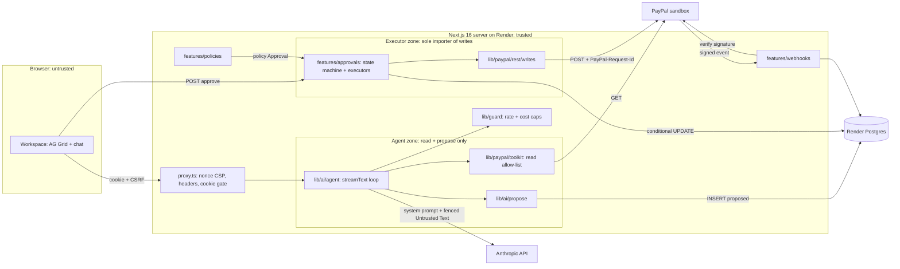
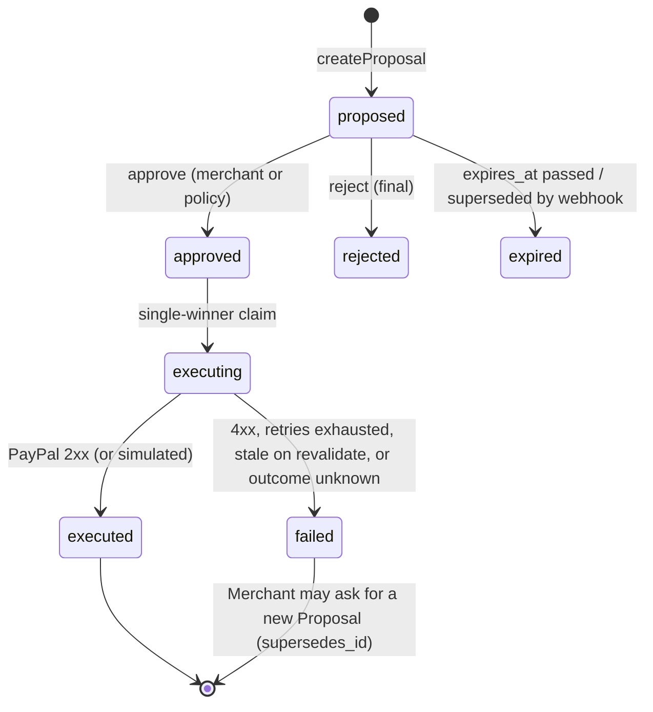

# PLAN: Steward

Build plan for Steward, an ops copilot for one small PayPal Merchant. Inputs: `REQUIREMENTS.md` (FR/NFR/SC IDs), `ASSUMPTIONS.md` (A-*, D-1..D-9), `CONTEXT.md` (glossary; terms used exactly), ADR 0001 (toolkit for reads, own REST for writes) and ADR 0002 (agent never holds write tools).
Companion docs written in parallel, not duplicated here: **`docs/DESIGN.md`** (visual direction, screen states, keyboard model) and **`docs/AI-QUALITY.md`** (prompts, eval sets, guardrails, classification labels).
Dates: today 2026-10-03, feature freeze Nov 8, submit Nov 11, deadline Nov 12 12:00 PT.

## 1. Live environment facts

| # | Fact | Source / status | Design consequence |
|---|---|---|---|
| F1 | `@paypal/agent-toolkit@1.11.0` depends on `ai@4` + `zod@3`; its 47 tools adapt to AI SDK 7 via `tool({ description, inputSchema: zodSchema(t.parameters), execute })` | **Probed** in spike (branch `spike/toolkit-adapter`, commit `0b9a003`) | `lib/paypal/toolkit` adapter; nested `ai@4` must stay server-only (CI client-bundle grep) |
| F2 | Toolkit `execute` returns a JSON **string** and never throws | Probed (spike) | Adapter parses + zod-validates and maps error payloads to a typed `ToolError`; callers never see raw strings |
| F3 | `accept_dispute_claim` is enabled by config key `disputes.create` | Probed (spike) | Allow-list filters by **tool name**, not config key; snapshot test pins the exact registered set |
| F4 | Not in toolkit: `POST /v1/customer/disputes/{id}/provide-evidence` (multipart: `input` JSON part + optional `evidence-file`), `POST /v1/notifications/verify-webhook-signature`, sandbox-only `/adjudicate` and `/require-evidence` (Dispute must be `UNDER_REVIEW`) | Probed (spike) + PayPal docs | Own REST client covers these; simulators live in `lib/paypal/rest/sandbox.ts`, importable only from `scripts/` |
| F5 | Sandbox Disputes can only be filed by a sandbox buyer in the Resolution Center, on a PayPal-wallet payment | Probed (spike) | Manual runbook (§8) + labeled simulated-dispute fixtures (FR-3.6) |
| F6 | Card-funded Orders (`intent: CAPTURE`, `payment_source.card`) capture via API with no buyer approval | Probed (spike) | Seed creates retail Orders, Refunds and Transactions unattended |
| F7 | Transaction Search: max 31-day window; transactions appear up to **3 h** late | PayPal docs (verified today) | Risk grid queries in 31-day chunks; UI states the lag; seed runs ≥ 3 h before any demo/recording |
| F8 | verify-webhook-signature does **not** validate PayPal's webhook-simulator mock events | PayPal/Hookdeck docs (verified today) | SC-8 proved with MSW; live check uses real events triggered by seed actions, not the simulator |
| F9 | AI SDK 7 is GA (v7.0.x); ships built-in tool approval (`needsApproval`) | Vercel docs/changelog (verified today) | Considered and rejected for writes (§3, T3) |
| F10 | Next.js 16 renames `middleware.ts` to `proxy.ts` (Node runtime); nonce CSP needs dynamic rendering | Next 16.2 docs (verified today) | `src/proxy.ts` sets per-request nonce + headers; all app pages are dynamic (behind passcode anyway) |
| F11 | AG Grid is v36.x; Enterprise via `AllEnterpriseModule` or per-module registration; sparklines need the AG Charts module | AG Grid docs (verified today) | Register only used modules; grid lazy-loaded (§10 budget exception) |
| F12 | Render free Postgres **expires 30 days** after creation (+14-day grace); free web services spin down after 15 min (30–60 s cold start); `basic-256mb` Postgres is $6/mo | Render docs (verified today) | Postgres on `basic-256mb` from slice 1 (a free DB made Oct 4 dies Nov 3, mid-v0.5); web `free` during build, `starter` from v0.5 (needs project-owner go-ahead, Q2) |
| F13 | Third-party listings show `claude-sonnet-5-5` $2/$10 and `claude-opus-5-5` $4/$20 per M input/output tokens | Web, unconfirmed | Prices are config constants in `lib/ai/models.ts`; probe P0-2 confirms IDs |

**Not yet probed (this planning session had no shell or credentials).** Probe **P0** is the first 30 minutes of session 0.1a; `scripts/probe.ts` prints a redacted report and its results are appended to this section before any other code. Each probe has a pre-decided branch so a bad result changes config, not the plan.

| Probe | Check (cheap) | If it fails |
|---|---|---|
| P0-1 PayPal scope | client-credentials token; `scope` lists invoicing, disputes, reporting (Transaction Search), payments; one GET each on invoices, disputes, transactions | Enable the feature in the sandbox app settings (ASSUMPTIONS §1); if Transaction Search stays off, v0.4 reads captures/refunds from seeded Orders (cut-list C6) |
| P0-2 Models | `GET /v1/models`; one 10-token call each to sonnet-5-5, opus-5-5, haiku-4-5; record usage fields + time-to-first-token | Substitute newest listed Sonnet/Opus in `MODELS`; no code change |
| P0-3 Request-Id replay | Same `PayPal-Request-Id` twice on remind, refund, accept-claim (sandbox, seed data) | Per-kind flag `requestIdReplaySafe=false` disables auto-retry of stuck executions (§5 I7) |
| P0-4 Invoice backdating | Create + send a draft Invoice with `invoice_date` 40 d ago, due 25 d ago | Seed uses earliest allowed due dates (Oct 5–15) so Invoices become overdue for real before recording |
| P0-5 Local tools | `node -v` (24.x), `pnpm -v` (≥ 10), `docker compose version`, `pnpm exec playwright install chromium firefox webkit` | Use `nvm`/Corepack; if Docker is absent, point `DATABASE_URL` at a Render dev DB |
| P0-6 Render | Blueprint validates; Node 24 via `NODE_VERSION`; `autoDeployTrigger: checksPass` accepted | Fall back to `autoDeploy: true` + branch protection requiring CI |

**Credentials (full verify commands in ASSUMPTIONS §1; none is entered by the agency).**

| Service | Credential -> env / secret | Exact scope | Needed from | Verify now |
|---|---|---|---|---|
| PayPal sandbox app | `PAYPAL_CLIENT_ID`, `PAYPAL_CLIENT_SECRET` | Invoicing (read, send, remind, record payment), Orders/Payments (create, capture, refund), Disputes (read, provide-evidence, accept-claim), Transaction Search (read), Webhooks | 0.1a | P0-1 |
| PayPal webhook | `PAYPAL_WEBHOOK_ID` (one per environment) | Subscribed events listed in §2 webhook flow | 0.5a | Dev portal shows the Render URL; a seed refund produces a delivery |
| PayPal sandbox accounts | Business + 2 personal logins (project owner only, never in env) | Buyer can pay with wallet and file a Dispute | 0.1b runbook | Log in at sandbox.paypal.com |
| Anthropic | `ANTHROPIC_API_KEY` (local, Render env group, GitHub Actions secret for `eval-subset`) | Messages API on the three model IDs; console spend limit ≤ A-9 budget | 0.1c | P0-2 |
| GitHub | `gh` login with `repo` scope | Create public repo, push, set Actions secrets | 0.1a (go-ahead) | `gh auth status` |
| Render | Dashboard account connected to GitHub (no API key needed) | Create Blueprint: web, Postgres, cron, env group | 0.1a (go-ahead) | P0-6 |
| AG Grid | `NEXT_PUBLIC_AG_GRID_LICENSE_KEY` (public by design, domain-locked) | Enterprise modules | optional, before 0.5d | Watermark absent on Render URL |

No media pipeline is built (the video is recorded by the project owner, D-8), so no codec probe applies.

## 2. Architecture



**Trust boundaries.** (1) Browser to server: passcode session cookie, CSRF token on every state change, zod on every body. (2) Agent zone to executor zone: the only crossing is a row in `proposals`; nothing in the agent zone can import `lib/paypal/rest/writes` (ESLint `no-restricted-imports` + a test). (3) Server to PayPal/Anthropic: secrets only server-side; all PayPal and Customer text that enters a prompt is Untrusted Text, fenced by `lib/untrusted`. (4) PayPal to server (webhooks): nothing is trusted until verify-webhook-signature returns `SUCCESS`.

**Data flows**

| Flow | Steps |
|---|---|
| Chat/agent turn (FR-1.4) | `POST /api/chat` -> `requireSession` + `rateLimit(ip)` -> `reserveSpend` (fails closed) -> `streamText` with read tools + propose tools for enabled kinds, step cap 8 -> each read result recorded in the run's `RunLedger` and returned fenced -> stream to UI -> `settleSpend` writes `ai_runs` |
| Proposal creation (FR-2.2, 3.3, 4.3) | Model calls `propose_<kind>` with IDs + draft text + evidence refs -> refs must resolve in this run's `RunLedger` (SC-6) -> `resolveTarget` re-fetches the PayPal record and **derives** target, recipient, amount, currency from it (NFR-S4) -> `createProposal` inserts `proposed` + Audit Entry in one transaction -> model receives `{proposalId}` only |
| Approval -> Execution (FR-2.3/2.4, NFR-S1/S2) | `POST /api/proposals/:id/approve` (session, CSRF, Origin, rate limit) -> tx1: `UPDATE ... SET status='approved' WHERE id=$1 AND status='proposed'` + insert `approvals` + Audit Entry -> tx2: `UPDATE ... SET status='executing' WHERE status='approved' RETURNING` (single winner) + insert `executions` -> executor `revalidate` against fresh PayPal record -> write with `PayPal-Request-Id = stw_<proposalId>` -> tx3: `executed`/`failed` + Audit Entry. Losers and repeats read and return current status (no-op) |
| Webhook ingest (FR-5.1) | Subscribed: `INVOICING.INVOICE.PAID`, `INVOICING.INVOICE.CANCELLED`, `CUSTOMER.DISPUTE.CREATED`, `CUSTOMER.DISPUTE.UPDATED`, `CUSTOMER.DISPUTE.RESOLVED`, `PAYMENT.CAPTURE.REFUNDED`. `POST /api/webhooks/paypal` reads raw body -> header presence check -> verify-webhook-signature (env `PAYPAL_WEBHOOK_ID`) -> non-`SUCCESS` = 400, no writes -> `INSERT webhook_events ON CONFLICT (event_id) DO NOTHING` -> if inserted, handler upserts `attention_items` or expires superseded Proposals (paid/cancelled Invoice, resolved Dispute) -> 200. Unknown types are stored and ignored. Never creates an Execution, never calls the model inline |
| Standing Policy run (D-3, v0.5) | "Run now" button or daily Render cron -> `runPolicies` loads enabled policies (kind CHECK = `invoice_reminder`) -> deterministic selection (days overdue, amount ceiling, cooldown, `max_per_run` ≤ 5, daily cap) -> template reminder via Haiku -> `createProposal(created_by='policy')` -> `approve(id, PolicyActor)` -> same executor path -> `policy_runs` row + Audit Entries |

## 3. Tech choices

| # | Choice | Trade-off accepted | Alternative rejected, why |
|---|---|---|---|
| T1 | TypeScript, Next.js 16 App Router, one Render web service | Server and UI share types; one deploy unit | Repo default Python/LangGraph: stack is fixed (REQUIREMENTS §7), toolkit + AG Grid + streaming UI are TS-native; a second Python service doubles deploy and auth surface |
| T2 | AI SDK 7 `streamText` tool loop with a step cap | Agent state is ephemeral; durable state lives in `proposals` | LangGraph JS: the agent is a single tool loop, no multi-node graph; persistence and resumption are already the Proposal queue |
| T3 | Own `proposals` table + separate approve route | More code than a flag | AI SDK 7 `needsApproval`: the write tool would still be in the agent's tool set with model-chosen args (violates ADR 0002, NFR-S1/S4); approvals must also outlive the chat (queue, webhooks, policies) |
| T4 | Toolkit for agent **and** UI reads via one `callRead` | Two OAuth token caches (toolkit + REST) | Duplicating reads in our REST client: two shapes to mock and drift; ADR 0001 keeps the toolkit central |
| T5 | Drizzle + `pg` on Render Postgres | Hand-written SQL for conditional UPDATEs | Prisma: heavier client, weaker raw-SQL ergonomics for the exactly-once claims. Snowflake/dbt/Databricks/Tableau/Sigma (data defaults): this is OLTP with hundreds of rows, no warehouse need |
| T6 | Rate limits and spend counters in Postgres | Extra DB writes per request | Redis/Upstash: another credential and service for a single instance (ASSUMPTIONS §1) |
| T7 | Real Postgres in tests (Docker locally, service container in CI) | Docker needed locally | PGlite: single connection, cannot prove concurrent-approve semantics (SC-2) |
| T8 | MSW for PayPal in unit/integration; same handlers injected into the Next server for E2E via `NODE_OPTIONS=--import test/msw/register.mjs` (`STEWARD_E2E=1` only) | Mock drift risk, mitigated by recorded-fixture contract tests | Overriding toolkit base URL: not exposed by the toolkit |
| T9 | Models: Sonnet 5.5 for chat/Brief/explanations, Opus 5.5 only for dispute drafts (NFR-C2), Haiku 4.5 for dispute-reason classification and policy reminders | Haiku may miss SC-3; switch that one call to Sonnet if eval < 90% | Opus everywhere: blows the $10/day ceiling |
| T10 | Passcode cookie session (HMAC-signed id, row in `sessions`) | Shared secret, not identity (NG2) | Auth.js/OAuth: identity is a non-goal |

## 4. Module design (deep modules, small interfaces)

A seam exists only where two adapters really exist: **PayPal HTTP** (sandbox vs MSW), **dispute source** (live vs simulated fixture), **dispute writer** (REST vs simulated), **language model** (Anthropic vs scripted mock for E2E/CI). Everything else is concrete.

| Module | Interface | Invariants | Test seam |
|---|---|---|---|
| `lib/env` | `env: Env` (parsed once, `server-only`); `parseEnv(raw): Env` | `PAYPAL_ENV` is `z.literal('sandbox')` (NG1 structural); boot fails on any missing/invalid var; `AI_PROVIDER=mock` rejected when `RENDER` is set; no secret has a `NEXT_PUBLIC_` name | `parseEnv` pure unit tests |
| `lib/paypal/rest` | `paypalFetch<T>({method, path, body?, multipart?, requestId?, schema}): Promise<T>`; throws `PayPalError{kind: auth\|validation\|not_found\|conflict\|rate_limited\|server\|network, status, debugId, retryable}`. `writes.ts`: `sendInvoiceReminder(id, note, rid)`, `provideDisputeEvidence(id, evidence, rid)`, `acceptDisputeClaim(id, note, rid)`, `refundCapture(captureId, amount?, rid)`. `webhooks.ts`: `verifyWebhookSignature(headers, rawBody)`. `sandbox.ts`: simulators | Token cached to `expires_in - 60 s`, single-flight refresh, one retry on 401; retries **only** 429/5xx/network, max 3, exponential backoff + jitter, honors `Retry-After`; every retry reuses the same Request-Id; base URL hard-coded to sandbox; `Authorization` and bodies redacted from logs; `writes.ts` importable only from `features/approvals/executors/**` and `scripts/seed-*`, `sandbox.ts` only from `scripts/**` (ESLint) | MSW handlers per endpoint; contract tests replay recorded sandbox responses |
| `lib/paypal/toolkit` | `getReadTools(ledger): ToolSet`; `callRead<T>(name: ReadToolName, args, schema): Promise<Result<T, ToolError>>` | Toolkit configured with read actions only **and** filtered by name against `READ_TOOL_ALLOWLIST` (`list_invoices`, `get_invoice`, `search_invoicing`, `get_order`, `list_disputes`, `get_dispute`, `list_transactions`, `get_refund`, `get_shipment_tracking`; names verified against the spike's `getTools()` output on `@paypal/agent-toolkit@1.11.0`); every result is zod-validated, recorded in the `RunLedger`, and returned to the model fenced | Snapshot test: registered names equal the allow-list exactly; MSW |
| `lib/untrusted` | `fence(text, {source, ref?}): FencedText` (branded); `fenceJson(value, meta): FencedText` | Per-run random boundary token; content can never contain the closing boundary; strips control and bidi characters; NFKC; truncates to 4 000 chars with marker. Prompt builders accept Untrusted Text only as `FencedText` (compile-time) | fast-check property tests |
| `lib/ai/ledger` | `createRunLedger(runId)`: `record(ref, value)`, `resolve(ref): Snapshot \| undefined` | A ref is `{type, id}`; resolves only if fetched in this run (SC-6) | Unit |
| `lib/ai/propose` | `proposeTool<K extends ProposalKind>(kind: K, ctx: {ledger, runId, sessionId}): Tool` | Input schema has IDs, draft text, evidence refs and (refund only) an optional partial amount; no recipient/target/currency fields; rejects when any ref is unresolved or `resolveTarget` fails, returning a model-readable reason; never imports writes | AI SDK mock model drives tool calls; DB real |
| `lib/ai/agent` | `runAgentTurn({messages, session}): Response` (UI message stream) | Model from `MODELS`; prompts from AI-QUALITY.md; temperature 0; step cap 8; Anthropic prompt caching on system + tools | Scripted mock model (`AI_PROVIDER=mock`) |
| `lib/guard` | `rateLimit(key, limit, windowSec)`; `reserveSpend({sessionId, purpose, model, maxOutputTokens}): Reservation \| CapExceeded`; `settleSpend(res, usage)` | Fails closed on DB error; reservation = worst-case cost of the call, so concurrent calls cannot jointly exceed the ceiling and no stream is cut mid-answer; caps from env (A-9: 100k tokens/session, 20 chat req/IP/10 min, $10/day) | Unit + integration on real Postgres |
| `lib/auth` | `login(passcode, ip)`, `requireSession(req): Session`, `verifyCsrf(req, session)` | Timing-safe passcode compare; login limited to 5/IP/10 min; cookie `HttpOnly; Secure; SameSite=Lax`; CSRF = header token bound to session + `Origin` must equal app origin | Route-handler integration tests |
| `features/approvals` | `createProposal(input)`, `approve(id, actor, edits?)`, `reject(id, actor, reason?)`, `listQueue(filter)`, `expireDue(now)`, `reconcileStuck(now)`; `EXECUTORS: {[K in ProposalKind]: Executor<K>}` where `Executor = {payloadSchema, editableSchema, revalidate(payload), execute(payload, requestId): ExecOutcome, requestIdReplaySafe}` | §5 invariants I1–I8; edits may touch only `editableSchema` fields (draft text), never target/amount | Executor adapters (REST vs simulated); concurrency test with real Postgres |
| `features/invoices` | `rankOverdue(invoices, history, now): RankedInvoice[]` (pure, reason codes per factor); `resolveReminderTarget(invoiceId)` | Only Overdue Invoices (unpaid, due date < today); recipient and amount due come from the fetched Invoice | Pure unit + MSW |
| `features/disputes` | `DisputeSource = {list(), get(id)}` with `liveSource` (toolkit) and `fixtureSource`; `buildEvidencePacket(dispute)`; `classifyReason(dispute)`; `draftResponse(packet)`; `recommend(packet, cls)`; `deadlineUrgency(now, deadline)` | Fixture IDs prefixed `SIM-`, carry `source: 'simulated'` end to end (UI badge, Audit Entry, Execution `simulated=true`); fixture Response Deadlines are offsets from load time so countdowns stay live; every Evidence Packet item has a ref; buyer messages fenced | Two sources, two writers; golden set (AI-QUALITY.md) |
| `features/refunds` | `resolveRefundTarget(captureId, amount?)` | Amount ≤ refundable remainder, currency equals capture's | MSW |
| `features/risk` | `computeFlags(txns, disputes, now): RiskFlag[]` (pure, rule id + cited Transaction IDs); `explainFlag(flag)` | Explanation may cite only the flag's Transaction IDs (validator); never says "fraud" (CONTEXT) | Pure unit + citation validator |
| `features/brief` | `buildBrief(now): Brief` | Deterministic order: urgency then money at stake; every line links to an Attention Item or queue row | Pure unit |
| `features/webhooks` | `ingest(headers, rawBody): {status: 200\|400, eventId?}` | See flow table; no model call, no Execution | MSW verify endpoint; SC-8 table tests |
| `features/policies` | `runPolicies(trigger: 'manual'\|'cron'): PolicyRunSummary` | Off by default (`POLICIES_ENABLED=false` and `enabled=false`); reminders only (DB CHECK); caps enforced before any Proposal is made | Integration on real Postgres + MSW |
| `db` | `schema.ts`, SQL migrations, `db` (pg Pool, max 5) | Constraints in §5 live in migrations, not app code only | Migrations run in every test DB |

## 5. Data model and Proposal state machine

| Table | Key columns | Constraints that matter |
|---|---|---|
| `proposals` | `id uuid`, `epoch`, `kind` (`invoice_reminder`\|`dispute_contest`\|`dispute_accept`\|`refund`), `status`, `payload jsonb`, `rationale`, `risk` (low\|medium\|high), `evidence_refs jsonb`, `target_ref`, `amount_minor bigint`, `currency`, `idempotency_key`, `created_by` (agent\|policy), `ai_run_id`, `supersedes_id`, `expires_at`, `stale_reason` | `UNIQUE(idempotency_key)`; `UNIQUE(id, kind)`; `CHECK jsonb_array_length(evidence_refs) >= 1` (SC-6); partial unique `(kind, target_ref) WHERE status IN ('proposed','approved','executing')` (no duplicate open work) |
| `approvals` | `id`, `proposal_id`, `proposal_kind`, `actor_type` (merchant\|policy), `actor_id`, `edited_fields jsonb`, `created_at` | `UNIQUE(proposal_id)`; FK `(proposal_id, proposal_kind) -> proposals(id, kind)`; `CHECK (actor_type='merchant' OR proposal_kind='invoice_reminder')` (D-3, NG4 in the DB) |
| `executions` | `id`, `proposal_id`, `approval_id NOT NULL`, `request_id`, `status` (pending\|succeeded\|failed\|unknown), `http_status`, `paypal_debug_id`, `paypal_ref`, `response_digest jsonb` (redacted), `attempts`, `simulated bool` | `UNIQUE(proposal_id)`, `UNIQUE(request_id)`; FK to `approvals` (SC-1) |
| `audit_entries` | `id bigserial`, `epoch`, `proposal_id`, `approval_id`, `event`, `actor_type` (agent\|merchant\|policy\|system\|webhook), `actor_id`, `data jsonb`, `created_at` | Trigger raises on UPDATE/DELETE (append-only); `CHECK (event NOT IN ('execution_started','executed') OR approval_id IS NOT NULL)` (SC-1) |
| `webhook_events` | `event_id PK`, `event_type`, `resource_id`, `payload jsonb`, `verified_at`, `processed_at`, `outcome` | PK dedupe (SC-8) |
| `attention_items` | `id`, `epoch`, `kind`, `source_ref`, `status`, `from_event_id` | `UNIQUE(epoch, kind, source_ref)` |
| `standing_policies` / `policy_runs` | `kind`, `enabled`, `min_days_overdue`, `max_amount_minor`, `max_per_run`, `max_per_day`, `cooldown_days` / `trigger`, counts, `capped` | `CHECK kind='invoice_reminder'`, `CHECK max_per_run BETWEEN 1 AND 5`, `enabled DEFAULT false` |
| `ai_runs` | `id`, `session_id`, `purpose`, `model`, tokens in/out/cache, `reserved_usd`, `cost_usd`, `latency_ms`, `ttft_ms`, `tool_calls jsonb` (names + refs only), `status` | Index on `(created_at)` for the daily ceiling |
| `sessions` / `rate_limits` / `demo_state` | hashed session id, CSRF hash, `tokens_used` / `(key, window_start) PK`, `count` / `epoch` | Reset demo bumps `epoch`; nothing is deleted, so Audit Entries stay append-only |



Invariants: **I1** every transition is one conditional `UPDATE ... WHERE status = <from> RETURNING`; zero rows means "someone else won", return current state. **I2** at most one Execution per Proposal (`UNIQUE(proposal_id)`). **I3** an Execution cannot exist without an Approval (NOT NULL FK) (SC-1). **I4** `PayPal-Request-Id = stw_<proposalId>`, identical on every retry (SC-2). **I5** `revalidate` re-fetches the target before writing (Invoice still unpaid, Dispute still awaiting seller response and before the Response Deadline, refundable remainder ≥ amount); otherwise `failed(stale)` with no write. **I6** each state change and its Audit Entry commit in one transaction. **I7** `reconcileStuck`: an `executing` row older than 2 min is retried with the same Request-Id only if `requestIdReplaySafe` (P0-3), else marked `failed(unknown)` and the UI tells the Merchant to check PayPal. **I8** expiry: reminders 72 h, dispute Proposals at the Response Deadline, refunds 7 d. Failed and rejected are terminal; at most one Execution, ever (CONTEXT).

## 6. Repo layout

```
src/app/            (routes) login, workspace, queue, disputes, risk, audit, settings; api/{chat,session,proposals/[id]/{approve,reject},webhooks/paypal,policies/run,demo/reset,health}
src/proxy.ts        nonce CSP, security headers, signed-cookie gate (no DB)
src/features/       approvals/{state,executors/*,ui}, invoices/, disputes/{sources,fixtures,ui}, refunds/, risk/, brief/, webhooks/, policies/
src/lib/            env/, paypal/{rest,toolkit}/, ai/{models,agent,propose,ledger}/, untrusted/, guard/, auth/, log/
src/db/             schema.ts, migrations/
scripts/            probe.ts, seed-sandbox.ts, dispute-sim.ts, run-policies.ts, check-bundle.ts, start.sh (migrate then next start)
evals/              runner + sets (contents owned by docs/AI-QUALITY.md)
test/               msw/{handlers,register.mjs}, fixtures/recorded/, e2e/*.spec.ts
render.yaml  .github/workflows/ci.yml  docker-compose.yml (Postgres only)  .env.example  LICENSE  README.md  DEMO.md
```

## 7. Build plan: vertical slices

Each row is one builder session (sized to finish, test and push in one session). A version is tagged only when all its rows pass their exit checks in CI and on Render. Demo E2E specs are tagged `@v0.x` and stay green in every later slice. UI states and visual direction per DESIGN.md.

**v0.1 Walking skeleton (target tag Oct 10)**

| Session | Scope (FR) | Customer sees / demo command | Stubbed | Test seams | Exit (SC) |
|---|---|---|---|---|---|
| 0.1a Oct 4 | P0 probes; scaffold; `lib/env`; `lib/paypal/rest` (token + read); `lib/auth` passcode; `db` (sessions, rate_limits, demo_state); `proxy.ts` headers; `render.yaml` (web free + Postgres basic-256mb); CI jobs lint, typecheck, test, build, gitleaks (FR-1.1, 1.5, 1.6) | Passcode screen, then an Invoice grid (AG Grid Community) of live sandbox Invoices or a designed empty state. `pnpm dev` -> `/`; hosted on the Render URL | Chat, seed, all writes | `parseEnv`, MSW token/list, cookie tests | CI green; Render deploy up; SC-13 (MIT detected), SC-15 (gitleaks 0), SC-18 (Blueprint) |
| 0.1b Oct 6 | `scripts/seed-sandbox.ts` (§8): Invoices, card-captured Orders, Refunds, shipment trackers; idempotent (FR-1.2) | 12 cafés' Invoices in mixed states in the grid. `pnpm seed && pnpm dev` | Disputes (runbook only) | Seed unit tests on fixture builders; MSW "already exists" paths | Second `pnpm seed` creates 0 new records |
| 0.1c Oct 8 | `lib/paypal/toolkit` adapter + allow-list; `lib/untrusted`; `lib/ai/{agent,ledger}`; `/api/chat` streaming; `lib/guard` (IP rate limit, session token cap, daily ceiling); `ai_runs` (FR-1.4, NFR-C1, NFR-O1) | Chat panel: "Which invoices are overdue?" answered from live data with streamed text. `pnpm dev` -> ask | Propose tools (none registered) | Allow-list snapshot; mock-model E2E `@v0.1`; guard tests | SC-9 (`@v0.1` green), SC-16 caps tested, SC-10 dry run by `solution-verifier`; **tag v0.1** |

**v0.2 Invoice chaser (target tag Oct 17)**

| Session | Scope (FR) | Customer sees / demo command | Stubbed | Test seams | Exit (SC) |
|---|---|---|---|---|---|
| 0.2a Oct 12 | `proposals/approvals/executions/audit_entries` + constraints; `features/approvals` state machine; `invoice_reminder` executor; `propose_invoice_reminder`; approve/reject routes with CSRF; queue grid (FR-2.2, 2.3, 2.4) | Ask "chase my overdue invoices" -> Proposals appear in the queue -> Approve -> PayPal sandbox shows the reminder. `pnpm dev` | Ranking (plain due-date order), edit, batch, audit UI | Concurrency test (10 parallel approves), MSW write recorder, import-restriction test | **SC-1, SC-2** for reminders; SC-6 validator |
| 0.2b Oct 15 | `rankOverdue` with stated reasons; tone by Customer history; edit-then-approve (draft text only); Audit Entry view; batch approve (S) (FR-2.1, 2.2, 2.5, 2.6) | Ranked list with "why" per row; edit a draft, approve; audit timeline. `pnpm e2e --grep @v0.2` | Disputes, refunds | Pure ranking tests; SC-7 deterministic checks on drafts | SC-7 (reminders), SC-9 `@v0.2`; **tag v0.2** |

**v0.3 Dispute desk (target tag Oct 26)**

| Session | Scope (FR) | Customer sees / demo command | Stubbed | Test seams | Exit (SC) |
|---|---|---|---|---|---|
| 0.3a Oct 19 | `DisputeSource` live + fixture; fixtures reference real seeded Orders; Disputes grid with Response Deadline countdown, amount, reason, urgency sort; buyer messages shown as text (React-escaped) and fenced for the model; "Simulated" badge (FR-3.1, 3.5, 3.6) | Disputes sorted by deadline; simulated ones clearly labeled. `DISPUTE_SOURCE=mixed pnpm dev` -> `/disputes` | Evidence, drafting, writes | Both sources under one contract test | SC-19 (label visible on every simulated row) |
| 0.3b Oct 21 | `buildEvidencePacket` (Order, tracking, Invoice, history; each with ref); `classifyReason` (Haiku); `draftResponse` (Opus); `recommend` Contest/Accept with confidence + fee trade-off; `propose_dispute_contest` / `propose_dispute_accept` (FR-3.2, 3.3) | Open a Dispute: Evidence Packet with source links, draft, recommendation. `pnpm dev` | Execution of dispute kinds | Golden-set runner (`pnpm eval --set golden`) | SC-3 ≥ 90%, SC-4 ≥ 80%, SC-6 on Disputes |
| 0.3c Oct 24 | Executors: provide-evidence (multipart), accept-claim, simulated writer; revalidate status + deadline; injection set (FR-3.4, 3.5) | Approve "Contest" -> PayPal (or simulated) result in audit. `pnpm e2e --grep @v0.3` | Refunds | MSW multipart assertions; injection runner (3x each) | **SC-5** 100%, SC-1/SC-2 for dispute kinds, SC-7 (responses); **tag v0.3** |

**v0.4 Refunds and risk (target tag Nov 1)**

| Session | Scope (FR) | Customer sees / demo command | Stubbed | Test seams | Exit (SC) |
|---|---|---|---|---|---|
| 0.4a Oct 28 | Transactions grid via `callRead('list_transactions')` in 31-day chunks + lag note; `computeFlags` (refund spike, repeat disputer, high-value first Order); `explainFlag` with citations (FR-4.1, 4.2) | Risk view: flagged rows with a cited explanation. `pnpm dev` -> `/risk` | Refund writes | Pure rule tests with fixed clock; citation validator | SC-6 on Risk Flags |
| 0.4b Oct 30 | `propose_refund` (full/partial), `refund` executor, revalidate remainder; history + dispute exposure panel (S) (FR-4.3, 4.4) | Approve a partial Refund; Transaction appears after PayPal lag. `pnpm e2e --grep @v0.4` | Webhooks, Brief | MSW refund + over-refund case | SC-1/SC-2 refunds, SC-9 `@v0.4`; **tag v0.4** |

**v0.5 Polish and autonomy (target tag Nov 7; freeze Nov 8)**

| Session | Scope (FR) | Customer sees / demo command | Stubbed | Test seams | Exit (SC) |
|---|---|---|---|---|---|
| 0.5a Nov 2 | Webhook route, verify, dedupe, handlers, `attention_items`; Render web to `starter` (go-ahead) (FR-5.1) | A paid Invoice expires its open reminder Proposal; a new Dispute appears as an Attention Item | Brief | SC-8 table: valid, tampered, replayed, unsigned | **SC-8** |
| 0.5b Nov 3 | Brief; cost/token telemetry panel; Reset demo (epoch bump + seed ensure) (FR-5.2, 5.4, 5.5) | Morning Brief linking to queue rows; spend today vs ceiling; Reset button | Policies | Pure Brief ordering; reset integration | SC-16 telemetry visible |
| 0.5c Nov 4 | Standing Policy (reminders only), "Run now", Render cron job (D-3) | Enable a policy, run, see policy-approved reminders with caps in audit | n/a | DB CHECK tests (policy cannot approve a refund) | SC-1 holds with `actor_type=policy` |
| 0.5d Nov 5 | AG Grid depth: row grouping, master/detail Evidence Packet, sparklines, custom AI-status/risk renderers, status bar + set filters; keyboard-complete approval; reduced motion (FR-5.3, 5.7) | Grid tour as in DEMO.md | Eval dashboard | Playwright keyboard path; visual snapshots at 320/768/1024/1440 | SC-17 ≥ 5 features; NFR-A1 keyboard |
| 0.5e Nov 6–7 | Eval dashboard (S); Lighthouse + axe; Firefox/Safari smoke; bundle check; hosted smoke spec (FR-5.6) | `pnpm e2e:hosted` against the Render URL | none | `check-bundle.ts`; axe in Playwright | SC-11, SC-14, SC-9 all; **tag v0.5** |

After freeze: Nov 8 `ACCEPTANCE.md` + `solution-verifier` clean-checkout run (SC-10); Nov 9 video (SC-12, project owner); Nov 10 launch docs; Nov 11 submit (SC-20).

## 8. Seed strategy (`scripts/seed-sandbox.ts`)

| Fixture | How | Idempotency key |
|---|---|---|
| ~12 wholesale cafés (Ember & Oak's Customers) as Invoices: ~4 paid, ~3 due, ~5 overdue (varied amounts, ages 5–45 days, one with Untrusted Text in the note for the injection demo) | Create draft -> send; "paid" via record-payment (external payment); overdue via backdated dates or, if P0-4 fails, near-term due dates that lapse before recording | Invoice number `EO-INV-0NN`; search before create |
| ~20 retail Orders | `intent: CAPTURE` + `payment_source.card` (sandbox test card), one repeat Customer, one high-value first Order (feeds Risk Flags) | `PayPal-Request-Id: seed-order-NN` + `custom_id` |
| Shipment tracking on ~10 Orders | Tracking API with carrier + number | Lookup by capture before add |
| 3–4 Refunds (one partial, a cluster to trigger "refund spike") | `refundCapture` | `PayPal-Request-Id: seed-refund-NN` |

Output: a summary table (created / existing / failed per fixture). Re-runs create nothing new. `pnpm seed --check` verifies without writing. The seed is an operator script, not the agent; it uses `lib/paypal/rest` directly and refuses to run unless `PAYPAL_ENV=sandbox`.

**Manual dispute runbook (project owner, D-6), in DEMO.md:** (1) `pnpm seed:wallet-order` prints an approval link for a PayPal-wallet Order; (2) log into sandbox.paypal.com as the sandbox buyer and approve; (3) `pnpm seed:capture <orderId>`; (4) in the buyer's Resolution Center file "Item not received" on one Order and "Not as described" on another; (5) `pnpm dispute:sim require-evidence <disputeId>` if the Dispute sits in `UNDER_REVIEW`; (6) confirm in Steward's Disputes grid (no "Simulated" badge). Repeat for 2–3 Disputes.

**Simulated-dispute mode:** `src/features/disputes/fixtures/*.json`, ~6 Disputes shaped exactly like `GET /v1/customer/disputes/{id}` (same zod schema), IDs `SIM-*`, linked to real seeded Orders so Evidence Packets use live Order and tracking data. `DISPUTE_SOURCE=live|fixture|mixed` (default `mixed`). Every simulated Dispute shows a persistent "Simulated dispute" badge with text (not color alone); its Executions are recorded `simulated=true` and make no PayPal call; DEMO.md and the video say so (SC-19).

## 9. Security design (summary; `security-auditor` expands in SECURITY.md)

| Area | Design |
|---|---|
| Trust boundaries | §2; agent zone cannot import writes (ESLint rule + a test that walks the module graph of `lib/ai/**`); write clients only in `features/approvals/executors/**` (plus seed scripts) |
| Secrets | `.env` gitignored; `.env.example` names only: `DATABASE_URL`, `PAYPAL_CLIENT_ID`, `PAYPAL_CLIENT_SECRET`, `PAYPAL_ENV=sandbox`, `PAYPAL_WEBHOOK_ID`, `ANTHROPIC_API_KEY`, `DEMO_PASSCODE`, `SESSION_SECRET` (≥ 32 bytes), `NEXT_PUBLIC_AG_GRID_LICENSE_KEY` (public by design), caps, `DISPUTE_SOURCE`, `POLICIES_ENABLED`. Render: secrets as `sync: false` in an env group. Logger redaction list; CI gitleaks over full history; `check-bundle.ts` greps client chunks for secret names and `@paypal/agent-toolkit` (SC-15) |
| Webhook verification | Raw body; required `PAYPAL-*` headers; verify-webhook-signature with `PAYPAL_WEBHOOK_ID`; anything but `SUCCESS`, or a verify error -> 400 and zero writes; dedupe by `event_id` (NFR-S3, SC-8) |
| CSRF | Approve/reject/reset/policy routes require `x-steward-csrf` (session-bound) **and** matching `Origin`; cookie `SameSite=Lax` |
| CSP and headers | `proxy.ts`: `script-src 'self' 'nonce-…' 'strict-dynamic'`, `style-src 'self' 'unsafe-inline'` (AG Grid injects theme styles at runtime), `connect-src 'self'`, `frame-ancestors 'none'`, `object-src 'none'`, `base-uri 'self'`; HSTS, `nosniff`, `Referrer-Policy`, `Permissions-Policy` (NFR-S6) |
| Passcode | Shared, printed in README/Devpost (A-10, D-4); timing-safe compare; 5 tries/IP/10 min; rotate by env change |
| Rate limits | Every API route: default 60/IP/min; chat 20/IP/10 min; login 5/IP/10 min; approve 30/session/min |
| Cost ceiling | Per-call reservation before the model call; session cap 100k tokens; $10/day global; on cap the chat returns a friendly message and grids keep working (reads need no model); Anthropic console spend limit as the outer guard |
| Prompt injection | Structural: no write tools in the agent; targets/amounts derived from PayPal records; refs must resolve; Untrusted Text fenced. Evals confirm (SC-5); guardrail detail in AI-QUALITY.md |
| Errors | Users see a short message + correlation id; server logs carry `debug_id`, route, proposal id (NFR-S7) |

## 10. Testing, observability, performance

| Layer | Tooling | Gate |
|---|---|---|
| Unit | Vitest; fast-check for `lib/untrusted`; pure domain functions | Coverage ≥ 80% lines/branches on `src/lib` + `src/features/*` (Vitest thresholds fail CI) |
| Integration | Vitest + MSW + real Postgres; AI SDK mock model; MSW write recorder asserts each PayPal write has an `approvals` row and the expected Request-Id | SC-1, SC-2, SC-8 suites |
| E2E | Playwright against `next start` with MSW injected and scripted mock model; Chromium in CI, Firefox/WebKit in 0.5e and pre-tag | `@v0.x` specs; axe 0 serious/critical |
| Evals | `evals/` runner (sets and scoring in AI-QUALITY.md); CI subset ~10 golden + ~10 injection, 1 run each, ≤ $0.30 | Full run ≤ $5 (A-9), logged in `ai_runs` purpose `eval` |
| Hosted smoke | `pnpm e2e:hosted` with real PayPal + Anthropic | SC-11 |

**Baselines.** No SC is phrased "vs baseline", but SC-3/SC-4 are reported next to a naive baseline so the numbers are not self-flattering: classification baseline = PayPal's own `reason` code mapped straight to our label set plus keyword rules on buyer text; recommendation baseline = "always Contest when tracking shows delivered, else Accept". Both run on the same golden set with no model; AI-QUALITY.md owns the scoring.

**Observability (NFR-O1).** Structured JSON logs (pino) with request id, route, proposal id, PayPal `debug_id`, latency; redaction of `authorization`, `*_secret`, cookies, passcode. `ai_runs` per model call (model, tokens, cache reads, cost, latency, time-to-first-token, tool names). `/api/health` checks DB and cached PayPal token. Telemetry panel reads `ai_runs` (FR-5.4).

**Performance budget (NFR-P1/P2).** Server-rendered shell + Brief text is the LCP element; chat and AG Grid are `next/dynamic` client islands. **Budget exception:** the AG Grid + AG Charts chunk is excluded from "initial JS" because it loads after first paint; target ≤ 450 kB gz for that lazy chunk, measured by `check-bundle.ts`; initial JS stays < 300 kB gz. Render `starter` from v0.5 removes cold starts that would break NFR-P3 (first token < 3 s).

## 11. CI/CD

`.github/workflows/ci.yml` on PR and push to `main`; actions pinned to SHAs; `concurrency` cancels superseded runs.

| Job | Runs | Notes |
|---|---|---|
| `lint` | ESLint (incl. import restrictions), Prettier check | Fails on any agent-zone import of writes |
| `typecheck` | `tsc --noEmit` (strict) | |
| `test` | Vitest + coverage with `services: postgres:17` | 80% thresholds |
| `e2e` | Playwright Chromium, MSW + mock model | Uploads report artifact on failure |
| `eval-subset` | `pnpm eval --subset ci` | Runs only when the `ANTHROPIC_API_KEY` secret is present (job-level env flag, since `secrets` cannot be read in `if`); skipped on fork PRs |
| `build` | `next build` + `check-bundle.ts` | Bundle and secret-in-client checks |
| `gitleaks` | gitleaks action, `fetch-depth: 0` | Full history |

Deploy: `render.yaml` Blueprint (web service, Postgres `basic-256mb`, env group, daily cron from 0.5c), `autoDeployTrigger: checksPass` on `main` (fallback per P0-6). Start command `scripts/start.sh` runs Drizzle migrations then `next start`, so it works on free and paid plans alike. Production deploy and repo push need the project owner's go-ahead each time (REQUIREMENTS §7).

## 12. Risks, failure modes and cut list

| ID | Risk / failure mode | Mitigation | Fallback |
|---|---|---|---|
| R1 | Real sandbox Disputes slow or impossible to file | Runbook §8 on Oct 6; `mixed` mode | Fixture-only Disputes, labeled (FR-3.6) |
| R2 | Toolkit upgrade renames tools or leaks `ai@4` client-side | Pin `1.11.0`; allow-list snapshot; bundle grep | Replace a broken read with `paypalFetch` behind the same `callRead` |
| R3 | No AG Grid Enterprise key | Build with Enterprise (watermark in dev) | SC-17 counts only unwatermarked features; Community set: custom renderers, pinned rows, column groups, filters, row animation |
| R4 | Demo abuse / cost | Passcode, rate limits, reservation-based ceiling, console spend limit | Rotate passcode; lower ceiling |
| R5 | LLM nondeterminism | Containment is structural; temperature 0; 3 runs per injection | A failing injection is a structural bug, fixed in code, not in the prompt |
| R6 | Render sleep / DB expiry in judging window | Paid Postgres from day 1; `starter` web from v0.5 through Dec 15 (A-11) | Keep-warm cron if staying free (project owner decides, Q2) |
| R7 | PayPal ignores Request-Id on some write | DB single-winner claim is the primary guarantee; P0-3 sets `requestIdReplaySafe` | `failed(unknown)` instead of a blind retry (I7) |
| R8 | Invoice or Dispute state drifts between propose and approve | `revalidate` (I5); webhook expiry | Merchant sees "stale: Invoice already paid" |
| R9 | Transaction Search lag or empty | Lag note; seed ≥ 3 h before demo | Risk from seeded Orders/Refunds, labeled (C6) |
| R10 | Webhooks untestable with simulator | MSW for SC-8; real events from seed actions on Render | Replay a recorded real event in tests |
| R11 | Model IDs invalid, slow, or Anthropic outage | P0-2; `MODELS` constants; chat shows a friendly error | Grids, queue, approvals and audit keep working with no model; next listed Sonnet/Opus |
| R12 | Session overrun slips the schedule | Sessions sized small; buffer days before each tag | Cut list below |

**Cut list (drops first to last; Must items never cut):** C1 eval dashboard (FR-5.6, S); C2 Render cron (keep "Run now"); C3 batch approve (FR-2.6, S); C4 Customer history panel on refunds (FR-4.4, S); C5 sparklines (replace with a text trend cell); C6 live Transaction Search view (use seeded data, labeled); C7 Standing Policies entirely (D-3 is v0.5 scope, not an FR). Never cut: approval gating, exactly-once, audit, webhook verification, labeling, caps.

**Non-goals held structurally:** NG1 `PAYPAL_ENV` literal + hard-coded sandbox base URL; NG4 DB CHECK on `approvals`; NG5 no mail library in dependencies; NG2 no user table.

## 13. Revision log

| Round | Date | Change |
|---|---|---|
| 1 | 2026-10-03 | Initial plan. Verified against docs today: AI SDK 7 GA + `needsApproval` (rejected, T3), Next 16 `proxy.ts`, AG Grid 36 modules, Render free-DB 30-day expiry (drove paid Postgres from slice 1), Transaction Search 3 h lag and 31-day window, webhook verify not working on simulator events. Spike facts F1–F6 adopted. Live probes P0-1..P0-6 scheduled as the first step of session 0.1a because this planning session had no shell or credentials. Slices v0.1–v0.5 split into 15 single-session rows. Credential-scope table added in §1. |
