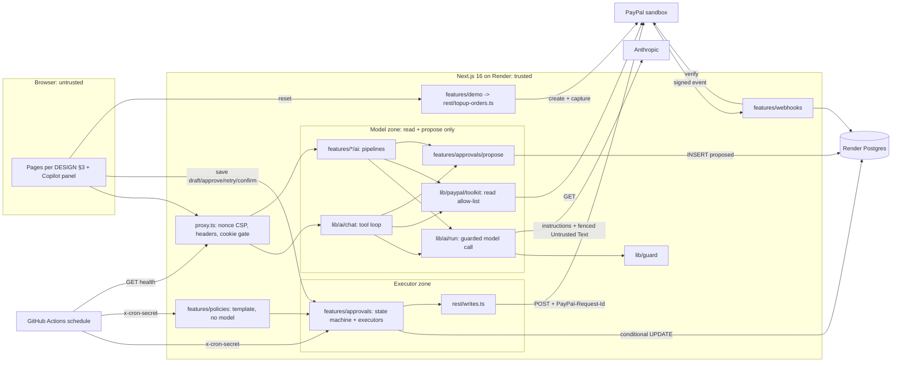
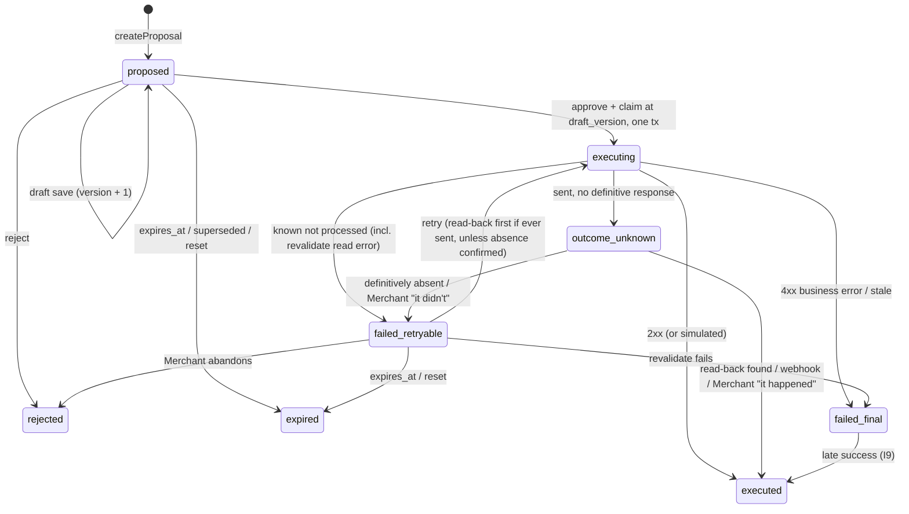

# PLAN: Steward

Build plan for Steward, an ops copilot for one small PayPal Merchant. Inputs: `REQUIREMENTS.md` (FR/NFR/SC; NG4, NFR-S1, SC-1, SC-11, FR-5.5 amended), `ASSUMPTIONS.md` (A-*, D-1..D-11), `CONTEXT.md` (terms used exactly), ADR 0001/0002, and the binding rulings in `docs/PLAN-DECISIONS-R1.md` (R1–R39).
**Ownership (R1).** `docs/AI-QUALITY.md` owns models, routing, prompts, Untrusted Text format, evidence-ref grammar, output checks, eval commands, budgets and CI eval policy. `docs/DESIGN.md` owns routes, pages, copy and tokens. This plan owns architecture, data model, invariants, slices, CI/CD, probes, owner calendar and code paths (§6), and references the others by section.
Dates: today 2026-10-03; v0.5 tag Nov 6 (A-14); feature freeze Nov 8; submit Nov 11; deadline Nov 12 12:00 PT.

## 1. Live environment facts

| # | Fact | Source / status | Design consequence |
|---|---|---|---|
| F1 | `@paypal/agent-toolkit@1.11.0` depends on `ai@4` + `zod@3`; its 47 tools adapt to AI SDK 7 via `tool({ description, inputSchema: zodSchema(t.parameters), execute })` | **Probed** (spike branch `spike/toolkit-adapter`, `0b9a003`) | `lib/paypal/toolkit` adapter; nested `ai@4` stays server-only (client-bundle grep in CI) |
| F2 | Toolkit `execute` returns a JSON string and never throws | Probed (spike) | Adapter zod-parses and maps error payloads to a typed `ToolError` |
| F3 | `accept_dispute_claim` is enabled by config key `disputes.create` | Probed (spike) | Allow-list by **tool name**; snapshot test pins the registered set |
| F4 | Not in toolkit: provide-evidence (multipart `input` JSON + optional `evidence-file`), verify-webhook-signature, sandbox-only `/adjudicate` and `/require-evidence` (Dispute must be `UNDER_REVIEW`) | Probed (spike) + PayPal docs | Own REST client; simulators only in `seed-writes.ts` (R18) |
| F5 | Sandbox Disputes are filed only by a sandbox buyer in the Resolution Center, on a PayPal-wallet payment | Probed (spike) | Runbook §8; labeled SIM Disputes (FR-3.6) |
| F6 | Card-funded Orders (`intent: CAPTURE`, `payment_source.card`) capture via API with no buyer approval | Probed (spike) | Seed and Reset top-up create captures unattended |
| F7 | Transaction Search: 31-day max window; up to 3 h lag | PayPal docs (verified 2026-10-03) | 31-day chunks; lag note in UI; seed ≥ 3 h before recording |
| F8 | verify-webhook-signature rejects the webhook simulator's mock events | PayPal/Hookdeck docs (verified) | SC-8 proved with MSW; live check uses real events (P0-9) |
| F9 | AI SDK 7: `system` → `instructions`; `stopWhen: isStepCount(n)`; `onFinish` → `onEnd`; `prepareStep`/`onStepFinish`; built-in `needsApproval` | Vercel docs; AI-QUALITY header (`ai@7.0.127`) | Names used as stated; `needsApproval` rejected (T3) |
| F10 | `claude-sonnet-5-5` / `claude-opus-5-5` return 400 on non-default `temperature`, prefill or forced `tool_choice` | AI-QUALITY header | No temperature except the Haiku classify call |
| F11 | Next.js 16: `proxy.ts` (Node runtime); nonce CSP needs dynamic rendering; `after()` runs work after the response | Next 16.2 docs (verified) | Pages dynamic; lazy work in `after()` (R23) |
| F12 | AG Grid v36; grouping, master/detail, status bar, set filter, sparklines, charts are Enterprise; CSV export, cell editing, filters, pinning, selection, renderers, keyboard nav are Community | AG Grid docs (verified) | SC-17 per branch (§12 R3); grid lazy-loaded (§10) |
| F13 | Render free Postgres expires after 30 days; free web sleeps after 15 min | Render docs (verified) | D-10: Postgres `basic-256mb` from slice 1, web `starter` from v0.5 |
| F14 | Model prices | AI-QUALITY §6 (verified against Anthropic pricing docs 2026-10-03) | Versioned price table in config |

**Probes.** Credential-free probes run in 0.1a. Credentialed probes run when the project owner's `.env` exists (0.1c, R13); `scripts/probe.ts` prints a redacted report, appended to this section before dependent code is written. Until a kind is probed, `requestIdReplaySafe=false` (R21). **Results:** P0-5, P0-6 (local part) and P0-8 are recorded below (0.1a); the credentialed probes are pending credentials.

| Probe | Check | Branch if it fails |
|---|---|---|
| P0-1 PayPal scope (cred, 0.1c) | Token `scope` lists invoicing, disputes, reporting, payments; one GET each | Enable in the sandbox app; Transaction Search off -> `/risk` uses seeded data, labeled (C6) |
| P0-2 Models (cred, 0.1c) | `GET /v1/models` lists AI-QUALITY §6 IDs; one minimal call each; usage fields, TTFT | AI-QUALITY §6 fallbacks; config only |
| P0-3a Replay + read-back: remind, refund (cred, 0.1c) | Throwaway Invoice + card capture; same `PayPal-Request-Id` twice on remind and refund; find each read-back signal and its lag | Not replay-safe -> flag stays `false`; no read-back signal -> unknown outcomes stay `outcome_unknown` until the Merchant confirms (R17); measured lag sets `readBackMinAge` |
| P0-3b Replay + read-back: Dispute writes (cred, 0.1d) | provide-evidence on probe Dispute #2, accept-claim on #3, each sent twice with one Request-Id; read-back via Dispute status/evidence | Same branch; Disputes not actionable -> `/require-evidence` first; still blocked -> flags `false`, read-back via GET Dispute status |
| P0-4 Invoice backdating (cred, 0.1c) | Send an Invoice dated 40 d ago, due 25 d ago | Earliest allowed due dates (Oct 5–15) so Invoices become overdue for real |
| P0-5 Local tools (free, 0.1a) | `node -v` 24.x, `pnpm -v` ≥ 10, `docker compose version`, Playwright browsers install | Corepack/nvm; no Docker -> `DATABASE_URL` to a Render dev DB |
| P0-6 Render (0.1a) | Blueprint validates; `NODE_VERSION=24`; `autoDeployTrigger: checksPass`; **role `steward_eval` can be created on Render Postgres and an Actions job can connect with `EVAL_DATABASE_URL`** (R34) | `autoDeploy: true` + branch protection; no external connection from Actions -> eval jobs run locally only and CI `eval-smoke` stays off |
| P0-7 Sandbox Dispute lifecycle (cred, probe Dispute #1, Oct 6 onward) | Initial status, seller window length, auto-close/escalation, `/require-evidence` effect | Window < 10 d or auto-close -> recording may use SIM Disputes, labeled |
| P0-8 MSW interception (free, 0.1a) | MSW `setupServer` in a Next 16 server intercepts server `fetch` and the toolkit's HTTP client | E2E mocks at the `ReadPort` seam behind `callRead`; T8 changes only |
| P0-9 Webhook delivery (cred, 0.5a) | `record-payment` emits `INVOICING.INVOICE.PAID`? API refund emits `PAYMENT.CAPTURE.REFUNDED`? | Paid-Invoice expiry relies on `revalidate` (I5); live demo uses the refund event |

**Probe results, slice 0.1a (2026-10-03).**

| Probe | Result | Consequence |
|---|---|---|
| P0-5 Local tools | **Pass.** Node 24.21.0 and pnpm 10.34.6 used for every gate run (the dev machine defaults to Node 26.7.0 and pnpm 9.15.9, so `.nvmrc`, `engines` and `packageManager` pin 24 and 10; CI reads them). Docker 29.8.1, `docker compose` v5.5.1; Postgres 17 container healthy. Playwright 1.63 Chromium installs and runs. `psql` is not installed locally (use `docker compose exec postgres psql`) | Compose maps Postgres to host port 54329 (5433 was taken). No fallback needed |
| P0-6 Render | **Pass locally; Render side pending owner.** `render.yaml` validates against Render's published JSON schema (`render.com/schema/render.yaml.json`, checked with ajv; a bad plan name is rejected, so the check is not vacuous): Node `NODE_VERSION=24`, `autoDeployTrigger: checksPass`, Postgres 17 `basic-256mb`, env group with `sync: false` secrets. Role `steward_eval` (`scripts/sql/steward_eval_grants.sql`) verified on Postgres 17: `INSERT, SELECT` on `api_spend` plus its sequence only; `UPDATE`, `DELETE`, `TRUNCATE` and every other table are denied (`src/db/steward-eval-role.test.ts`). **Pending owner:** Blueprint sync accepted by Render, `CREATE ROLE steward_eval` on the Render Postgres, and an Actions job connecting with `EVAL_DATABASE_URL`; also confirm Render's `X-Forwarded-For` shape against `TRUSTED_PROXY_HOPS=1` | If Render rejects `autoDeployTrigger`, use `autoDeploy: true` plus branch protection. If Actions cannot reach the database, eval jobs run locally only |
| P0-8 MSW interception | **Pass.** With `NODE_OPTIONS="--import ./test/msw/register.mjs"` on `next start` (Next 16.3.8, Node 24), MSW `setupServer` intercepted both a plain server `fetch` in a route handler and `list_invoices` from `@paypal/agent-toolkit@1.11.0` run inside the same route (it uses axios over Node `http`); no `serverExternalPackages` entry was needed. The toolkit authenticates against **`api.sandbox.paypal.com`** but calls resources on **`api-m.sandbox.paypal.com`**, so every handler is registered on both hosts (`test/msw/handlers.ts`). A request with no handler does not fail cleanly: MSW's passthrough crashed with `unhandledRejection: Headers.append: "AI-SDK, Version" is an invalid header name` (the toolkit's `User-Agent` contains `, `) and the request hung | The `ReadPort` fallback is not needed. 0.1b must keep handler coverage complete for every endpoint a test touches, and treat an MSW warning as a failure. Note: the `--import` path must be relative (the repo path contains spaces and `NODE_OPTIONS` splits on them) |

Other facts found while scaffolding: the toolkit's `openai@4.86.1` dependency declares a `zod@^3` peer and pnpm reports it unmet (the nested `zod@3` is used; our `zod@4` is separate); Next 16 rejects a relative `Location` from `proxy.ts` (`NextResponse.redirect` needs an absolute URL); `node --env-file` cannot be used for `next build` (Next workers reject `--env-file` in `NODE_OPTIONS`), so `scripts/with-env.sh` loads `.env.ci`.

**Credentials (verify commands in ASSUMPTIONS §1; the agency never enters any).**

| Service | Credential -> env / secret | Exact scope | Needed from | Verify |
|---|---|---|---|---|
| PayPal sandbox app | `PAYPAL_CLIENT_ID`, `PAYPAL_CLIENT_SECRET` | Invoicing (read, send, remind, record payment), Orders/Payments (create, capture, refund), Disputes (read, provide-evidence, accept-claim), Transaction Search, Webhooks | 0.1c (placeholders before) | P0-1 |
| PayPal webhook | `PAYPAL_WEBHOOK_ID` | Events in §2 webhook row | 0.5a | P0-9 |
| PayPal sandbox logins | Business + 2 personal (project owner only, never in env) | Wallet payment, file Disputes | Oct 6 | sandbox.paypal.com login |
| Anthropic | `ANTHROPIC_API_KEY` (local, Render env group, Actions secret) | Messages API on AI-QUALITY §6 models; console spend limit **$220** (D-11) | 0.1c | P0-2 |
| Spend ledger | `EVAL_DATABASE_URL`: role `steward_eval` with `INSERT, SELECT` on `api_spend` and `USAGE` on its sequence only (R34) | Eval and dev caps | 0.1a probe; used from 0.3b | P0-6; `DELETE` and other tables denied |
| GitHub | `gh` with `repo` scope; Actions secrets `ANTHROPIC_API_KEY`, `EVAL_DATABASE_URL`, `CRON_SECRET`, `STEWARD_URL` | Public repo, push, secrets, scheduled workflows | 0.1a (go-ahead) | `gh auth status` |
| Render | Dashboard connected to GitHub; env group incl. `CRON_SECRET`, `AI_PROVIDER=anthropic` | Blueprint: web, Postgres, env group (no cron service) | 0.1a (go-ahead) | P0-6 |
| AG Grid | `NEXT_PUBLIC_AG_GRID_LICENSE_KEY` (public, domain-locked) | Enterprise modules | decision **Oct 20** (R10) | No watermark on Render URL |

No media pipeline is built (the video is the project owner's, D-8), so no codec probe applies.

## 2. Architecture



**Trust boundaries.** (1) Browser -> server: passcode cookie, CSRF on every state change, zod on every body. (2) Model zone -> executor zone: the only crossing is a `proposals` row. (3) Write modules (R18): `writes.ts` only from `features/approvals/executors/**`; `topup-orders.ts` only from `features/demo/**` and `scripts/**`; `seed-writes.ts` (Invoices, record-payment, tracking, seed refunds, wallet-order create/capture, simulators, probe writes) only from `scripts/**`; enforced by ESLint and `test/arch/module-graph.test.ts`. (4) Server -> PayPal/Anthropic: secrets server-only; Untrusted Text normalized and fenced per AI-QUALITY §3. (5) PayPal -> server: nothing trusted before verify-webhook-signature returns `SUCCESS`. (6) GitHub Actions -> server: `x-cron-secret` (timing-safe) on `cron/tick` and `policies/run` only; the policy runner is the only scheduled writer (NG4 as amended). `hosted-health.yml` makes unauthenticated GETs of `/api/health` and `/enter` only.

**Data flows**

| Flow | Steps |
|---|---|
| Chat turn (FR-1.4) | `POST /api/chat` -> session + rate limit -> `streamText` (`instructions`, read + propose tools, `stopWhen: [isStepCount(8), capReached]`) -> `prepareStep` reserves the step (R22), `onStepFinish` settles it; a failed reservation ends the turn with DESIGN's "budget reached" state -> read results recorded in the Run Ledger, returned fenced |
| Pipeline run (R7) | `POST /api/invoices/chase`, `/api/disputes/:id/assess`, `/api/risk/explain`, `/api/brief/refresh` -> code fetches by ID via `callRead`, builds the Context Bundle (AI-QUALITY §2.1), computes ranking, amounts, deadlines, risk -> reserve -> **one** structured-output call, no tools -> settle -> validators -> `createProposal` or cached Brief line; streams `data-step` parts |
| Code-built refund (R38) | `POST /api/refunds/propose {orderId, basis, lineItemRefs}` -> `callRead('get_order')` (captures inside `purchase_units`) -> order + capture recorded in a Run Ledger and used as `evidence_refs` -> code computes amount -> `createProposal(created_by='code')`. No model call, no explanation line |
| Proposal creation | Refs resolve in the Run Ledger (SC-6) -> `resolveTarget` re-fetches the PayPal record and derives target, `subject_ref` (§5), recipient, amount, currency (NFR-S4; refunds from `basis` + `line_item_refs`, R5) -> insert `proposed` with `draft_original = draft_current`, `draft_version = 1`, + Audit Entry; open-work index hit -> "already has open work" |
| Draft edit (R33) | Drawer or inline cell save -> AI-QUALITY output checks on the Merchant text (failure blocks the save with the reason) -> `UPDATE proposals SET draft_current=$t, draft_version=draft_version+1 WHERE id=$1 AND status='proposed' AND draft_version=$v`; zero rows -> "This draft changed. Review it again." |
| Approve -> Execute (R3, R33) | `POST /api/proposals/:id/approve {draftVersion, amount?}` (session, CSRF, Origin, rate limit) -> **one tx**: `UPDATE … SET status='executing' WHERE id=$1 AND status='proposed' AND draft_version=$v RETURNING` + insert `approvals` (snapshot of final text and any refund amount in `edited_fields`), `executions`, Audit Entry; version mismatch -> "This draft changed. Review it again."; in-flight index violation -> "another write is in flight for this subject" -> `revalidate` (read error -> `failed_retryable`, `sent=false`) -> write **only the snapshot**, `PayPal-Request-Id = stw_<proposalId>` (20 s per request, ≤ 60 s total) -> classify outcome (I7) -> tx: new status + Audit Entry |
| Retry / confirm / reconcile (R2, R17, R37) | `POST /api/proposals/:id/retry` accepts only `failed_retryable`. If an earlier attempt may have been sent (`ever_sent`) and the Merchant has not confirmed absence since, `readBack` runs first: found -> `executed`; definitively absent -> proceed; no signal -> proceed only if `requestIdReplaySafe`, else refuse. Then `-> executing`, same Request-Id. `POST /api/proposals/:id/confirm {happened}` (audited) resolves `outcome_unknown`; "It didn't happen" counts as definitive absence. `reconcileStuck` (executing > 5 min, all `outcome_unknown`) runs `readBack` |
| Webhook ingest (FR-5.1) | Subscribed: `INVOICING.INVOICE.PAID`, `INVOICING.INVOICE.CANCELLED`, `CUSTOMER.DISPUTE.CREATED/UPDATED/RESOLVED`, `PAYMENT.CAPTURE.REFUNDED`. Raw body -> verify (`PAYPAL_WEBHOOK_ID`) -> non-`SUCCESS` = 400, zero writes -> `INSERT webhook_events ON CONFLICT (event_id) DO NOTHING` -> upsert `attention_items`, expire superseded Proposals, or resolve `outcome_unknown`/late success (I9) -> 200. No model call, no Execution |
| Lazy work (R23, R36) | Renders do no side effects. `/`, `/queue` schedule `after()` jobs (policy run if enabled, `reconcileStuck`, `expireDue`, `rollSimDeadlines`), each under `pg_try_advisory_lock(<job key>)`. `cron-tick.yml` calls `POST /api/cron/tick` (same jobs) and `/api/policies/run` every 30 min |
| Standing Policy (D-3, R6) | `runPolicies` -> deterministic selection with caps -> skip any Invoice whose subject hits the open-work or in-flight index (`policy_runs.skipped += 1`) -> **template reminder, no model, no Untrusted Text** -> `createProposal(created_by='policy')` -> approve as `PolicyActor` (same one-tx claim; DB CHECK §5) -> executor. `/api/policies/run` auth: session + CSRF (Run now) **or** `x-cron-secret` |
| Reset (R12, R19) | `POST /api/demo/reset` (session + CSRF; 1 per 15 min global, ≤ 12/day, `demo_state` row lock): bump epoch, expire old-epoch `proposed`/`failed_retryable`, top up ≤ 5 captures. `POST /api/demo/topup` is session + CSRF only, ≤ 10/day, adds captures without an epoch bump; no cron route calls it |
| Health (R32) | `GET /api/health` -> pass/fail booleans only (no data), result cached in-process for 5 min so public GETs never fan out to PayPal/Anthropic: DB; PayPal OAuth token + one `list_invoices` read; model reachability via the models list (no generation); ≥ 2 SIM Disputes open with a deadline > 2 h away; demo budget remaining |

**Routes.** Pages per DESIGN §3 (R9): `/enter`, `/` (Brief), `/queue`, `/invoices`, `/disputes`, `/risk`, `/audit`, `/policies`, `/settings`. API: `chat`, `session`, `invoices/chase`, `disputes/[id]/assess`, `risk/explain`, `refunds/propose`, `brief/refresh`, `proposals/[id]/{draft,approve,reject,retry,confirm}`, `webhooks/paypal`, `policies/run`, `cron/tick`, `demo/reset`, `demo/topup`, `health`. Risk Flags are **Attention Items, not Proposals**; `/queue` lists Proposals only. `DISPUTE_SOURCE` (`live|simulated|mixed`) is env-only; `/settings` shows it read-only.

## 3. Tech choices

| # | Choice | Trade-off accepted | Alternative rejected, why |
|---|---|---|---|
| T1 | TypeScript, Next.js 16 App Router, one Render web service | One deploy unit, shared types | Repo default Python/LangGraph: stack fixed (REQUIREMENTS §7); toolkit, AG Grid, streaming UI are TS-native |
| T2 | Pipelines (one structured call, or none for `refunds/propose`) for desk/chaser/risk/Brief; one tool loop for chat only (R7) | Two shapes to test | All-agent loop: more steps, cost, injection surface. LangGraph JS: no multi-node graph; durable state is the Proposal queue |
| T3 | Own `proposals` table + separate approve route | More code than a flag | AI SDK 7 `needsApproval`: write tool stays in the model's tool set with model-chosen args (ADR 0002, NFR-S1/S4); approvals must outlive the chat |
| T4 | Toolkit for model **and** UI reads via one `callRead` (ADR 0001) | Two token caches | Re-implementing reads: two shapes to mock and drift |
| T5 | Drizzle + `pg` on Render Postgres | Hand-written SQL for conditional UPDATEs and locks | Prisma: heavier, weaker raw SQL. Snowflake/dbt/Databricks/Tableau/Sigma: OLTP, hundreds of rows |
| T6 | Rate limits, spend counters, job locks in Postgres (advisory locks) | Extra writes per request | Redis/Upstash: another credential for one instance |
| T7 | Real Postgres in tests | Docker needed | PGlite: one connection, cannot prove concurrency (SC-2) |
| T8 | MSW in unit/integration; same handlers injected into the Next server for E2E via `NODE_OPTIONS=--import test/msw/register.mjs` (`STEWARD_E2E=1`) | Mock drift, mitigated by recorded-response contract tests | Toolkit base URL not overridable; fallback P0-8 |
| T9 | Models and routing per **AI-QUALITY §6**; Opus only for dispute assessment (NFR-C2); no model for policy reminders or `refunds/propose` | Routing changes need eval re-runs | One model everywhere: too costly or too weak |
| T10 | Passcode cookie session | Shared secret, not identity (NG2) | Auth.js/OAuth: identity is a non-goal |
| T11 | Scheduled work via GitHub Actions calling secret routes + `after()` lazy runs (R6, R23) | Actions schedules can lag | Render cron service: extra paid unit |
| T12 | One append-only `api_spend` ledger for demo, eval and dev scopes; least-privilege role for off-server writers (R34) | One more role to create | Per-scope tables or eval rows in `ai_runs`: broader grants, split accounting |
| T13 | Read-only hosted health check + owner-run manual E2E (R32) | Fewer automated end-to-end assertions on the live URL | Write-performing hosted smoke: needs a privileged actor and consumes demo state |

## 4. Module design (deep modules, small interfaces)

Seams exist only where two adapters exist: **PayPal HTTP** (sandbox vs MSW), **dispute source** (live vs simulated), **dispute writer** (REST vs simulated), **language model** (Anthropic vs scripted mock). Everything else is concrete.

| Module | Interface | Invariants | Test seam |
|---|---|---|---|
| `lib/env` | `getEnv()` (parsed once on first use, `server-only`); `parseEnv(raw)` | `PAYPAL_ENV` = `z.literal('sandbox')` (NG1); placeholders allowed so a credential-free deploy boots into "Couldn't reach PayPal"; `AI_PROVIDER` defaults to `mock` in `.env.example`, `mock` rejected when `RENDER` is set; no secret under `NEXT_PUBLIC_` | Pure unit |
| `lib/paypal/rest` | `paypalFetch<T>({method, path, body?, multipart?, requestId?, schema, timeoutMs=20000})` -> `T` or `PayPalError{kind, status, debugId, sent}`. `writes.ts`: `sendInvoiceReminder`, `provideDisputeEvidence`, `acceptDisputeClaim`, `refundCapture`. `topup-orders.ts`: `createAndCaptureCardOrder`. `seed-writes.ts`: §2 boundary (3) list. `webhooks.ts` | Token cached to `expires_in - 60 s`, single-flight, one retry on 401; retries only when known not processed (`sent=false`, 429, 5xx with a no-processing body), max 3, jittered backoff, `Retry-After`; whole call ≤ 60 s; same Request-Id every attempt; sandbox base URL hard-coded; redacted logs | MSW per endpoint; recorded-response contract tests |
| `lib/paypal/toolkit` | `callRead<T>(name, args, schema): Result<T, ToolError>`; `getReadTools(ledger): ToolSet` | `READ_TOOL_ALLOWLIST` = `list_invoices`, `get_invoice`, `search_invoicing`, `get_order`, `list_disputes`, `get_dispute`, `list_transactions`, `get_refund`, `get_shipment_tracking` (spike `getTools()`); read-only config **and** name filter; results zod-validated, ledgered, fenced | Snapshot = allow-list; MSW |
| `lib/untrusted` | `normalize(text, field)`, `fence(text, meta): FencedText` | Implements AI-QUALITY §3 exactly; prompt builders accept Untrusted Text only as `FencedText` | fast-check |
| `lib/ai/ledger` | `createRunLedger(runId)`: `record`, `resolve` | Ref grammar per AI-QUALITY §2.4; resolves only records fetched in this run (SC-6) | Unit |
| `lib/ai/run` | `guardedGenerate`, `guardedStream`, `capReached` | **Only** importer of `generateText`/`streamText` and the provider (ESLint); every call reserved and settled; no `temperature` except Haiku classify | Mock model |
| `lib/ai/chat` | `runChatTurn({messages, session})` | `instructions` per AI-QUALITY §2.2; `stopWhen: [isStepCount(8), capReached]`; ≤ 3 propose calls/turn | Scripted mock |
| `lib/guard` | `rateLimit`; `reserve({scope: 'demo'\|'eval'\|'dev', sessionId?, purpose, model, estInputTokens, maxOutputTokens})`; `settle`; `release` | R22: short tx only; upsert today's `spend_days` row, then `FOR UPDATE` in order `spend_days` -> `sessions`; reservation = input estimate (chars/4 × 1.2) + max output at list price; TTL 10 min; `settle` appends one `api_spend` row; fails closed. **Caps (D-11, R34):** `demo` ≤ $5/day and ≤ $50 cumulative before 2026-11-12, ≤ $3/day and ≤ $70 from Nov 12 ($120 total), session ≤ 100k tokens; `eval` ≤ $70 and the run's `--budget-usd`; `dev` (live model off Render) ≤ $30. Eval/dev write via `EVAL_DATABASE_URL`; a failed ledger insert aborts the run | 20 parallel reserves at each cap; abort/TTL release; Nov 12 boundary test |
| `lib/auth` | `login`, `requireSession`, `verifyCsrf`, `verifyCronSecret`, `requireSessionOrCron` | Timing-safe compares; login 5/IP/10 min; `HttpOnly; Secure; SameSite=Lax`; CSRF header + `Origin` | Route integration |
| `features/approvals` | `schema.ts` (R14); `createProposal`, `saveDraft(id, text, version)`, `approve(id, actor, {draftVersion, amount?})`, `reject`, `retry`, `confirmOutcome`, `listQueue`, `expireDue`, `reconcileStuck`; `propose.ts`; `EXECUTORS[kind] = {revalidate, execute(snapshot, requestId), readBack, readBackMinAge, requestIdReplaySafe}` | §5 I1–I11; refund amount editable only at approval, ≤ remainder; `listQueue` always shows `outcome_unknown` rows from any epoch outside the Expired group | Executor adapters; real Postgres; kill, unknown-retry, draft-race tests |
| `features/invoices` | `rankOverdue` (pure, reason template); `ai/chase.ts`; `resolveReminderTarget` | Overdue only; recipient/amount from the fetched Invoice | Pure + MSW + mock |
| `features/disputes` | `DisputeSource {list, get}`: `liveSource`, `simulatedSource` (fixtures + `sim_dispute_state`); `evidencePlan(reason)`; `ai/assess.ts`; `rollSimDeadlines(now)` | `SIM-` IDs, `source:'simulated'` end to end; simulated writer updates the overlay only; a deadline < 2 h away rolls to `now + offset`, and open Proposals for that Dispute get the same `expires_at` (R36) | Two sources, two writers; golden set |
| `features/refunds` | `proposeRefund(orderId, basis, lineItemRefs)` (R38) resolves the order's single capture (seed Orders are single-capture; multi-capture Orders are refused) and calls internal `resolveRefundTarget(captureId, basis, lineItemRefs)` | Amount by code; ≤ remainder; open Dispute on the capture -> reject | MSW |
| `features/risk` | `computeFlags` (pure) -> `attention_items` `risk_flag`; `ai/explain.ts` | Cites only the flag's Transaction IDs; never "fraud" | Pure + citation validator |
| `features/brief` | `briefSnapshot(epoch)` (DB-only); `refreshAttention()`; `ai/lines.ts` | R8: first paint from DB; refresh when `refreshed_at` > 10 min or on "Refresh brief" | Pure ordering |
| `features/webhooks` | `ingest(headers, rawBody)` | No model call, no Execution | SC-8 table tests |
| `features/policies` | `runPolicies(trigger)` | Off by default; template only; caps and index pre-check before any Proposal; advisory lock | Integration |
| `features/demo` | `resetDemo(actor)`, `topUp(actor, n)` | R19 caps and cooldown under a `demo_state` row lock; session-only; deletes nothing | Integration + MSW |
| `features/health` | `checkHealth(): Record<check, boolean>` | Read-only; no generation; no data in the response | MSW + mock |
| `db` | `schema.ts`, SQL migrations, pool (max 5) | §5 constraints live in migrations | Migrations in every test DB |

## 5. Data model and Proposal state machine

**`subject_ref` derivation (R16)**, computed by `resolveTarget` from the fetched PayPal record, never from model text: `invoice_reminder` -> `invoice:<invoice_id>`; `dispute_contest`, `dispute_accept` -> `capture:<capture_id>` (live: the Dispute's `seller_transaction_id` resolved to its capture, unresolvable -> no Proposal; SIM: the linked seeded Order's capture); `refund` -> `capture:<capture_id>`.

| Table | Key columns | Constraints that matter |
|---|---|---|
| `proposals` | `id uuid`, `epoch`, `kind`, `status`, `payload`, `draft_original`, `draft_current`, `draft_version int`, `rationale`, `risk_level`, `evidence_refs`, `target_ref`, `subject_ref`, `amount_minor`, `currency`, `idempotency_key`, `created_by` (agent\|policy\|code), `run_id`, `supersedes_id`, `expires_at`, `stale_reason` | `idempotency_key = 'stw_' \|\| id` (generated, `UNIQUE`); `UNIQUE(id, kind, created_by)`; `CHECK jsonb_array_length(evidence_refs) >= 1` (SC-6); trigger rejects any change to `draft_original`; **open-work** `UNIQUE (epoch, subject_ref) WHERE status IN ('proposed','executing','failed_retryable','outcome_unknown')`; **in-flight** `UNIQUE (subject_ref) WHERE status IN ('executing','outcome_unknown')` (all epochs) |
| `approvals` | `id`, `proposal_id`, `proposal_kind`, `proposal_created_by`, `actor_type` (merchant\|policy), `actor_id`, `draft_version`, `edited_fields` (final text snapshot, refund amount) | `UNIQUE(proposal_id)`; FK `(proposal_id, proposal_kind, proposal_created_by)`; `CHECK (actor_type='merchant' OR (proposal_kind='invoice_reminder' AND proposal_created_by='policy'))` (R23) |
| `executions` | `id`, `proposal_id`, `approval_id NOT NULL`, `request_id`, `status` (pending\|succeeded\|failed_retryable\|failed_final\|outcome_unknown), `attempts`, `ever_sent`, `last_sent_at`, `absence_confirmed_at`, `http_status`, `paypal_debug_id`, `paypal_ref`, `response_digest`, `simulated`, `late_success_at` | `UNIQUE(proposal_id)`, `UNIQUE(request_id)`; FK to `approvals` (SC-1) |
| `audit_entries` | `id bigserial`, `epoch`, `proposal_id`, `approval_id`, `event`, `actor_type`, `actor_id` | UPDATE/DELETE trigger raises; `CHECK (event NOT IN ('execution_started','executed','late_success','outcome_confirmed') OR approval_id IS NOT NULL)` |
| `webhook_events` | `event_id PK`, `event_type`, `resource_id`, `payload`, `verified_at`, `outcome` | PK dedupe (SC-8) |
| `attention_items` / `brief_lines` | `epoch`, `kind`, `source_ref`, `title`, `amount_minor`, `due_at`, `cited_refs`, `refreshed_at` / `attention_item_id`, `text`, `run_id` | `UNIQUE(epoch, kind, source_ref)`; `UNIQUE(epoch, attention_item_id)` |
| `sim_dispute_state` (R25, R26) | `epoch`, `sim_dispute_id`, `status`, `deadline_at`, `deadline_offset_s`, `last_execution_id` | PK `(epoch, sim_dispute_id)`; absent row = fixture default |
| `standing_policies` / `policy_runs` | caps / `trigger`, `created`, `skipped`, `capped` | `CHECK kind='invoice_reminder'`, `max_per_run BETWEEN 1 AND 5`, `enabled DEFAULT false` |
| `ai_runs` | Fields per AI-QUALITY §6 + `scope`, `reserved_usd`, `reserved_at`, `settled_at` | Telemetry panel filters `scope='demo'`; eval `ai_runs` stay in the local/CI DB |
| `api_spend` (R34) | `id bigserial`, `scope` (demo\|eval\|dev), `run_id`, `call_id`, `cost_usd`, `created_at` | `UNIQUE(run_id, call_id)`; UPDATE/DELETE trigger raises; `steward_eval`: `INSERT, SELECT` + sequence `USAGE` only |
| `spend_days` / `sessions` / `rate_limits` / `demo_state` | `day PK, reserved_usd, spent_usd` / hashed id, `tokens_used` (the CSRF token is an HMAC of the session id, so none is stored) / `(key, window_start)` / `epoch`, `last_reset_at`, `resets_today`, `topups_today` | Locks per R22 / R19 |



Reset expires only `proposed` and `failed_retryable` rows of the old epoch. `executing` and `outcome_unknown` are never expired; their subjects stay locked across epochs (in-flight index) and they stay actionable in `/queue`.

**Invariants.** **I1** each transition is one conditional `UPDATE … WHERE status = <from> RETURNING`; zero rows = return current state. **I2** approve, claim, approval, execution row and Audit Entry commit in one tx; no resting `approved` state (R3). **I3** one Execution row per Proposal, with an Approval FK (SC-1). **I4** `PayPal-Request-Id = idempotency_key = stw_<proposalId>` on every attempt (SC-2). **I5** `revalidate` before each attempt: Invoice unpaid; Dispute awaiting seller and before its Response Deadline; refundable remainder ≥ amount and no open Dispute on the capture; a read error is `failed_retryable` with `sent=false`. **I6** timeouts 20 s per request, 60 s per attempt, reconcile threshold 5 min. **I7** `failed_retryable` only when PayPal provably did not process; anything sent without a definitive answer is `outcome_unknown`. **Definitively absent** = the read-back finds no record and `now - last_sent_at ≥ readBackMinAge` (per kind, from P0-3; default 10 min), **or** the Merchant's audited "It didn't happen" (`absence_confirmed_at > last_sent_at`, R37). **I8** expiry: reminders 72 h, dispute Proposals at the Response Deadline (rolled with SIM deadlines, R36), refunds 7 d, plus reset. **I9** a success seen after `failed_final` sets Execution `succeeded` + `late_success_at`, Proposal `executed`, and a `late_success` Audit Entry. **I10** at most one write in flight per subject (in-flight index); switching Contest to Accept = reject + new Proposal with `supersedes_id`. **I11** PayPal only ever receives the text and amount snapshotted in `approvals.edited_fields` at the approved `draft_version`; Merchant text passes the same output checks as model text (R33).

## 6. Repo layout (code paths cited by AI-QUALITY)

```
src/app/            pages per DESIGN §3; api/ routes per §2 Routes
src/proxy.ts        nonce CSP, headers, signed-cookie gate (no DB)
src/features/       approvals/{schema.ts,propose.ts,state.ts,executors/*,ui}, invoices/{ai,ui}, disputes/{ai,sources,fixtures,ui},
                    refunds/, risk/{ai,ui}, brief/{ai,ui}, webhooks/, policies/, demo/, health/
src/lib/            env/, paypal/rest/{client,writes,topup-orders,seed-writes,webhooks}.ts, paypal/toolkit/,
                    ai/{run,chat,ledger,models,prompts}/, untrusted/, guard/, auth/, log/
src/db/             schema.ts, migrations/
scripts/            probe.ts, seed-sandbox.ts, dispute.ts (wallet-order, capture, sim), check-bundle.ts, start.sh (migrate, then next start)
evals/              per AI-QUALITY §4 (runner uses lib/guard scope 'eval')
test/               msw/{handlers,register.mjs}, fixtures/recorded/, e2e/*.spec.ts, arch/module-graph.test.ts
.github/workflows/  ci.yml, eval-nightly.yml, cron-tick.yml, hosted-health.yml
render.yaml  docker-compose.yml  .env.example (AI_PROVIDER=mock)  .env.ci (dummy; !.env.ci in .gitignore)  LICENSE  README.md  DEMO.md
```

## 7. Build plan: vertical slices (19 sessions)

Each row is one builder session, finished, tested and pushed in that session. A version is tagged only after all its rows pass in CI and on Render; `@v0.x` E2E specs stay green later. Grid features land with their page (R10); screens and states per DESIGN §4–§6. Until Oct 20, Enterprise features are built with the dev watermark (D-7). Owner dependencies are in §8.

**v0.1 Walking skeleton (5 sessions; tag Oct 10; buffer Oct 9–10)**

| Session | Scope (FR) | Customer sees / demo command | Stubbed | Test seams | Exit (SC) |
|---|---|---|---|---|---|
| 0.1a Oct 4 (no PayPal/Anthropic creds) | P0-5/6/8; scaffold; `lib/env`; `lib/auth` + `/enter`; `proxy.ts`; base tables + `api_spend` + `start.sh`; `render.yaml`; basic `/api/health`; CI incl. `.env.ci` (FR-1.5, 1.6) | Render URL: passcode, then the app shell with "Couldn't reach PayPal" | All PayPal, chat | `parseEnv`, cookie, CSP header tests | CI green; Render up; SC-13, SC-15, SC-18 |
| 0.1b Oct 5 (no creds) | `lib/paypal/toolkit` `callRead` + allow-list (D18); MSW handlers; `/invoices` grid over MSW; first `@v0.1` E2E | `pnpm dev:mock` -> `/invoices` with mock Invoices | Live PayPal | Allow-list snapshot; MSW-in-Next E2E | `@v0.1` spec green in CI |
| 0.1c Oct 6 (needs `.env`) | `lib/paypal/rest` client + `seed-writes.ts`/`topup-orders.ts` skeletons (FR-1.1); `probe.ts`: P0-1, P0-2, P0-3a, P0-4; `dispute.ts wallet-order/capture` so the owner files **3 probe Disputes** (R21) | Probe report appended to §1 | Seed, live grid | MSW for retry/`sent` classification | Probe facts recorded; module-graph test green |
| 0.1d Oct 7 | `seed-sandbox.ts` (FR-1.2); live `/invoices` grid (FR-1.3); **P0-3b** script on probe Disputes #2/#3 (R28) | 12 cafés' Invoices live. `pnpm seed && pnpm dev` | Chat | Seed "already exists" paths | 2nd seed creates 0; P0-3b recorded |
| 0.1e Oct 8 | `getReadTools`; `lib/untrusted`; `lib/ai/{run,chat,ledger}`; `lib/guard` (all scopes) + `spend_days`; `/api/chat` (FR-1.4, NFR-C1, NFR-O1) | Copilot answers "which invoices are overdue?" with cited, streamed text | Propose tools | Mock-model E2E; 20-way reserve at each cap; TTL release | SC-9 `@v0.1`, SC-16 caps, SC-10 dry run; **tag v0.1** |

**v0.2 Invoice chaser (3 sessions; tag Oct 17; buffer Oct 16–17)**

| Session | Scope (FR) | Customer sees / demo command | Stubbed | Test seams | Exit (SC) |
|---|---|---|---|---|---|
| 0.2a Oct 11 | Proposal tables (incl. draft columns) + both indexes; one-tx approve/claim; reminder executor; `POST /api/invoices/chase`; approve/reject routes; basic `/queue` (FR-2.1–2.4) | "Chase overdue" -> Proposals with reasons -> Approve -> reminder in PayPal sandbox | Failure paths, edits | 10 parallel approves; MSW write recorder | **SC-1, SC-2** (reminders), SC-6 |
| 0.2b Oct 13 | Outcome classification (I7), `outcome_unknown`, `retry`, `confirm`, reconcile/expire in `after()` + advisory locks, `cron/tick` + `cron-tick.yml`, late success | Forced 503 -> "Try again (safe)"; forced post-send timeout -> "Not sure this went through" -> resolved | Edits, audit page | **Kill test** (child SIGKILLed while MSW blocks mid-write -> exactly 1 write); **unknown-retry test** (replay-unsafe kind, post-send timeout, Merchant retry -> exactly 1 write) | I1–I10 tests green |
| 0.2c Oct 15 | Draft versioning (R33): drawer + **inline cell editing** of draft text, version-checked approve, snapshot to executor; `/audit` (FR-2.5); queue grouping + status bar; chat `propose_invoice_reminder` | Edited reminder approved; PayPal shows the edited text; Audit Log. `pnpm e2e --grep @v0.2` | Disputes | **Draft-race test** (save during approve -> "This draft changed"); SC-7 + output checks on Merchant text | SC-7 (reminders), SC-9 `@v0.2`; **tag v0.2** |

**v0.3 Dispute desk (4 sessions; tag Oct 26; buffer Oct 25–26)**

| Session | Scope (FR) | Customer sees / demo command | Stubbed | Test seams | Exit (SC) |
|---|---|---|---|---|---|
| 0.3a Oct 18 | `DisputeSource` live + simulated with `sim_dispute_state`, `rollSimDeadlines` (cron + `after()`); `/disputes` grid, countdown, urgency sort; Untrusted Text fence UI; Simulated badge; CSV export on `/audit` (never-cut SC-17 Community item) (FR-3.1, 3.5, 3.6) | `DISPUTE_SOURCE=mixed pnpm dev` -> `/disputes` | Assessment, writes | One contract test over both sources; roll-forward incl. `expires_at` | SC-19 |
| 0.3b Oct 20 | `POST /api/disputes/:id/assess` (AI-QUALITY §2.1); master/detail Evidence Packet; eval guard on `api_spend`; CI `eval-smoke` enabled; **AG Grid key decision** (FR-3.2, 3.3) | Assess -> Evidence Packet with source links, draft, Contest/Accept + confidence + fee | Dispute writes | `pnpm eval --suite golden` | SC-3, SC-4, SC-6 (disputes) |
| 0.3c Oct 22 | Executors: provide-evidence (multipart), accept-claim, simulated writer (FR-3.4, 3.5); deadline revalidate. If no key on Oct 20: Proposal drawer replaces master/detail (DESIGN fallback) | Approve "Contest" -> PayPal or simulated result; SIM row shows "Evidence submitted (simulated)" | Refunds | **Contest ∥ Accept on one capture -> exactly 1 write**; MSW multipart; `pnpm eval --suite injection` | **SC-5**, SC-1/2 dispute kinds, SC-7 |
| 0.3d Oct 24 | Judge calibration vs **12 human-labeled drafts** (AI-QUALITY §4.3); chat dispute propose tools; `pnpm eval --suite full` | `evals/results/latest-summary.json` committed | Refunds | Judge agreement ≥ 80% | Full pass (tag gate); **tag v0.3** |

**v0.4 Refunds and risk (2 sessions; tag Nov 1; buffer Oct 31–Nov 1)**

| Session | Scope (FR) | Customer sees / demo command | Stubbed | Test seams | Exit (SC) |
|---|---|---|---|---|---|
| 0.4a Oct 27 | `/risk` via `list_transactions` (31-day chunks); `computeFlags` -> Attention Items; `POST /api/risk/explain`; sparklines (FR-4.1, 4.2). If no key: sectioned grouping, inline SVG sparklines, chart cut (C5) | Flagged rows with cited explanations | Refund writes | Pure rules, fixed clock; citation validator | SC-6 (Risk Flags) |
| 0.4b Oct 29 | Refund Proposals (`basis` + `line_item_refs`, code amount, capped amount edit at approval); `refunds/propose` (R38); executor; open-Dispute revalidate; integrated chart (Enterprise only); history panel (S, FR-4.4) (FR-4.3) | "Propose refund" on an Order -> approve a partial Refund. `pnpm e2e --grep @v0.4` | Webhooks, Brief | Over-refund, open-Dispute, edited-amount | SC-1/2 refunds, SC-9 `@v0.4`, full eval; **tag v0.4** |

**v0.5 Polish and autonomy (5 sessions; tag Nov 6 per A-14; buffer Nov 7; freeze Nov 8)**

| Session | Scope (FR) | Customer sees / demo command | Stubbed | Test seams | Exit (SC) |
|---|---|---|---|---|---|
| 0.5a Nov 2 | Webhooks (FR-5.1); P0-9; telemetry panel, `scope='demo'` (FR-5.4); web to `starter` (D-10) | Paid Invoice expires its reminder; spend today vs ceiling and vs cap | Brief | SC-8 table: valid, tampered, replayed, unsigned | **SC-8**, SC-16 telemetry |
| 0.5b Nov 3 | Brief (R8), `brief/refresh` (FR-5.2); Reset + top-up (R19, FR-5.5); full `/api/health` checks + `hosted-health.yml` (R32) | Brief figures paint first; Reset with shared-demo confirm; health green on the Render URL | Policies | Cooldown/cap tests; health checks over MSW | SC-11 health green |
| 0.5c Nov 4 | Standing Policy (R6, R23): `/policies`, Run now, cron, index pre-check; eval dashboard (S, FR-5.6); **live provide-evidence check** on the reserved demo Dispute (`pnpm probe live-evidence <id>`, R35) | Policy-approved template reminders in `/audit`; eval scores page | none | CHECK: policy can't approve agent, code or non-reminder Proposals | SC-1 (policy actor); **security-auditor sign-off** |
| 0.5d Nov 5 | Polish only (R10): keyboard-complete approval, reduced motion, grid polish (FR-5.3, 5.7) | DEMO.md grid tour | none | Keyboard E2E; snapshots 320/768/1024/1440 | SC-17 inventory (branch per §12 R3); NFR-A1 |
| 0.5e Nov 6 | Lighthouse, axe, Firefox/Safari smoke; fixes; full eval | Lighthouse and axe reports | none | `check-bundle.ts`; axe | SC-14 (automated part), SC-9; **tag v0.5** |

After freeze: Nov 8 `ACCEPTANCE.md`, a pre-recording check that the pre-Nov-12 demo budget has ≥ $15 left (else record against a local build with `AI_PROVIDER=live` on the `dev` scope), `solution-verifier` clean-checkout run (SC-10), one manual pre-submission full eval (R20); then the owner calendar (§8).

## 8. Owner tasks calendar, seed and Disputes

| Date | Owner task (project owner; agency prepares commands and text) | Unblocks |
|---|---|---|
| Recurring | Go-ahead for each push and each production deploy | Every session |
| Oct 4 | Read the Devpost rules page (A-1); go-ahead for public repo push and Render Blueprint deploy; set `CRON_SECRET` in the Render env group and as an Actions secret; after first deploy set `STEWARD_URL`; run the provided SQL creating `steward_eval`, add `EVAL_DATABASE_URL` (P0-6); email AG Grid for a key | 0.1a |
| Oct 5–6 | Create `.env` (PayPal sandbox app + Anthropic key); dedicated Anthropic workspace, console limit $240 (D-11); `ANTHROPIC_API_KEY` Actions secret | 0.1c |
| Oct 6 | File **3 probe Disputes** as the sandbox buyer | P0-7, P0-3b |
| **Oct 20** | AG Grid key received or not -> branch decision (R10, §12 R3) | 0.3c/0.4a |
| **Oct 23** | Label the 12 drafts for judge calibration | 0.3d |
| **Nov 1–2** | File the reserved demo Dispute (live provide-evidence check, R35) | 0.5c |
| Nov 2 | Go-ahead: Render web to `starter`; register the webhook for the Render URL, set `PAYPAL_WEBHOOK_ID` | 0.5a |
| Nov 3–5 | File 1–2 more demo Disputes for the recording | Recording |
| Nov 6–7 | Manual VoiceOver + Safari pass on the demo path (SC-14) | ACCEPTANCE |
| **Nov 9 / 10 / 11** | Record the video (≤ 2:50) / upload to YouTube / submit on Devpost | SC-12, SC-20 |
| **Nov 12, Dec 1** | Manual end-to-end on the Render URL: seed, ask, approve reminder, contest a SIM Dispute, approve a refund, view audit (SC-11) | SC-11 |

| Seed fixture | How | Idempotency key |
|---|---|---|
| ~12 wholesale cafés as Invoices: ~4 paid, ~3 due, ~5 overdue; one note with Untrusted Text | `seed-writes.ts`: create -> send; paid via record-payment; overdue per P0-4 | `EO-INV-0NN`; search first |
| ~20 retail Orders with line items + shipping; one repeat Customer, one high-value first Order | `topup-orders.ts` (card capture) | `seed-order-NN` |
| Tracking on ~10 Orders; 3–4 Refunds (one partial, a "refund spike" cluster) | `seed-writes.ts` | Lookup first; `seed-refund-NN` |
| Reset top-up (≤ 5) | `topup-orders.ts` | `topup-e<epoch>-<n>` |

Re-runs create nothing; `pnpm seed --check` writes nothing; seed refuses unless `PAYPAL_ENV=sandbox`.
**Dispute runbook.** `pnpm dispute wallet-order` (prints buyer approval link) -> buyer approves -> `pnpm dispute capture <orderId>` -> buyer files "Item not received" / "Not as described" -> `pnpm dispute sim require-evidence <id>` if `UNDER_REVIEW`. Probe Disputes: #1 observe-only (P0-7), #2 provide-evidence and #3 accept-claim (P0-3b).
**SIM Disputes.** ~6 fixtures shaped like `GET /v1/customer/disputes/{id}` (same zod schema), `SIM-*` IDs linked to seeded Orders, always badged "Simulated dispute" in text; deadlines roll forward (R26, R36); Executions update `sim_dispute_state`, never PayPal (SC-19). Hosted judging uses SIM Disputes (DEMO.md); a red health check for "≥ 2 SIM Disputes open" means the owner presses Reset.

## 9. Security design (summary; `security-auditor` expands in SECURITY.md)

| Area | Design |
|---|---|
| Trust boundaries | §2 (six); three write modules (R18) checked by ESLint + module-graph test; SC-1 scan covers `writes.ts` endpoints; `topup-orders.ts` excluded per amended SC-1 |
| Secrets | `.env` gitignored; `.env.example` names only (`DATABASE_URL`, `PAYPAL_*`, `ANTHROPIC_API_KEY`, `AI_PROVIDER=mock`, `DEMO_PASSCODE`, `SESSION_SECRET` ≥ 32 B, `CRON_SECRET`, `EVAL_DATABASE_URL`, `NEXT_PUBLIC_AG_GRID_LICENSE_KEY`, caps, `DISPUTE_SOURCE`, `POLICIES_ENABLED`); Render env group `sync: false`; `.env.ci` fake values (gitleaks-allowlisted); `redact()` per AI-QUALITY §6; gitleaks full history; client-bundle grep (SC-15) |
| Webhook verification | Raw body; `PAYPAL-*` headers; verify with `PAYPAL_WEBHOOK_ID`; non-`SUCCESS` -> 400, zero writes; dedupe by `event_id` (NFR-S3, SC-8) |
| CSRF / auth modes | UI state changes (draft save, approve, reject, retry, confirm, reset, topup, policy Run now, propose refund) need session CSRF header + `Origin`. `cron/tick` is cron-secret only; `policies/run` accepts session + CSRF **or** cron secret (R23). `health` is public, read-only, booleans only |
| CSP and headers | `script-src 'self' 'nonce-…' 'strict-dynamic'`; `style-src 'self' 'unsafe-inline'` (AG Grid runtime styles); `connect-src 'self'`; `frame-ancestors 'none'`; `object-src 'none'`; `base-uri 'self'`; HSTS, `nosniff`, `Referrer-Policy`, `Permissions-Policy` (NFR-S6) |
| Abuse limits | Passcode (A-10, D-4) 5/IP/10 min; every route 60/IP/min; chat 20/IP/10 min; approve 30/session/min; reset 1 per 15 min global, ≤ 12/day; topup ≤ 10/day |
| Cost (D-11, R34) | Demo $120 ($50 before Nov 12 at ≤ $5/day; $70 after at ≤ $3/day), eval $70, dev $30, all enforced in `reserve` against `api_spend`; caps show DESIGN's "budget reached" state; dedicated-workspace console limit $240 as outer backstop (monthly; in-app caps are the real enforcement) |
| Prompt injection | Structural (ADR 0002); policy reminders and `refunds/propose` use no model and no Untrusted Text; Merchant-edited text passes the same output checks (R33) |
| Errors | Short message + correlation id; logs carry `debug_id` (NFR-S7) |

## 10. Testing, observability, performance

| Layer | Tooling | Gate |
|---|---|---|
| Unit | Vitest; fast-check for `lib/untrusted` | ≥ 80% lines/branches on `src/lib/**`, `src/features/**`, excluding `**/ui/**`, `src/app/**`, fixtures |
| Integration | Vitest + MSW + real Postgres + mock model; MSW write recorder checks each `writes.ts` call has an Approval, `stw_<id>` and the snapshot text | SC-1, SC-2, SC-8; kill, unknown-retry, draft-race, Contest ∥ Accept, reservation, advisory-lock tests |
| Architecture | `test/arch/module-graph.test.ts` | R18 import rules; `lib/ai/run` exclusivity |
| E2E | Playwright on `next start` + MSW + mock model; Chromium in CI, Firefox/WebKit at 0.5e and pre-tag | `@v0.x`; axe 0 serious/critical |
| Evals | AI-QUALITY §4 commands | Smoke per PR from 0.3b (8+8, ≤ $1); full only at v0.3/v0.4/v0.5 tags + one pre-submission run (R20) |
| Hosted | `hosted-health.yml` daily to Dec 15 + owner manual E2E Nov 12 and Dec 1 | SC-11 (amended) |

**Baselines.** SC-3 beside AI-QUALITY's filed-reason baseline; SC-4 beside "Contest when tracking shows delivered, else Accept"; same golden set, scoring per AI-QUALITY §4.3.
**Observability (NFR-O1).** pino JSON logs via `redact()` (request id, route, proposal id, `debug_id`, latency); `ai_runs` per model call; `/api/health`; telemetry panel reads `ai_runs` and `api_spend` (`scope='demo'`).
**Performance.** LCP = the Brief's DB-rendered figures (R8); chat and AG Grid are `next/dynamic`. **Budget exception:** the AG Grid + AG Charts chunk loads after first paint, excluded from initial JS (≤ 450 kB gz, `check-bundle.ts`); initial JS < 300 kB gz. Pipelines stream `data-step` parts immediately (AI-QUALITY §2.5).

## 11. CI/CD

| Workflow / job | Trigger | Runs |
|---|---|---|
| `ci.yml`: `lint`, `typecheck`, `test` (`postgres:17`), `e2e` (Chromium), `build` (`.env.ci` + `check-bundle.ts`), `gitleaks` (`fetch-depth: 0`) | PR, push to `main` | Required; actions pinned to SHAs; `concurrency` cancels superseded runs |
| `ci.yml`: `eval-smoke` | PR from this repo when `ANTHROPIC_API_KEY` and `EVAL_DATABASE_URL` exist (from 0.3b) | `pnpm eval --suite smoke --budget-usd 1`; `concurrency: eval-spend` |
| `eval-nightly.yml` | Nightly, only if `src/lib/ai/**`, `src/lib/untrusted/**`, `src/features/*/ai/**`, `src/features/approvals/schema.ts` or `evals/**` changed, **at most 6 nightly runs in total** (counted in `api_spend` by `run_id` prefix `nightly-`); plus `workflow_dispatch` | Nightly: `golden`. Dispatch: `full` (tag gates, pre-submission) or `golden`. `concurrency: eval-spend`; every run checks the $70 eval cap |
| `cron-tick.yml` | Every 30 min | `POST /api/cron/tick`, `POST /api/policies/run` with `x-cron-secret` |
| `hosted-health.yml` (from 0.5b) | **Daily** + `workflow_dispatch`; skips itself after 2026-12-15; a failure opens a GitHub issue (owner notified; SIM Disputes below 2 -> owner presses Reset) | `GET $STEWARD_URL/api/health` (all checks true) and `GET $STEWARD_URL/enter` (200) |

Deploy: `render.yaml` (web, Postgres `basic-256mb`, env group), `autoDeployTrigger: checksPass` (fallback P0-6). `scripts/start.sh` migrates then starts. Each push and production deploy needs the project owner's go-ahead (§8).

## 12. Risks, failure modes and cut list

| ID | Risk / failure mode | Mitigation | Fallback |
|---|---|---|---|
| R1 | Sandbox Disputes slow, auto-closing or impossible | 3 probe Disputes Oct 6; P0-3b in 0.1d; live check in 0.5c | SIM Disputes, labeled |
| R2 | Toolkit renames tools or leaks `ai@4` client-side | Pin 1.11.0; allow-list snapshot; bundle grep | `paypalFetch` behind `callRead` |
| R3 | No AG Grid key by Oct 20 | Decision date; fallback pre-scheduled in 0.3c/0.4a. **SC-17, key branch (≥ 5):** row grouping + status bar, master/detail Evidence Packet, sparklines, integrated chart, custom renderers, set filter. **SC-17, Community branch (≥ 5, R29):** custom AI-status/risk renderers, quick + column filters, pinned columns with row selection, keyboard navigation, CSV export (`/audit`), inline cell editing of draft text (`/queue`) | Only unwatermarked features are counted |
| R4 | Demo abuse / cost / reset griefing | Passcode, rate limits, per-window and daily caps, reset cooldown | Rotate passcode; lower caps |
| R5 | LLM nondeterminism (F10) | Structural containment; structured outputs, validators, repeated eval runs | Injection failures fixed in code |
| R6 | Render sleep / DB expiry in judging window | D-10; `starter` web through Dec 15; weekly health; SIM deadlines roll forward | Owner extends plan (A-11) |
| R7 | Ambiguous write outcome | `outcome_unknown`, read-back with `readBackMinAge`, in-flight index (I7, I10) | Merchant confirms after checking PayPal (audited) |
| R8 | State drift between propose and approve | `revalidate` (I5); webhook expiry; draft version check (I11) | "Stale" or "This draft changed" with the reason |
| R9 | Transaction Search lag or empty | Lag note; seed ≥ 3 h ahead | Seeded data, labeled (C6) |
| R10 | Webhooks don't fire for seed actions | P0-9 | Revalidate covers paid Invoices; SC-8 by MSW |
| R11 | Model outage, invalid IDs, or demo cap reached | P0-2; AI-QUALITY §6/§7 fallbacks; "budget reached" state | Grids, queue, approvals, audit, templates, `refunds/propose` work without a model |
| R12 | MSW can't intercept the toolkit in Next | P0-8 in 0.1a | `ReadPort` fixture seam |
| R13 | Eval overspend | Golden-only nightly (≤ 6); full at gates; $70 cap; serialized jobs; abort on ledger failure | Gates only |
| R14 | Session overrun | 19 small sessions; buffers before each tag and Nov 7 | Cut list |

**Cut list (first to last; Must items never cut).** Already cut: night theme (R10), batch approve FR-2.6 (R35). Then: C1 eval dashboard (FR-5.6, S); C2 scheduled policy run (keep lazy + Run now); C4 refund history panel (FR-4.4, S); C5 integrated chart (keep sparklines); C6 live Transaction Search (seeded, labeled); C7 Standing Policies entirely (D-3 scope). Never cut: approval gating, exactly-once, open-work and in-flight indexes, draft version check, audit, webhook verification, labeling, caps, the SC-17 Community set.
**Non-goals held structurally:** NG1 `PAYPAL_ENV` literal + hard-coded sandbox URL; NG4 (amended) via the `approvals` CHECK and the policy runner being the only scheduled writer; NG5 no mail library; NG2 no user table.

## 13. Revision log

| Round | Date | Change |
|---|---|---|
| 1 | 2026-10-03 | Initial plan: spike facts, doc-verified facts, P0-1..6, 15 sessions, credential table. |
| 2 | 2026-10-03 | Critic 67/100; R1–R15 (D1–D21): one-tx approve, `subject_ref`, AI SDK 7 names, pipelines, timeouts, failed split, reset, policy, refund basis, eval gates, grid per page, credential-free 0.1a, routes, Brief LCP, per-step reservation. |
| 3 | 2026-10-03 | Critic 77/100; R16–R25 (N1–N14): `subject_ref` table, `outcome_unknown` + in-flight index, three write modules, reset caps, $90 eval guard, P0-3a/b, spend locks, `after()` + advisory locks, policy CHECK, 19 sessions, `sim_dispute_state`. |
| 4 | 2026-10-03 | Critic 84/100; R26–R31 (M1–M5, m1–m10): SIM deadline roll, `eval_spend`, P0-3b in 0.1d, SC-17 per branch, demo caps, retry/read-back refinements, `refunds/propose`, owner calendar. |
| 5 | 2026-10-03 | Critic 80/100; R32–R39 (P1–P5, s1–s7, M5/m7 partials), subtractive. **R32** deleted `smokeLogin`, the `smoke` actor, `SIM-SMOKE`, the write-performing hosted smoke, cron-driven topup and the `DEMO_PASSCODE` secret; added read-only `hosted-health.yml` + `/api/health` checks and owner manual E2E Nov 12 / Dec 1 (SC-11 amended); `topup` session-only. **R33** `draft_original`/`draft_current`/`draft_version`, version-checked save and approve claim, executor sends only the approval snapshot, output checks on Merchant text (I11, draft-race test). **R34** `eval_spend` -> one `api_spend` ledger (demo/eval/dev) with sequence grant; caps demo $120 ($50/$70), eval $70, dev $30; `AI_PROVIDER=mock` default; abort on ledger failure; `concurrency: eval-spend`; ≤ 6 nightly runs; role check in P0-6. **R35** reserved demo Dispute Nov 1–2, live evidence check in 0.5c, batch approve cut, CSV export in the Oct 16–17 buffer, health in 0.5b. **R36** SIM roll also rolls `expires_at`; runs in cron and `after()` at < 2 h. **R37** Merchant "It didn't happen" = definitive absence. **R38** `refunds/propose` via `get_order` with ledger refs, no model, no explanation line. **R39** calendar adds `STEWARD_URL`, Render `CRON_SECRET`, recurring push/deploy go-aheads; projected scores removed. |
| 5b | 2026-10-03 | Critic round 5: **91/100 PASS**. Orchestrator applied the 8 minor follow-ups: FR-2.6 marked cut; CSV export scheduled in 0.3a; `/api/health` cached 5 min; health daily with issue on failure; dedicated Anthropic workspace, console limit $240; pre-recording budget check; DESIGN duplicate-risk line on "It didn't happen"; refund naming clarified. |
